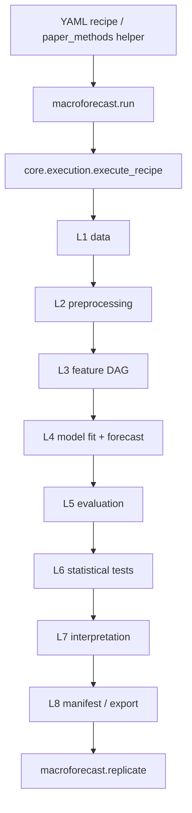
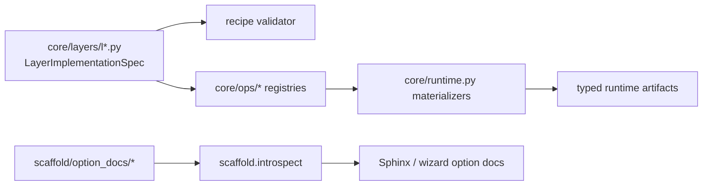
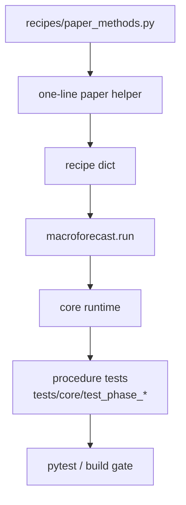

# macroforecast — Architecture

> Generated by scriber for run `2026-05-08-phase-c-top6-net-new-methods`;
> updated on 2026-05-09 after Phase C-3/C-4 audit fixes. Reflects HEAD
> `a77a6e4c` plus the current staged Phase B/C/C-4 package boundary before
> the user-owned target repo commit.

## Overview

macroforecast is a fair, reproducible macroeconomic forecasting
benchmarking package. It implements a **12-layer canonical design** (L0
study setup → L8 manifest export, plus L1.5 / L2.5 / L3.5 / L4.5 default-
off diagnostic hooks). A YAML recipe fully specifies a study; a
single `macroforecast.run("recipe.yaml")` call executes the DAG cell
loop, materialises per-layer artifacts, and writes a manifest that
``macroforecast.replicate(manifest_path)`` reproduces bit-for-bit.

The package follows a **schema-before-runtime** pattern: every layer
declares an axis × option × gate contract in
``LayerImplementationSpec`` (``core/layers/l*.py``); per-layer
materialization helpers in ``core/runtime.py`` enforce that contract.
The **scaffold** package
(``macroforecast/scaffold/option_docs/``) ships per-option
documentation that the wizard UI and sphinx reference docs both consume.

---

## Module Structure

```
macroforecast/
├── __init__.py             # lazy-export top-level surface
├── api.py                  # macroforecast.run / macroforecast.replicate
├── core/
│   ├── execution.py        # execute_recipe (cell loop) + replicate_recipe
│   ├── runtime.py          # per-layer materialize_l{1..8}_minimal helpers
│   ├── figures.py          # matplotlib backend + US state choropleth
│   ├── cache.py, dag.py, sweep.py, manifest.py, validator.py, yaml.py, types.py
│   ├── layer_specs.py, recipe.py, selectors.py
│   ├── layers/             # l0..l8 + l1_5/l2_5/l3_5/l4_5 schema definitions
│   └── ops/                # universal/l3/l4/l5/l6/l7/l8/diagnostic op registry
├── recipes/
│   └── paper_methods.py    # paper-faithful one-line recipe builders
├── raw/                    # FRED-MD/QD/SD adapters, vintage manager
├── preprocessing/          # preprocessing contract helpers
├── scaffold/
│   ├── introspect.py       # operational_options() / all_options() schema view
│   └── option_docs/        # per-option Tier-1 / Tier-2 documentation registry
├── custom.py               # user-defined model / preprocessor registration
├── defaults.py             # default profile dict template
└── tuning/                 # HP search engines (optuna / genetic)
```







---

## Layer table (extended for Phase C additions)

| Layer | Purpose | Module |
|-------|---------|--------|
| L0 | Study setup (failure_policy, seed, compute_mode) | `core/layers/l0.py` |
| L1 | Data definition (FRED-MD/QD/SD, target, geography, regime) | `core/layers/l1.py` |
| L2 | Preprocessing (transform / outlier / imputation / frame edge) | `core/layers/l2.py` |
| L3 | Feature engineering DAG (40+ ops + cascade β) | `core/layers/l3.py`, `core/ops/l3_ops.py` |
| L4 | Forecasting model + tuning (40+ families, 6 combine ops) | `core/layers/l4.py`, `core/ops/l4_ops.py` |
| L5 | Evaluation (metrics × benchmark × aggregation × decomposition × ranking) | `core/layers/l5.py`, `core/ops/l5_ops.py` |
| L6 | Statistical tests (DM/HLN, CW, MCS bootstrap, PT/HM, residual battery, **HN encompassing**) | `core/layers/l6.py`, `core/ops/l6_ops.py` |
| L7 | Interpretation (30+ importance ops, group_aggregate, lineage, US choropleth) | `core/layers/l7.py`, `core/ops/l7_ops.py` |
| L8 | Output / provenance (json/csv/parquet/latex/markdown, manifest) | `core/layers/l8.py`, `core/ops/l8_ops.py` |

---

## L3 operational ops (Phase C additions)

| Op | Family | Purpose | Paper anchor |
|----|--------|---------|--------------|
| `u_midas` | Mixed-frequency aggregation | Unrestricted MIDAS lag stack: emit `K = n_lags_high` HF lags at LF dates. | Foroni-Marcellino-Schumacher (2015); Borup-Rapach-Schütte (2023) |
| `midas` | Mixed-frequency aggregation | Almon / Exp-Almon / Beta weighted lag polynomial via NLS against `target_signal` input. | Ghysels-Sinko-Valkanov (2007) |
| `sliced_inverse_regression` | Supervised dimension reduction | sSUFF / SIR (scaled): standardise → optional sSUFF scaling → H slices → between-slice covariance → top-K eigenvectors. | Huang-Jiang-Li-Tong-Zhou (2022); Fan-Xue-Yao (2017); Li (1991) |

Schema location: `macroforecast/core/ops/l3_ops.py:518-622`.
Runtime helpers: `_midas_lag_stack`, `_u_midas`, `_midas`,
`_sliced_inverse_regression`, `_univariate_slope` in `core/runtime.py`
(lines 11697-11985).

---

## L4 operational families (Phase C additions)

| Family | Class | Purpose | Paper anchor |
|--------|-------|---------|--------------|
| `garch11` | `_GARCHFamily` | Standard GARCH(1,1) volatility model `σ²_t = ω + α ε²_{t-1} + β σ²_{t-1}`. | Bollerslev (1986); Engle (1982) |
| `egarch` | `_GARCHFamily` | EGARCH(p, o, q) on log-variance with leverage asymmetry. | Nelson (1991) |
| `realized_garch_with_rv_exog` | `_GARCHFamily` | RV-as-exogenous approximation in a vanilla GARCH(1,1). This is **not** the Hansen-Huang-Shek joint MLE; canonical `realized_garch` is reserved as FUTURE. | Hansen-Huang-Shek (2012) target spec; honest approximation label |
| `ets` | `_ETSWrapper` | Exponential-smoothing state-space (statsmodels `ETSModel`). | Hyndman-Koehler-Ord-Snyder (2008); Hyndman-Athanasopoulos (2018) |
| `theta_method` | `_ThetaWrapper` | Hand-coded Theta(2) closed form: `0.5·trend + 0.5·SES`. | Assimakopoulos-Nikolopoulos (2000); Hyndman-Billah (2003) |
| `holt_winters` | `_HoltWintersWrapper` | Additive / multiplicative seasonal exponential smoothing (statsmodels `ExponentialSmoothing`). | Holt (1957/2004); Winters (1960); Hyndman-Athanasopoulos (2018) |

Wrapper classes: `_GARCHFamily`, `_ETSWrapper`, `_ThetaWrapper`,
`_HoltWintersWrapper` in `core/runtime.py` (lines 6349-6743).
`OPERATIONAL_MODEL_FAMILIES` extension in
`macroforecast/core/ops/l4_ops.py:71-79`.

GARCH families require the optional `[arch]` extra
(`pip install macroforecast[arch]`); a clear `NotImplementedError`
fires when `arch` is missing (mirrors xgboost / lightgbm pattern).

### L4 predict-op `pi_correction` axis (Phase C M12)

| Option | Purpose | Paper anchor |
|--------|---------|--------------|
| `none` (default) | Default Gaussian-residual PI bands `[ŷ ± z·σ̂_ε]`; back-compat. | — |
| `bai_ng` | Bai-Ng (2006) Theorem 3 + Corollary 1 PI correction for `factor_augmented_ar`: total variance `σ̂²_ε + V₁/T + V₂/N` accounts for factor-estimation noise on top of parameter and residual variance. | Bai-Ng (2006) |

Schema: `macroforecast/core/ops/l4_ops.py:225-244`. Runtime helper:
`_bai_ng_pi_correction` in `core/runtime.py:1899-1972`. The
`_FactorAugmentedAR` class (`core/runtime.py:3194-3294`) was extended
to expose `factor_loadings_`, `factor_coefficients_`,
`idiosyncratic_variance_` at fit time.

---

## L6 operational tests (Phase C additions)

| Sub-layer | Test | Purpose | Paper anchor |
|-----------|------|---------|--------------|
| L6.A `equal_predictive_test` | `harvey_newbold_encompassing` | One-sided forecast encompassing test on `d_t = e_a · (e_a − e_b)`; HAC long-run variance with `nw_truncation = horizon − 1`; HN 1998 Eq. 5 small-sample correction; directional pairs (a,b) ≠ (b,a). | Harvey-Leybourne-Newbold (1998); Chong-Hendry (1986) |

Runtime helpers: `_l6_harvey_newbold_results`, `_harvey_newbold_test`
in `core/runtime.py:9133-9233`. Dispatch from
`_l6_equal_predictive_results` reads
`equal_predictive_test == "harvey_newbold_encompassing"` directly (no
schema enum change required).

---

## paper_methods helpers (Phase C additions, 8 new)

The `recipes.paper_methods` module exposes paper-faithful one-line
recipe builders. Phase C added eight helpers — all return a
`recipe_dict` consumable by `macroforecast.run`.

| Helper | One-line description | Paper anchor |
|--------|----------------------|--------------|
| `u_midas(target, horizon, freq_ratio, n_lags_high, panel, seed)` | Unrestricted MIDAS lag-stack mixed-frequency recipe. | Foroni 2015 §3 / Borup-Rapach-Schütte (2023) |
| `midas_almon(target, horizon, weighting, polynomial_order, freq_ratio, n_lags_high, panel, seed)` | MIDAS Almon / Exp-Almon / Beta NLS recipe. | GSV (2007) §2 |
| `sliced_inverse_regression(target, horizon, n_components, n_slices, scaling_method, panel, seed)` | sSUFF / SIR-scaled supervised dimension reduction recipe. | Huang-Zhou-Tong (2022); Fan-Xue-Yao (2017) |
| `garch_volatility(target, horizon, family, min_train_size, panel, seed)` | GARCH / EGARCH / RV-as-exog volatility recipe (`family ∈ {garch11, egarch, realized_garch_with_rv_exog}`); legacy `realized_garch` raises until a true joint-MLE implementation exists. | Bollerslev (1986); Nelson (1991); Hansen et al. (2012) |
| `ets(target, horizon, error_trend_seasonal, seasonal_periods, panel, seed)` | ETS state-space recipe (statsmodels `ETSModel` wrapper). | Hyndman et al. (2008) |
| `theta_method(target, horizon, theta, panel, seed)` | Theta(2) M3-winning closed-form recipe. | Assimakopoulos-Nikolopoulos (2000) |
| `holt_winters(target, horizon, seasonal_periods, panel, seed)` | Additive / multiplicative seasonal exponential smoothing recipe. | Hyndman-Athanasopoulos (2018) §7 |
| `bai_ng_corrected_factor_ar(target, horizon, n_factors, n_lag, panel, seed)` | FAR with Bai-Ng (2006) PI correction (`predict.params.pi_correction = "bai_ng"`). | Bai-Ng (2006) |

Implementation: `macroforecast/recipes/paper_methods.py` (~+280 lines
across the 8 helpers + `__all__` updates).

---

## Architectural patterns (selected)

- **Schema before runtime**: every layer's axis × option × gate
  contract is declared in `LayerImplementationSpec`; runtime helpers
  in `core/runtime.py` enforce it. Phase C adds 9 schema entries (3
  L3 ops, 6 L4 families) plus a new `pi_correction` `predict.params`
  axis and a runtime-only `harvey_newbold_encompassing` L6 test
  option (no schema enum change required).
- **One recipe = one study**: a YAML recipe fully specifies the DAG;
  sweep markers expand into independent cells. Phase C helpers are
  recipe-builders that wrap the spec choices.
- **Bit-exact replication**: seed propagation + canonical key
  ordering + per-cell sink hashes guarantee
  `replicate(manifest_path)` reproduces artifacts identically.
- **Default-off diagnostics**: L1.5 / L2.5 / L3.5 / L4.5 + L6 / L7
  require explicit `enabled: true` so a minimal recipe stays fast.
- **Optional extras**: heavy / niche dependencies are gated as
  install extras (`[deep]` for torch, `[anatomy]`, `[mars]`, and
  Phase-C-introduced **`[arch]` for GARCH**). The runtime raises a
  clear `NotImplementedError` with an install hint when the extra
  is absent.

---

## Notes (run-specific)

- HEAD `a77a6e4c` unchanged across this run (NO commit per protocol).
- Phase C builder produced ~1500 net new lines of runtime + helper
  code; after the boundary fix, current core CI validation reports
  `1318 passed, 19 skipped, 4 deselected, 1 xfailed, 4 xpassed`.
- Scriber closed HOLD-5 (3 scaffold-doc completeness gaps): added 3
  L3 + 6 L4 + 1 L7 Tier-1 OptionDoc entries to
  `macroforecast/scaffold/option_docs/`. After scriber edits the
  scaffold suite passes 16 / 0.
- Phase C-3/C-4 closed the Round 0/1 blocking items for M9, M12, M14,
  and M16. Remaining items are cosmetic/deferred unless explicitly
  selected: M2 Almon positivity, M3 `n_slices` default, and M14 manual
  `pair_user_list` direction semantics.
