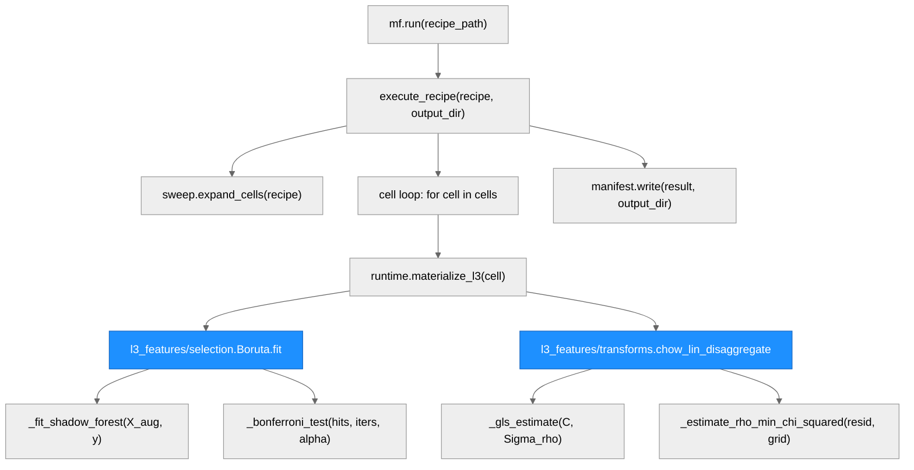
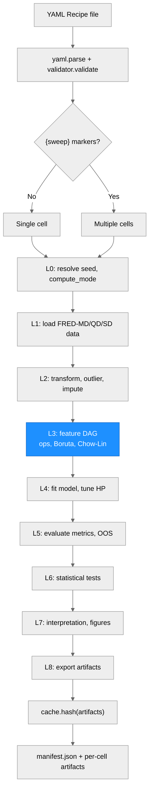

# Architecture — macroforecast

> **Run:** 2026-05-26-docs-precision-audit / PR5 (sidebar orphan fix)
> **Branch:** `docs-fix/pr5-sidebar-orphan`
> **Version:** v0.9.5a0 (post Phase 3g-bis restructure)

---

## System Architecture

### Module Structure

```mermaid
%%{init: {'theme': 'neutral'}}%%
graph TD
    subgraph API["Public API Layer"]
        INIT["macroforecast/__init__.py<br/>lazy-export surface"]
        APIH["api_high.py<br/>high-level API"]
        APIR["api/recipe.py<br/>mf.run / mf.replicate"]
        APIQ["api/quick.py<br/>quick API"]
        APIF["api/functions/<br/>standalone callables"]
        APID["api/_deprecations.py<br/>model_family shims"]
        CUSTOM["custom.py / api/custom.py<br/>register_model etc."]
    end

    subgraph CORE["Core Runtime Layer"]
        EXEC["core/execution.py<br/>execute_recipe cell loop"]
        RUNTIME["core/runtime.py<br/>per-layer materialize helpers"]
        PIPELINE["core/pipeline.py<br/>pipeline context"]
        MANIFEST["core/manifest.py<br/>manifest schema + write"]
        CACHE["core/cache.py<br/>hash + sink cache"]
        SWEEP["core/sweep.py<br/>sweep expansion"]
        YAML_["core/yaml.py<br/>recipe parser"]
        VALIDATOR["core/validator.py<br/>schema validation"]
        TYPES["core/types.py<br/>RuntimeResult etc."]
        STATUS["core/status.py<br/>OPERATIONAL / FUTURE"]
        LSPECS["core/layer_specs.py<br/>LayerImplementationSpec"]
    end

    subgraph LAYERS["Layer Implementation (L0-L8)"]
        L0["layers/l0_meta<br/>study setup, seed, compute_mode"]
        L1["layers/l1_data<br/>FRED-MD/QD/SD, target, regime"]
        L1D["layers/l1_5_diagnostic"]
        L2["layers/l2_preprocessing<br/>transform, outlier, imputation"]
        L2D["layers/l2_5_diagnostic"]
        L3["layers/l3_features<br/>feature engineering DAG"]
        L3D["layers/l3_5_diagnostic"]
        L4["layers/l4_models<br/>30+ estimator families"]
        L4D["layers/l4_5_diagnostic"]
        L5["layers/l5_evaluation<br/>metrics, decomposition"]
        L6["layers/l6_tests<br/>DM/CW/MCS/GR/DMP"]
        L7["layers/l7_interpretation<br/>SHAP, PFI, ALE, IRF"]
        L8["layers/l8_output<br/>json/csv/parquet/latex"]
    end

    subgraph L3SUB["L3 Sub-modules"]
        L3SEL["layers/l3_features/selection.py<br/>Boruta class"]
        L3TRF["layers/l3_features/transforms.py<br/>chow_lin_disaggregate"]
        L3OPS["layers/l3_features/ops.py<br/>37 DAG ops registry"]
        L3SCH["layers/l3_features/schema.py<br/>L3 schema definition"]
    end

    subgraph DOCS2["Docs (PR2 touch surface)"]
        DR1["explanation/recipe_to_run.md<br/>sweep marker tutorial"]
        DR2["explanation/architecture/layer7.md<br/>L7 architecture narrative"]
        DR3["reference/api/.../l2_clean.md<br/>L2 standalone function ref"]
        DR4["reference/recipe_schema/defaults.md<br/>schema defaults ref"]
    end

    subgraph SHIMS["Backward-compat Shims"]
        INTERP["interpretation/__init__.py<br/>GIRF shim to l7_interpretation"]
        RECIPES["recipes/__init__.py<br/>shim to layers"]
        FUNCS["functions/<br/>shim to api/functions"]
    end

    subgraph VENDOR["Vendor"]
        MRF["_vendor/macro_random_forest/<br/>MRF / GTVP implementation"]
    end

    INIT --> APIH
    INIT --> APIR
    APIR --> EXEC
    EXEC --> RUNTIME
    RUNTIME --> L0
    RUNTIME --> L1
    RUNTIME --> L2
    RUNTIME --> L3
    RUNTIME --> L4
    RUNTIME --> L5
    RUNTIME --> L6
    RUNTIME --> L7
    RUNTIME --> L8
    EXEC --> MANIFEST
    EXEC --> CACHE
    EXEC --> SWEEP
    APIR --> YAML_
    YAML_ --> VALIDATOR
    L3 --> L3SEL
    L3 --> L3TRF
    L3 --> L3OPS
    L3 --> L3SCH
    INTERP -.->|shim| L7
    RECIPES -.->|shim| L3
    FUNCS -.->|shim| APIF
    L4 --> MRF

    DR1 -.->|illustrates op: fit sweep| L4
    DR2 -.->|illustrates shap_tree op| L7
    DR3 -.->|API ref + encyclopedia link| L2
    DR4 -.->|schema defaults| L0

    style DR1 fill:#1e90ff,stroke:#1565c0,color:#fff
    style DR2 fill:#1e90ff,stroke:#1565c0,color:#fff
    style DR3 fill:#1e90ff,stroke:#1565c0,color:#fff
    style DR4 fill:#1e90ff,stroke:#1565c0,color:#fff
```

| Module/Package | Purpose | Key Dependencies | Changed in This Run |
|----------------|---------|-----------------|---------------------|
| `macroforecast/__init__.py` | Lazy-export top-level surface; `__getattr__` dispatches attribute access | all submodules | No |
| `api/recipe.py` | `mf.run`, `mf.replicate` public entry points | `core/execution.py` | No |
| `api/_deprecations.py` | `model_family` to `model` deprecation shims | `api/functions/` | No |
| `core/execution.py` | Cell loop, seed propagation, bit-exact replicate | `core/runtime.py`, `core/manifest.py` | No |
| `core/runtime.py` | Per-layer `materialize_lN` helpers | all `layers/` | No |
| `core/status.py` | `OPERATIONAL` / `FUTURE` two-value vocabulary | -- | No |
| `layers/l2_preprocessing/` | Transform, outlier, imputation; `freq_align_*_clean` callables | `core/`, `pandas` | No (source unchanged) |
| `layers/l4_models/` | 35+ estimator families; `op: fit` dispatch | `core/`, `sklearn`, `statsmodels` | No (source unchanged) |
| `layers/l7_interpretation/` | 30 importance ops: SHAP, PFI, ALE, IRF, lineage | `core/`, `shap`, `statsmodels` | No (source unchanged) |
| `interpretation/__init__.py` | Backward-compat shim: `GIRF` to `l7_interpretation` | `layers/l7_interpretation` | No |
| `docs/explanation/recipe_to_run.md` | Sweep marker tutorial | -- | **YAML block: op: fit + params:** |
| `docs/explanation/architecture/layer7.md` | L7 architecture narrative + example | -- | **YAML param: model: xgboost** |
| `docs/reference/api/.../l2_clean.md` | L2 standalone function API reference | -- | **Links: _rule → _policy (×2)** |
| `docs/reference/recipe_schema/defaults.md` | Schema defaults reference | -- | **Prose: model_family → model + ar_p** |

---

### Function Call Graph

| Function | Purpose | Key Dependencies | Changed in This Run |
|----------|---------|-----------------|---------------------|
| `mf.run` | Public entry point | `api/recipe.py` | No |
| `execute_recipe` | Cell loop, seed prop, manifest write | `core/runtime.py` | No |
| `sweep.expand_cells` | Expands `{sweep: [...]}` markers to cell list | `core/sweep.py` | No |
| `runtime.materialize_l3` | Instantiates L3 DAG nodes, dispatches ops | `layers/l3_features/ops.py` | No |
| `Boruta.fit` | Runs Boruta iterative shadow-feature test | `numpy`, `sklearn.ensemble` | No (source); **docs fixed** |
| `_fit_shadow_forest` | Fits RF on X augmented with shadow copies | `sklearn.ensemble.RandomForestClassifier` | No |
| `_bonferroni_test` | Bonferroni significance test on hit counts | `scipy.stats.binom` | No |
| `chow_lin_disaggregate` | Chow-Lin (1971) GLS temporal disaggregation | `numpy`, `scipy` | No (source); **docs fixed** |
| `_gls_estimate` | BLUE GLS with AR(1) covariance matrix | `numpy.linalg` | No |
| `_estimate_rho_min_chi_squared` | Grid search for AR(1) parameter rho | `numpy` | No |
| `manifest.write` | Writes manifest.json with provenance fields | `core/manifest.py` | No |

---

### Data Flow

---

## Documentation Surface (PR2 — this run)

The following docs files were the direct subject of PR2. All are user-facing reference or explanation pages.

| Doc file | Subject | What changed |
|----------|---------|-------------|
| `docs/explanation/recipe_to_run.md` | Sweep marker tutorial | `op: ridge` + `config:` → `op: fit` + `params: {model: ridge, ...}` |
| `docs/explanation/architecture/layer7.md` | L7 architecture narrative | `model_family: xgboost` → `model: xgboost` in example YAML fragment |
| `docs/reference/api/standalone_functions/l2_clean.md` | L2 standalone function API reference | `monthly_to_quarterly_rule` → `monthly_to_quarterly_policy`, `quarterly_to_monthly_rule` → `quarterly_to_monthly_policy` |
| `docs/reference/recipe_schema/defaults.md` | Schema defaults reference | Replaced stale `model_family: "ar"` with `model: "ar"` (deprecated; use `model: "ar_p"`) |
| `CHANGELOG.md` | Release notes | PR2 entry added under `[Unreleased] ### Docs` |

**Sphinx build:** `build succeeded` — 0 new errors or warnings introduced by this PR.

**Termination greps (all PASS — empty output):**
- Old `op:` shorthand in docs/examples: none found
- `config:` key in docs/examples: none found
- `monthly_to_quarterly_rule`, `quarterly_to_monthly_rule`, `model_family:` in docs: none found
