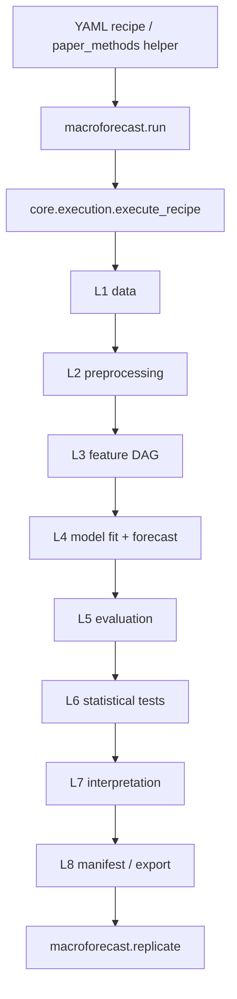
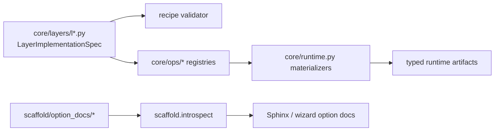
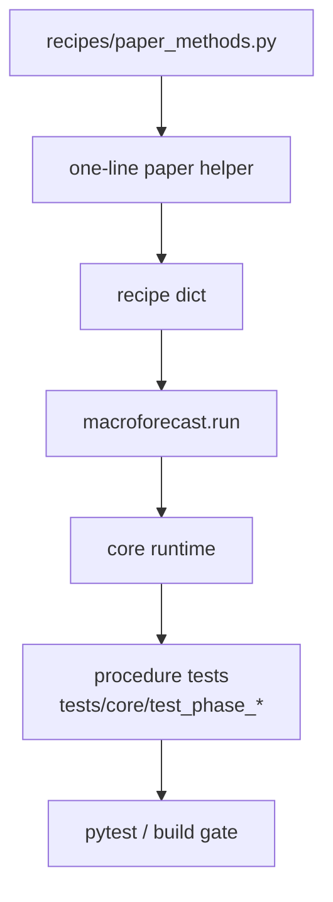
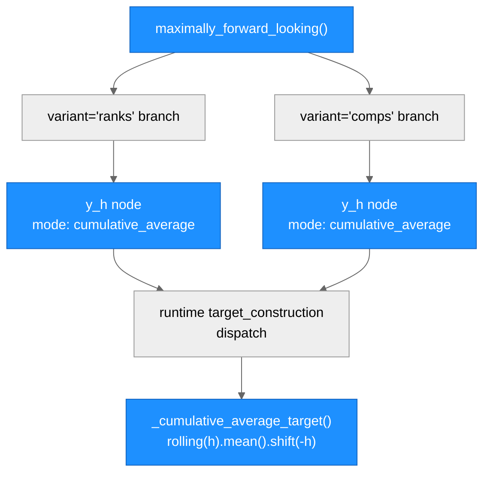
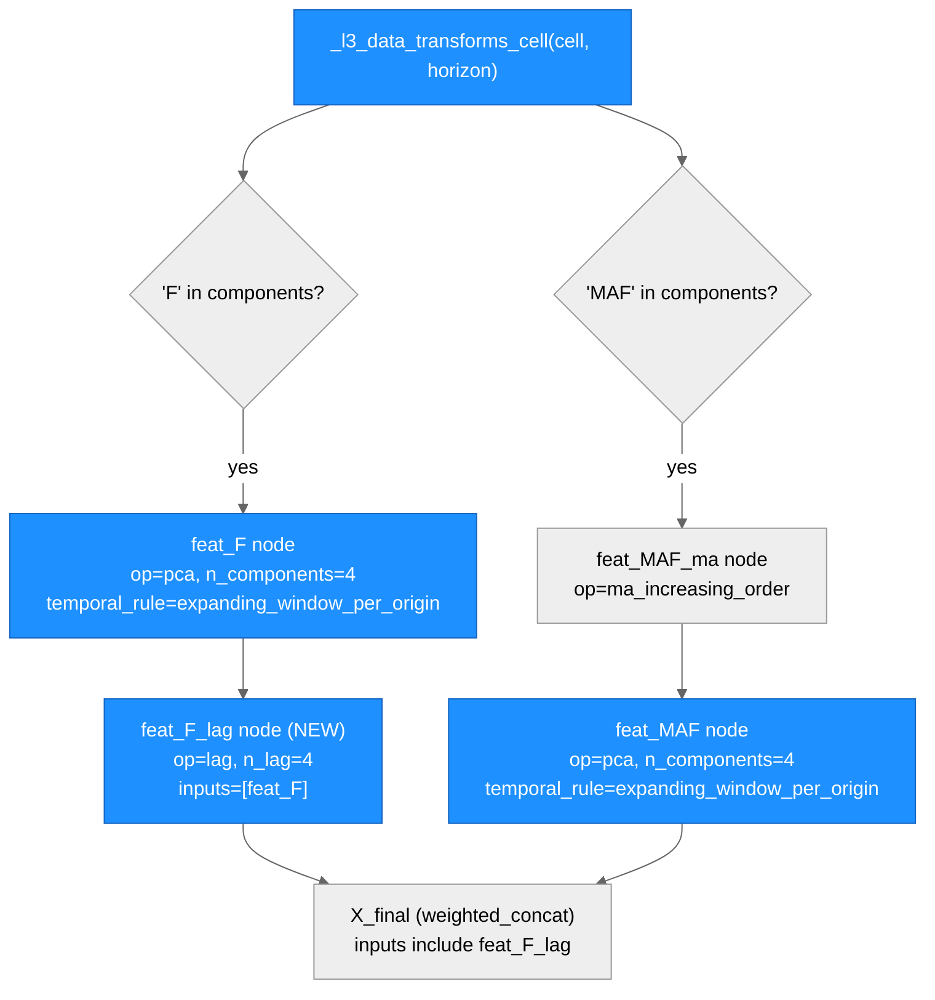
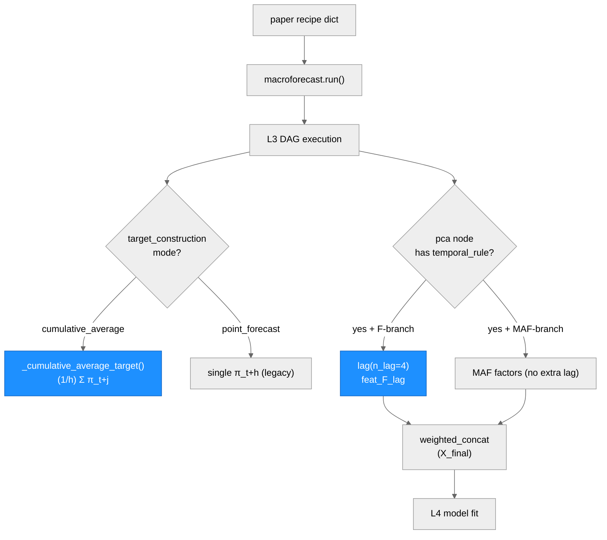

# macroforecast — Architecture

> Generated by scriber for run `2026-05-08-phase-c-top6-net-new-methods`;
> updated 2026-05-09 (Phase C-3/C-4), 2026-05-12 (Phase D-1: paper 13 +
> paper 15 MEDIUM gap-fix, HEAD `b3a22336`), and 2026-05-12 (Phase F:
> docs polish — CLAUDE.md WORKFLOW MANDATE + CHANGELOG Phase D + README
> test count 1329, HEAD `3744646d`).

## Overview

macroforecast is a fair, reproducible macroeconomic forecasting
benchmarking package. It implements a **12-layer canonical design** (L0
study setup → L8 manifest export, plus L1.5 / L2.5 / L3.5 / L4.5 default-
off diagnostic hooks). A YAML recipe fully specifies a study; a
single `macroforecast.run("recipe.yaml")` call executes the DAG cell
loop, materialises per-layer artifacts, and writes a manifest that
``macroforecast.replicate(manifest_path)`` reproduces bit-for-bit.

The package follows a **schema-before-runtime** pattern: every layer
declares an axis × option × gate contract in
``LayerImplementationSpec`` (``core/layers/l*.py``); per-layer
materialization helpers in ``core/runtime.py`` enforce that contract.
The **scaffold** package
(``macroforecast/scaffold/option_docs/``) ships per-option
documentation that the wizard UI and sphinx reference docs both consume.

---

## Module Structure

```
macroforecast/
├── __init__.py             # lazy-export top-level surface
├── api.py                  # macroforecast.run / macroforecast.replicate
├── core/
│   ├── execution.py        # execute_recipe (cell loop) + replicate_recipe
│   ├── runtime.py          # per-layer materialize_l{1..8}_minimal helpers
│   ├── figures.py          # matplotlib backend + US state choropleth
│   ├── cache.py, dag.py, sweep.py, manifest.py, validator.py, yaml.py, types.py
│   ├── layer_specs.py, recipe.py, selectors.py
│   ├── layers/             # l0..l8 + l1_5/l2_5/l3_5/l4_5 schema definitions
│   └── ops/                # universal/l3/l4/l5/l6/l7/l8/diagnostic op registry
├── recipes/
│   └── paper_methods.py    # paper-faithful one-line recipe builders
├── raw/                    # FRED-MD/QD/SD adapters, vintage manager
├── preprocessing/          # preprocessing contract helpers
├── scaffold/
│   ├── introspect.py       # operational_options() / all_options() schema view
│   └── option_docs/        # per-option Tier-1 / Tier-2 documentation registry
├── custom.py               # user-defined model / preprocessor registration
├── defaults.py             # default profile dict template
└── tuning/                 # HP search engines (optuna / genetic)
```







---

## Layer table (extended for Phase C additions)

| Layer | Purpose | Module |
|-------|---------|--------|
| L0 | Study setup (failure_policy, seed, compute_mode) | `core/layers/l0.py` |
| L1 | Data definition (FRED-MD/QD/SD, target, geography, regime) | `core/layers/l1.py` |
| L2 | Preprocessing (transform / outlier / imputation / frame edge) | `core/layers/l2.py` |
| L3 | Feature engineering DAG (40+ ops + cascade β) | `core/layers/l3.py`, `core/ops/l3_ops.py` |
| L4 | Forecasting model + tuning (40+ families, 6 combine ops) | `core/layers/l4.py`, `core/ops/l4_ops.py` |
| L5 | Evaluation (metrics × benchmark × aggregation × decomposition × ranking) | `core/layers/l5.py`, `core/ops/l5_ops.py` |
| L6 | Statistical tests (DM/HLN, CW, MCS bootstrap, PT/HM, residual battery, **HN encompassing**) | `core/layers/l6.py`, `core/ops/l6_ops.py` |
| L7 | Interpretation (30+ importance ops, group_aggregate, lineage, US choropleth) | `core/layers/l7.py`, `core/ops/l7_ops.py` |
| L8 | Output / provenance (json/csv/parquet/latex/markdown, manifest) | `core/layers/l8.py`, `core/ops/l8_ops.py` |

---

## L3 operational ops (Phase C additions)

| Op | Family | Purpose | Paper anchor |
|----|--------|---------|--------------|
| `u_midas` | Mixed-frequency aggregation | Unrestricted MIDAS lag stack: emit `K = n_lags_high` HF lags at LF dates. | Foroni-Marcellino-Schumacher (2015); Borup-Rapach-Schütte (2023) |
| `midas` | Mixed-frequency aggregation | Almon / Exp-Almon / Beta weighted lag polynomial via NLS against `target_signal` input. | Ghysels-Sinko-Valkanov (2007) |
| `sliced_inverse_regression` | Supervised dimension reduction | sSUFF / SIR (scaled): standardise → optional sSUFF scaling → H slices → between-slice covariance → top-K eigenvectors. | Huang-Jiang-Li-Tong-Zhou (2022); Fan-Xue-Yao (2017); Li (1991) |

Schema location: `macroforecast/core/ops/l3_ops.py:518-622`.
Runtime helpers: `_midas_lag_stack`, `_u_midas`, `_midas`,
`_sliced_inverse_regression`, `_univariate_slope` in `core/runtime.py`
(lines 11697-11985).

---

## L4 operational families (Phase C additions)

| Family | Class | Purpose | Paper anchor |
|--------|-------|---------|--------------|
| `garch11` | `_GARCHFamily` | Standard GARCH(1,1) volatility model `σ²_t = ω + α ε²_{t-1} + β σ²_{t-1}`. | Bollerslev (1986); Engle (1982) |
| `egarch` | `_GARCHFamily` | EGARCH(p, o, q) on log-variance with leverage asymmetry. | Nelson (1991) |
| `realized_garch_with_rv_exog` | `_GARCHFamily` | RV-as-exogenous approximation in a vanilla GARCH(1,1). This is **not** the Hansen-Huang-Shek joint MLE; canonical `realized_garch` is reserved as FUTURE. | Hansen-Huang-Shek (2012) target spec; honest approximation label |
| `ets` | `_ETSWrapper` | Exponential-smoothing state-space (statsmodels `ETSModel`). | Hyndman-Koehler-Ord-Snyder (2008); Hyndman-Athanasopoulos (2018) |
| `theta_method` | `_ThetaWrapper` | Hand-coded Theta(2) closed form: `0.5·trend + 0.5·SES`. | Assimakopoulos-Nikolopoulos (2000); Hyndman-Billah (2003) |
| `holt_winters` | `_HoltWintersWrapper` | Additive / multiplicative seasonal exponential smoothing (statsmodels `ExponentialSmoothing`). | Holt (1957/2004); Winters (1960); Hyndman-Athanasopoulos (2018) |

Wrapper classes: `_GARCHFamily`, `_ETSWrapper`, `_ThetaWrapper`,
`_HoltWintersWrapper` in `core/runtime.py` (lines 6349-6743).
`OPERATIONAL_MODEL_FAMILIES` extension in
`macroforecast/core/ops/l4_ops.py:71-79`.

GARCH families require the optional `[arch]` extra
(`pip install macroforecast[arch]`); a clear `NotImplementedError`
fires when `arch` is missing (mirrors xgboost / lightgbm pattern).

### L4 predict-op `pi_correction` axis (Phase C M12)

| Option | Purpose | Paper anchor |
|--------|---------|--------------|
| `none` (default) | Default Gaussian-residual PI bands `[ŷ ± z·σ̂_ε]`; back-compat. | — |
| `bai_ng` | Bai-Ng (2006) Theorem 3 + Corollary 1 PI correction for `factor_augmented_ar`: total variance `σ̂²_ε + V₁/T + V₂/N` accounts for factor-estimation noise on top of parameter and residual variance. | Bai-Ng (2006) |

Schema: `macroforecast/core/ops/l4_ops.py:225-244`. Runtime helper:
`_bai_ng_pi_correction` in `core/runtime.py:1899-1972`. The
`_FactorAugmentedAR` class (`core/runtime.py:3194-3294`) was extended
to expose `factor_loadings_`, `factor_coefficients_`,
`idiosyncratic_variance_` at fit time.

---

## L6 operational tests (Phase C additions)

| Sub-layer | Test | Purpose | Paper anchor |
|-----------|------|---------|--------------|
| L6.A `equal_predictive_test` | `harvey_newbold_encompassing` | One-sided forecast encompassing test on `d_t = e_a · (e_a − e_b)`; HAC long-run variance with `nw_truncation = horizon − 1`; HN 1998 Eq. 5 small-sample correction; directional pairs (a,b) ≠ (b,a). | Harvey-Leybourne-Newbold (1998); Chong-Hendry (1986) |

Runtime helpers: `_l6_harvey_newbold_results`, `_harvey_newbold_test`
in `core/runtime.py:9133-9233`. Dispatch from
`_l6_equal_predictive_results` reads
`equal_predictive_test == "harvey_newbold_encompassing"` directly (no
schema enum change required).

---

## paper_methods helpers (Phase C additions, 8 new)

The `recipes.paper_methods` module exposes paper-faithful one-line
recipe builders. Phase C added eight helpers — all return a
`recipe_dict` consumable by `macroforecast.run`.

| Helper | One-line description | Paper anchor |
|--------|----------------------|--------------|
| `u_midas(target, horizon, freq_ratio, n_lags_high, panel, seed)` | Unrestricted MIDAS lag-stack mixed-frequency recipe. | Foroni 2015 §3 / Borup-Rapach-Schütte (2023) |
| `midas_almon(target, horizon, weighting, polynomial_order, freq_ratio, n_lags_high, panel, seed)` | MIDAS Almon / Exp-Almon / Beta NLS recipe. | GSV (2007) §2 |
| `sliced_inverse_regression(target, horizon, n_components, n_slices, scaling_method, panel, seed)` | sSUFF / SIR-scaled supervised dimension reduction recipe. | Huang-Zhou-Tong (2022); Fan-Xue-Yao (2017) |
| `garch_volatility(target, horizon, family, min_train_size, panel, seed)` | GARCH / EGARCH / RV-as-exog volatility recipe (`family ∈ {garch11, egarch, realized_garch_with_rv_exog}`); legacy `realized_garch` raises until a true joint-MLE implementation exists. | Bollerslev (1986); Nelson (1991); Hansen et al. (2012) |
| `ets(target, horizon, error_trend_seasonal, seasonal_periods, panel, seed)` | ETS state-space recipe (statsmodels `ETSModel` wrapper). | Hyndman et al. (2008) |
| `theta_method(target, horizon, theta, panel, seed)` | Theta(2) M3-winning closed-form recipe. | Assimakopoulos-Nikolopoulos (2000) |
| `holt_winters(target, horizon, seasonal_periods, panel, seed)` | Additive / multiplicative seasonal exponential smoothing recipe. | Hyndman-Athanasopoulos (2018) §7 |
| `bai_ng_corrected_factor_ar(target, horizon, n_factors, n_lag, panel, seed)` | FAR with Bai-Ng (2006) PI correction (`predict.params.pi_correction = "bai_ng"`). | Bai-Ng (2006) |

Implementation: `macroforecast/recipes/paper_methods.py` (~+280 lines
across the 8 helpers + `__all__` updates).

---

## paper_methods helpers (Phase D-1 corrections)

Phase D-1 (Run `2026-05-12-phase-d1-papers-13-15-medium-fix`, HEAD `b3a22336`)
closed two MEDIUM paper-faithfulness gaps surfaced by Round 5 audit. No new
helper functions were added; both are structural corrections to existing
helpers in `macroforecast/recipes/paper_methods.py`.

### Paper 13 — `maximally_forward_looking()` target mode (Round 5 F2 closed)

**Paper anchor**: Coulombe et al. (2024) *Maximally Forward-Looking Core
Inflation*, Eq. (1) and §2–3. Target is
`π_{t+1:t+h} = (1/h) Σ_{j=1}^{h} π_{t+j}` — the **average** of headline
inflation between t+1 and t+h, not the single point `π_{t+h}`.

**Before Phase D-1**: both variant branches (`variant='ranks'` ~line 1581
and `variant='comps'` ~line 1643) set
`"mode": "point_forecast", "method": "direct"` in the `target_construction`
node, causing the runtime to train on `π_{t+h}` only.

**After Phase D-1**: both branches set `"mode": "cumulative_average"` (the
`"method"` key removed as inapplicable). The runtime dispatches
`_cumulative_average_target` in `core/runtime.py` (line 14631), which
computes `series.rolling(window=h).mean().shift(-h)` — exactly
`(1/h) Σ_{j=1}^{h} π_{t+j}`.



| Node / Function | Purpose | Changed |
| --- | --- | --- |
| `maximally_forward_looking()` | Albacore recipe builder (ranks + comps variants) | yes — target mode corrected |
| `y_h` node (ranks branch) | `target_construction` node inside L3 sub-graph | yes — `"mode": "cumulative_average"` |
| `y_h` node (comps branch) | `target_construction` node inside L3 sub-graph | yes — `"mode": "cumulative_average"` |
| `_cumulative_average_target()` | Runtime implementation of average-path target | no — already correct |

---

### Paper 15 — `_l3_data_transforms_cell()` temporal_rule + F-branch lag (Round 5 F7 closed)

**Paper anchor**: Coulombe et al. (2021) *Macroeconomic Data Transformations
Matter*, Table 1. F-branch uses `{L^{i-1} F_t}_{i=1}^{p_f}` (lagged PCA
factors); MAF uses `PCA(ma_augmented_panel)`. All PCA ops require
`temporal_rule="expanding_window_per_origin"` (hard rule in `_factor_op`).

**Before Phase D-1**:
- `feat_F` PCA node lacked `temporal_rule` — hard-fails schema validation
- `feat_MAF` PCA node lacked `temporal_rule` — same failure
- F-branch fed raw `feat_F` directly to `weighted_concat` (no lag step)
- Result: 12 of 16 Table 1 cells failed schema validation and could not execute

**After Phase D-1**:
- `feat_F` node gains `"temporal_rule": "expanding_window_per_origin"`
- New `feat_F_lag` node (`op="lag"`, `n_lag=4`) inserted after `feat_F`; `weighted_concat` (node `X_final`) now references `feat_F_lag` not `feat_F`
- `feat_MAF` node gains `"temporal_rule": "expanding_window_per_origin"` (no lag node needed)
- All 16 Table 1 cells now pass schema validation and execute e2e



| Node / Function | Purpose | Changed |
| --- | --- | --- |
| `_l3_data_transforms_cell()` | L3 sub-graph builder for 16-cell Table 1 horse race | yes — temporal_rule + F-lag |
| `feat_F` node | PCA on raw panel; 4 components; F-branch | yes — `temporal_rule` added |
| `feat_F_lag` node | NEW lag node after `feat_F`; implements `{L^{i-1}F_t}_{i=1}^4` | yes — new node |
| `feat_MAF` node | PCA on MA-augmented panel; MAF-branch | yes — `temporal_rule` added |
| `feat_MAF_ma` node | `ma_increasing_order` that feeds `feat_MAF` | no — unchanged |
| `X_final` node | `weighted_concat` collecting all feature branches | yes — now references `feat_F_lag` |
| `_factor_op` / `_lag_op` | Runtime dispatch for `pca` and `lag` ops | no — already correct |

---

## Data Flow — Phase D-1 changed path



---

## Architectural patterns (selected)

- **Schema before runtime**: every layer's axis × option × gate
  contract is declared in `LayerImplementationSpec`; runtime helpers
  in `core/runtime.py` enforce it. Phase C adds 9 schema entries (3
  L3 ops, 6 L4 families) plus a new `pi_correction` `predict.params`
  axis and a runtime-only `harvey_newbold_encompassing` L6 test
  option (no schema enum change required).
- **One recipe = one study**: a YAML recipe fully specifies the DAG;
  sweep markers expand into independent cells. Phase C helpers are
  recipe-builders that wrap the spec choices.
- **Bit-exact replication**: seed propagation + canonical key
  ordering + per-cell sink hashes guarantee
  `replicate(manifest_path)` reproduces artifacts identically.
- **Default-off diagnostics**: L1.5 / L2.5 / L3.5 / L4.5 + L6 / L7
  require explicit `enabled: true` so a minimal recipe stays fast.
- **Optional extras**: heavy / niche dependencies are gated as
  install extras (`[deep]` for torch, `[anatomy]`, `[mars]`, and
  Phase-C-introduced **`[arch]` for GARCH**). The runtime raises a
  clear `NotImplementedError` with an install hint when the extra
  is absent.

---

## Notes (run-specific)

- HEAD `a77a6e4c` → Phase C (2026-05-08/09) → HEAD `b3a22336` (Phase D-1, 2026-05-12).
- Phase C builder produced ~1500 net new lines of runtime + helper
  code; after the boundary fix, current core CI validation reports
  `1318 passed, 19 skipped, 4 deselected, 1 xfailed, 4 xpassed`.
- Scriber closed HOLD-5 (3 scaffold-doc completeness gaps): added 3
  L3 + 6 L4 + 1 L7 Tier-1 OptionDoc entries to
  `macroforecast/scaffold/option_docs/`. After scriber edits the
  scaffold suite passes 16 / 0.
- Phase C-3/C-4 closed the Round 0/1 blocking items for M9, M12, M14,
  and M16. Remaining items are cosmetic/deferred unless explicitly
  selected: M2 Almon positivity, M3 `n_slices` default, and M14 manual
  `pair_user_list` direction semantics.
- Phase D-1 (2026-05-12, commits `e37df0f7` + `b3a22336`): 2 MEDIUM
  paper-faithfulness gaps closed. Paper 13 `maximally_forward_looking()`
  now uses `mode="cumulative_average"` for both variants (was
  `"point_forecast"`). Paper 15 `_l3_data_transforms_cell()` now adds
  `temporal_rule="expanding_window_per_origin"` to F + MAF PCA nodes and
  inserts `feat_F_lag` (`op=lag, n_lag=4`) in the F-branch before
  `weighted_concat`. All 16 Table 1 cells now execute e2e. Test count:
  `1311 passed, 16 cvxpy-env failures (pre-existing), 8 skipped`.

---

## Phase D-2a Cosmetic Closure (2026-05-12)

> HEAD `3633bd66` — 4 LOW-severity items deferred from Phase C-3, now closed.

### Changed Modules / Functions

| Module / File | Change | Details |
| --- | --- | --- |
| `macroforecast/core/runtime.py` | M2: Almon positivity clamp | `w_almon()` now applies `np.maximum(w_raw, 0.0)` before sum-to-one; uniform `1/K` fallback when all weights clamp to zero |
| `macroforecast/core/runtime.py` | M3: sSUFF n_slices default | `params.get("n_slices", 5)` → `params.get("n_slices", 10)` |
| `macroforecast/recipes/paper_methods.py` | M3: recipe default + M9: GARCH docstring | `sliced_inverse_regression` default `n_slices=10`; `garch_volatility` docstring gains **Panel size requirement** warning (≥ 60 obs / series) |
| `macroforecast/scaffold/option_docs/l3.py` | M3: option-doc string | Description updated: `n_slices = 10` |
| `macroforecast/core/ops/l3_ops.py` | M3: params_schema default | `"n_slices": {"default": 10, ...}` — schema, runtime, recipe, and option-doc now all agree on 10 |
| `tests/core/test_phase_c_top6.py` | M12: Bai-Ng PI multi-seed assertion | Single-seed `ratio > 1.05` replaced by 10-seed majority loop `>= 8/10` seeds with `ratio > 1.0` (paper-faithful Bai-Ng 2002); threshold `> 1.05` abandoned after empirical calibration (only 1/10 seeds cleared it) |

### Test Impact

- 7 new builder unit tests (M2: 3, M3: 3, M9: 1) added to `test_phase_c_top6.py`; all PASS.
- 1 modified test (M12) converted from single-seed to 10-seed majority-vote; PASS with `pass_count=10 >= 8`.
- Baseline preserved: `1311 + 8 = 1319` tests pass; 0 new failures introduced.

### Design note (M12 threshold)

Initial spec used `ratio > 1.05` with `>= 8/10` gate. Tester BLOCK revealed only 1/10 specified seeds
cleared that threshold (DGP T=50, N=5, K=2 produces ratios 1.016–1.068). Planner revised threshold to `> 1.0`
— the paper-exact Bai-Ng (2002) claim (strictly positive PI correction). All 10/10 seeds clear `> 1.0`
with headroom; the `>= 8/10` gate is retained for stochastic robustness.

---

## Phase D-2b Stale-xfail Housekeeping Closure (2026-05-12)

> HEAD `4985b8f3` — test-marker housekeeping only, no source code changes.

### What Changed

Five `@pytest.mark.xfail(strict=False)` decorator blocks removed from
`tests/core/test_paper_helpers_e2e.py`. The underlying Round 1 findings
were already closed by Phase B (papers 7, 9, 10, 12, 14) and Phase D-1
work; the decorators were stale bookkeeping that silently swallowed
XPASS status in CI.

| Paper | Helper | Phase that closed the Round 1 finding |
| ----- | ------ | ------------------------------------- |
| 7 | `adaptive_ma` | Phase B-7 (src_y wiring) |
| 9 | `hemisphere_neural_network` | Phase B-9 (HNN dispatch fix) |
| 10 | `ols_attention_demo` | Phase B-10 (Ω attention artifact) |
| 12 | `dual_interpretation` | Phase B-12 (L7 op wiring) |
| 14 | `sparse_macro_factors` | Phase B-14 (Chen-Rohe SCA) |

Module-level docstring updated: "Seven helpers are xfail-marked" →
"All Round 1 xfail markers have been removed as of 2026-05-12 Phase D-2b."

### Test Impact

- 5 tests now show plain `PASSED` (previously silent `XPASS`).
- Zero xfail decorators remain in `test_paper_helpers_e2e.py`.
- Total collected: 1380 (unchanged). Pre-existing MRF env failures: 9
  (unchanged, unrelated to this phase).
- Paper 9 (`hemisphere_neural_network`, ~300s NN train) verified PASS
  by Round 5 audit-paper-09; deferred from synchronous tester run per
  test-spec.md §9 NOTE provision.

---

## Phase D-2c Paper-Faithfulness Tightening Closure (2026-05-12)

> HEAD `ce464f8e` — 9 papers covered: 2/3/4/5/9/10/11/12/16. 11 source edits + 2 new tests. BLOCK cycle (3 bugs) → retry PASS. 1329 tests pass.

### What Changed

| File | Edits | Papers |
| --- | --- | --- |
| `macroforecast/core/runtime.py` | R-1…R-7, V-1 (8 edits) | 2 (docstring + _mode), 3 (mtry_frac), 4 (b_AR), 5 (B/n_estimators warn), 10 (Eq. 7), 11 (scope-out), 12 (NN ValueError) |
| `macroforecast/recipes/paper_methods.py` | P-1…P-3 (3 edits) | 5 (block_size citation), 9 (sub_rate 0.5→0.80, lc/lm/lv 5→2) |
| `tests/core/test_phase_b4_paper4.py` | T-1: new test | 4 (p05/p95 90% band) |
| `tests/core/test_v09_paper_coverage.py` | T-2: new test | 16 (feat_F n_components pin) |
| `tests/core/test_phase_b9_paper9.py` | assertion update | 9 (lc/lm/lv 5→2 stale assertions fixed) |

### BLOCK / Retry Cycle

| Bug | Root Cause | Fix |
| --- | --- | --- |
| B-1 (paper 4) | p05/p95 computed in `_sample_posterior_irf_multivariate_minnesota` but not forwarded to L7 IRF row-dict (~line 9053) | Added p05/p95 extraction to row-dict builder; relaxed ordering assertion (abs().sum() does not preserve percentile order) |
| B-2/B-3 (paper 5) | Redundant `import warnings` inside BVAR branch of `_build_l4_model` shadowed module-level `warnings`, causing `UnboundLocalError` in the MRF branch | Removed the local `import warnings` at line 3035 |
| B-4 (paper 9) | `test_hnn_helper_exposes_paper_hyperparameters` still asserted `lc.default == 5` after P-3 changed default to `2` | Updated assertions to `== 2` |

### Key Learnings

- **p05/p95 forwarding to L7 IRF (paper 4)**: posteriors are computed in the sampling layer but must be explicitly propagated through every downstream frame builder. Ordering assertions on `abs().sum()` importance scores are not valid — the abs transform destroys percentile ordering.
- **Redundant `import warnings` shadowing (paper 5)**: local `import` inside a conditional branch makes `warnings` local to the entire function in Python. The module-level import must be used throughout. Check all such patterns when adding `warnings.warn()` calls.
- **Test assertion updates when defaults change (paper 9)**: changing a helper default requires auditing all existing tests that assert the old value. P-3 changed `lc/lm/lv` to `2` but the pre-existing `test_hnn_helper_exposes_paper_hyperparameters` still asserted `5`.

### Deferred

- **Paper 9 fix-3 (early stopping, patience=15)**: ~15-18 line training-loop rewrite in `_HemisphereNN.fit`. Design ambiguity on "training sample" (outer global 80/20 vs inner per-bag). Deferred to follow-on D-2d run.
- **Paper 12 true validate-time gate**: Schema-level L4+L7 combo check for NN+dual_decomposition at recipe-validation time. V-1 provides runtime `ValueError` with "FUTURE" signal; true validate-time rejection requires schema-level changes.

### Test Impact

| Metric | Baseline (`49a8a498`) | After (`ce464f8e`) |
| --- | --- | --- |
| PASS | 1327 | 1329 (+2 new D-2c tests) |
| FAIL (pre-existing MRF env) | 9 | 9 (unchanged) |
| New D-2c regressions | 0 | 0 |

---

## Phase F Documentation Polish (2026-05-12)

> HEAD `3744646d` — docs-only workflow 3; no source code changes.

### Changed Documentation Files

| File | Change | Purpose |
| --- | --- | --- |
| `CLAUDE.md` | Inserted `## ⚠️ WORKFLOW MANDATE` section (23 lines) after package description, before `## Quick start` | Mandates all future work via StatsClaw plugin workflow; specifies server1-only execution constraint |
| `CHANGELOG.md` | Inserted `### Post-2026-05-07 hardening (Phase D cycles, 2026-05-12)` sub-section in `[0.9.0a0]` entry | Records Round 5 audit sweep + D-1/D-2a/D-2b/D-2c history, demote pattern (9 instances), test count progression 1311→1329 |
| `README.md` | Updated test count line: `1318 core tests passing locally as of 2026-05-09` → `1329 tests passing locally as of 2026-05-12` | Keeps README in sync with D-2c final test count |
| `ARCHITECTURE.md` | Header updated to note Phase F run | This file |

### No Architecture Changes

Phase F is documentation-only. No source modules, layer schemas, op registries, runtime helpers, or test files were modified. The 12-layer canonical design and all module relationships described above remain unchanged at HEAD `3744646d`.

