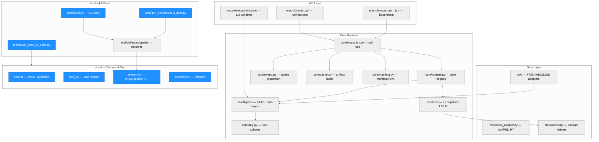
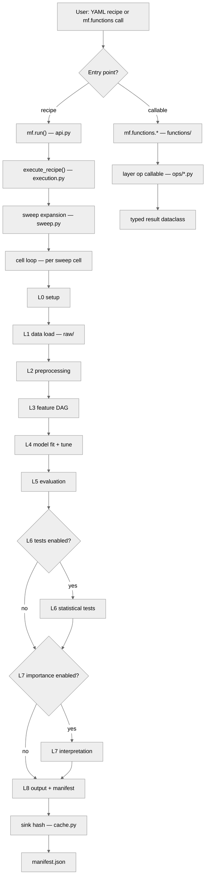
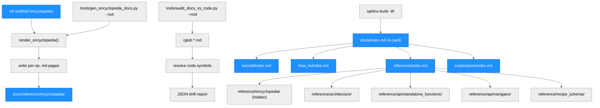

# macroforecast — Architecture

> Generated by scriber for run `2026-05-22-cycle52-diataxis-structure-migration` on 2026-05-22.

## Overview

macroforecast is a Python package for reproducible macro-forecasting benchmarking
studies on FRED-MD / FRED-QD / FRED-SD data (or custom data sources). The 12-layer
canonical design (L0–L8 plus diagnostic half-layers L1.5–L4.5) converts a YAML
recipe into a sweep of independent study cells, each producing bit-exact replicable
artifacts. Layer operations are also available as standalone Python callables via
`mf.functions.*`. The documentation was reorganized from 11 parallel top-level
directories into the Diátaxis 4-tier structure (tutorial / how-to / reference /
explanation) in C52.

---

## Module Structure



### Module Reference

| Module / File | Layer | Purpose | Key Exports | Changed in C52 |
| --- | --- | --- | --- | --- |
| `macroforecast/api.py` | API | `mf.run`, `mf.replicate`, `mf.forecast` entry points | `run`, `replicate` | no |
| `macroforecast/api_high.py` | API | High-level `Experiment` class, `ForecastResult` | `Experiment` | no |
| `macroforecast/functions/` | API | 118 standalone callables by layer (L2–L7) | layer-grouped callables | no |
| `macroforecast/core/execution.py` | Core | Cell loop, seed propagation, `replicate_recipe` | `execute_recipe` | no |
| `macroforecast/core/runtime.py` | Core | Per-layer `materialize_l*` artifact helpers | `materialize_l2` .. `materialize_l8` | no |
| `macroforecast/core/layers/` | Core | L0–L8 + L1.5–L4.5 schema definitions | layer axis / gate / default dicts | no |
| `macroforecast/core/ops/` | Core | Op registries: L3 (41 ops), L4 (47 families), L5–L8 | per-op factory callables | no |
| `macroforecast/core/dag.py` | Core | Universal DAG schema: 5 node types | `DAGNode` type hierarchy | no |
| `macroforecast/core/sweep.py` | Core | Sweep expansion: param / recipe / node | `expand_sweep` | no |
| `macroforecast/core/cache.py` | Core | Content-addressed artifact cache, SHA-256 hashing | `sink_hash` | no |
| `macroforecast/core/manifest.py` | Core | Manifest read/write, provenance record schema | `Manifest`, `ManifestRecord` | no |
| `macroforecast/raw/` | Data | FRED-MD / QD / SD adapters, vintage manager | `load_fred_md`, `load_alfred` | no |
| `macroforecast/raw/alfred_adapter.py` | Data | Rolling-mode ALFRED vintage resolution (C51 vectorized) | `resolve_alfred_vintage` | no |
| `macroforecast/preprocessing/` | Data | Preprocessing contract helpers (legacy support) | `PreprocessingContract` | no |
| `macroforecast/scaffold/cli.py` | Scaffold | CLI entry: `scaffold`, `encyclopedia` subcommands | `main` | yes |
| `macroforecast/scaffold/encyclopedia/` | Scaffold | Encyclopedia renderer: writes per-op .md pages | `render_encyclopedia` | no |
| `tools/gen_encyclopedia_docs.py` | Tools | Standalone generator: argparse CLI wrapping renderer | `--out` default, docstring | yes |
| `tools/audit_docs_vs_code.py` | Tools | Drift detector: scans .md for code-symbol tokens | `--root` CLI arg | yes |
| `.github/workflows/ci-docs.yml` | CI | Sphinx build + encyclopedia drift check | drift check paths | yes |
| `docs/index.md` | Docs | 4-card landing page (C52 rewrite) | top-level navigation | yes |
| `docs/tutorial/` | Docs | Tutorial tier: install, quickstart, study, replications | 5 files + replications/ | yes |
| `docs/how_to/` | Docs | How-to tier: 11 task recipes + simple_api/ | 11 files + simple_api/ | yes |
| `docs/reference/` | Docs | Reference tier: encyclopedia, architecture, API, recipe_schema | 319+80 files | yes |
| `docs/explanation/` | Docs | Explanation tier: placeholder (C54 content) | 1 file | yes |

---

## Docs Structure (C52 Diátaxis Migration)

The C52 migration reorganizes `docs/` from 11 parallel directories into the
Diátaxis 4-tier hierarchy. The diagram below shows the new layout.

```mermaid
%%{init: {'theme': 'neutral'}}%%
graph TD
    IDX["docs/index.md (4-card landing)"]
    IDX --> TUT["tutorial/"]
    IDX --> HOW["how_to/"]
    IDX --> REF["reference/"]
    IDX --> EXP["explanation/"]
    IDX --> HLP["help.md"]

    TUT --> T1["00_install.md"]
    TUT --> T2["01_first_forecast.md"]
    TUT --> T3["02_full_study.md"]
    TUT --> T4["03_two_entry_points.md"]
    TUT --> REPL["replications/"]

    HOW --> H1["custom_model.md"]
    HOW --> H2["custom_hooks.md"]
    HOW --> H3["add_dataset.md"]
    HOW --> H4["simple_api/"]
    HOW --> H5["contributing.md (+ 6 more)"]

    REF --> RA["reference/architecture/ (29 files)"]
    REF --> RE["reference/encyclopedia/ (319 files, hidden)"]
    REF --> RAPI["reference/api/"]
    REF --> RSS["reference/recipe_schema/ (9 files)"]

    RAPI --> RSF["standalone_functions/ (7 files)"]
    RAPI --> RNV["navigator/ (6 files)"]

    EXP --> EX1["index.md (C54 placeholder)"]

    style IDX fill:#1e90ff,stroke:#1565c0,color:#fff
    style TUT fill:#1e90ff,stroke:#1565c0,color:#fff
    style HOW fill:#1e90ff,stroke:#1565c0,color:#fff
    style REF fill:#1e90ff,stroke:#1565c0,color:#fff
    style EXP fill:#1e90ff,stroke:#1565c0,color:#fff
    style RE fill:#1e90ff,stroke:#1565c0,color:#fff
```



### Docs Migration Reference

| Old Path | New Path | Migration | Tier |
| --- | --- | --- | --- |
| `docs/install.md` | `docs/tutorial/00_install.md` | git mv | Tutorial |
| `docs/for_researchers/quickstart.md` | `docs/tutorial/01_first_forecast.md` | git mv + rename | Tutorial |
| `docs/for_researchers/first_study.md` | `docs/tutorial/02_full_study.md` | git mv + rename | Tutorial |
| `docs/two_entry_points.md` | `docs/tutorial/03_two_entry_points.md` | git mv | Tutorial |
| `docs/replications/*` (4 files) | `docs/tutorial/replications/*` | git mv | Tutorial |
| `docs/for_recipe_authors/custom_function_quickstart.md` | `docs/how_to/custom_model.md` | git mv + rename | How-to |
| `docs/for_recipe_authors/custom_hooks.md` | `docs/how_to/custom_hooks.md` | git mv | How-to |
| `docs/for_recipe_authors/partial_layer_execution.md` | `docs/how_to/partial_execution.md` | git mv + rename | How-to |
| `docs/for_recipe_authors/target_transformer.md` | `docs/how_to/target_transformer.md` | git mv | How-to |
| `docs/for_recipe_authors/data/datasets_fred_md.md` | `docs/how_to/add_dataset.md` | git mv + rename | How-to |
| `docs/troubleshooting.md` | `docs/how_to/troubleshooting.md` | git mv | How-to |
| `docs/CONVENTIONS.md` | `docs/how_to/conventions.md` | git mv + rename | How-to |
| `docs/for_contributors/index.md` | `docs/how_to/contributing.md` | git mv + rename | How-to |
| `docs/for_contributors/reproducibility_policy.md` | `docs/how_to/reproducibility_policy.md` | git mv | How-to |
| `docs/for_researchers/user_data_workflow.md` | `docs/how_to/user_data_workflow.md` | git mv | How-to |
| `docs/for_researchers/simple_api/*` (6 files) | `docs/how_to/simple_api/*` | git mv | How-to |
| `docs/architecture/*` (29 files) | `docs/reference/architecture/*` | git mv | Reference |
| `docs/encyclopedia/*` (319 files) | `docs/reference/encyclopedia/*` | git mv | Reference |
| `docs/standalone_functions/*` (7 files) | `docs/reference/api/standalone_functions/*` | git mv | Reference |
| `docs/navigator/*` (6 files) | `docs/reference/api/navigator/*` | git mv | Reference |
| `docs/recipe_api/*` (9 files) | `docs/reference/recipe_schema/*` | git mv | Reference |

---

## Data Flow



---

## Function Call Graph (Docs Pipeline — C52 Changed Paths)



### Function Reference

| Function / Path | Defined In | Calls | Changed | Purpose |
| --- | --- | --- | --- | --- |
| `mf.run(recipe_path)` | `api.py` | `execute_recipe` | no | YAML recipe entry point |
| `execute_recipe()` | `core/execution.py` | layer helpers, `expand_sweep`, `sink_hash` | no | Cell loop; seed propagation |
| `render_encyclopedia()` | `scaffold/encyclopedia/` | file writers | no | Emits per-op .md pages |
| `scaffold encyclopedia <out>` | `scaffold/cli.py` | `render_encyclopedia` | yes | CLI for encyclopedia regen |
| `gen_encyclopedia_docs.py --out` | `tools/gen_encyclopedia_docs.py` | `render_encyclopedia` | yes | Standalone doc generator |
| `audit_docs_vs_code.py --root` | `tools/audit_docs_vs_code.py` | `rglob`, code symbol resolver | yes | Docs-code drift detector |
| Sphinx `docs/index.md` toctree | `docs/index.md` | 4 tier indices | yes | Top-level navigation |
| `docs/reference/index.md` toctree | `docs/reference/index.md` | architecture, api, recipe_schema | yes | Reference tier navigation |

---

## Cycle 52 — What Changed

This cycle is a pure documentation structure migration. No source code
algorithms were added or modified. All `docs/**` renames were done via
`git mv`, preserving full file history.

| Category | Change |
| --- | --- |
| `docs/` structure | 11 parallel dirs → 4-tier Diátaxis (tutorial / how_to / reference / explanation) |
| `docs/index.md` | Rewritten as 4-card sphinx-design grid |
| `docs/tutorial/` (4 files + replications/) | New tier, populated via git mv |
| `docs/how_to/` (11 files + simple_api/) | New tier, populated via git mv |
| `docs/reference/` (architecture + encyclopedia + api + recipe_schema) | New tier, 360+ files |
| `docs/explanation/` | New tier, placeholder index |
| `docs/reference/encyclopedia/` | Moved from `docs/encyclopedia/`; hidden from sidebar |
| `.gitignore` | Removed `docs/reference/` exclusion (was auto-gen artifact) |
| `.github/workflows/ci-docs.yml` | 4 path updates: `docs/encyclopedia/` → `docs/reference/encyclopedia/` |
| `tools/gen_encyclopedia_docs.py` | Docstring + argparse default path update |
| `tools/audit_docs_vs_code.py` | Docstring example path update |
| `macroforecast/scaffold/cli.py` | Encyclopedia subcommand help text update |
| Redirect stubs (5) | `getting_started.md`, `user_guide.md`, `reference.md`, `replications.md`, `for_researchers/index.md` |
| `docs/help.md` | Updated toctree links to new `how_to/` paths |

---

## Version: v0.9.3-post-C51
## Module layout

```
macroforecast/
  __init__.py             # lazy-export top-level surface
  api.py                  # macroforecast.run / macroforecast.replicate
  api_high.py             # Experiment class, ForecastResult
  core/
    execution.py          # execute_recipe (cell loop) + replicate_recipe
    runtime.py            # per-layer materialize_l{1..8} helpers
    figures.py            # matplotlib backend + US state choropleth
    cache.py, dag.py, sweep.py, manifest.py, validator.py, yaml.py, types.py
    layer_specs.py, recipe.py, selectors.py
    layers/               # l0..l8 + l1_5/l2_5/l3_5/l4_5 schema definitions
    ops/                  # universal/l3/l4/l5/l6/l7/l8/diagnostic op registry
  raw/                    # FRED-MD/QD/SD adapters, vintage manager, manifest
  preprocessing/          # preprocessing contract helpers (legacy support)
  custom.py               # user-defined model / preprocessor registration
  defaults.py             # default profile dict template
  tuning/                 # HP search engines (optional, integrated via L4)
  scaffold/               # encyclopedia renderer + CLI
    cli.py                # argparse entry: scaffold, encyclopedia subcommands
    encyclopedia/         # per-op .md page renderer
docs/
  index.md                # 4-card landing (C52 rewrite)
  tutorial/               # guided walkthroughs (C52 migration)
  how_to/                 # task-specific recipes (C52 migration)
  reference/              # complete reference (C52 migration)
    architecture/         # 12-layer design narrative (29 files)
    encyclopedia/         # auto-gen option lookup (319 files, sidebar-hidden)
    api/
      standalone_functions/  # 7 files
      navigator/             # 6 files
    recipe_schema/         # 9 files
  explanation/             # placeholder for C54
  help.md                  # convenience page (updated links in C52)
  conf.py                  # Sphinx config (encyclopedia comment updated in C52)
tools/
  gen_encyclopedia_docs.py # encyclopedia generator (path updated in C52)
  audit_docs_vs_code.py    # drift detector (docstring updated in C52)
plans/design/             # 4-part design document (canonical source of truth)
tests/                    # 1345+ tests (core, layers, integration)
examples/recipes/         # YAML recipe examples per layer
```
