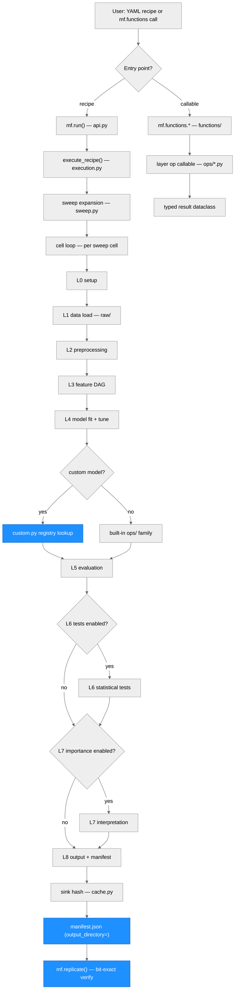
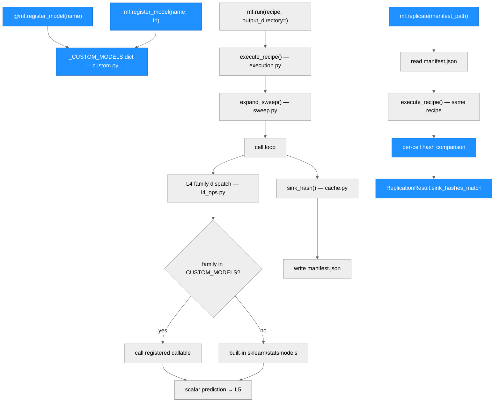

# macroforecast — Architecture

> Generated by scriber for run `2026-05-22-cycle55-v092b2-release-cut` on 2026-05-22.
> Last updated: C65 (2026-05-23) — R3-P2. `mf.recipes` becomes canonical home for recipe orchestration symbols. Pure refactor — `mf.__init__` lazy routes 8 symbols via `.recipes` instead of `.api`/`.api_high`. Full backward compat via `is`-identity aliases.

## Overview

macroforecast is a Python package for reproducible macro-forecasting benchmarking
studies on FRED-MD / FRED-QD / FRED-SD data (or custom data sources). The 12-layer
canonical design (L0–L8 plus diagnostic half-layers L1.5–L4.5) converts a YAML
recipe into a sweep of independent study cells, each producing bit-exact replicable
artifacts. Layer operations are also available as standalone Python callables via
`mf.functions.*`.

C52 reorganized `docs/` from 11 parallel directories into the Diátaxis 4-tier
structure (tutorial / how-to / reference / explanation). C53 wrote the actual
user-facing tutorial and how-to content: three narrative tutorials, six how-to
task recipes, two refactors, five redirect stubs, and broken-link fixes. C54
completes the overhaul: four new explanation-tier pages (12_layer_design,
bit_exact_replicate, honesty_pass, recipe_to_run), reference index cleanup
(api/index.md umbrella, encyclopedia visibility, card layout), landing page
finalization, and tutorial CI smoke test. The Diátaxis docs overhaul is now
complete as of C54.

---

## Module Structure

```mermaid
%%{init: {'theme': 'neutral'}}%%
graph TD
    subgraph API["API Layer"]
        A0["macroforecast.recipes — canonical orchestration (C65)"]
        A1["macroforecast.api — run/replicate (impl)"]
        A2["macroforecast.api_high — Experiment (impl)"]
        A3["macroforecast.functions — 132 callables"]
        A4["macroforecast.custom — register_model"]
        A5["macroforecast.models — 30 L4 classes"]
        A5T["models.tree — 6 classes (C64)"]
        A5N["models.neural — 2 classes (C64)"]
        A6["macroforecast.feature_selection — 5 classes"]
        A7["macroforecast.transforms — chow_lin"]
        A8["macroforecast.interpretation — GIRF/LSTM"]
    end

    subgraph Core["Core Runtime"]
        C1["core/execution.py — cell loop"]
        C2["core/runtime.py — layer helpers"]
        C3["core/layers/ — L0-L8 + half-layers"]
        C4["core/ops/ — op registries L3-L8"]
        C5["core/dag.py — DAG schema"]
        C6["core/sweep.py — sweep expansion"]
        C7["core/cache.py — artifact cache"]
        C8["core/manifest.py — manifest R/W"]
    end

    subgraph Data["Data Layer"]
        D1["raw/ — FRED-MD/QD/SD adapters"]
        D2["raw/alfred_adapter.py — ALFRED RT"]
        D3["preprocessing/ — contract helpers"]
    end

    subgraph Scaffold["Scaffold & Docs Tools"]
        S1["scaffold/cli.py — CLI entry"]
        S2["scaffold/encyclopedia — renderer"]
        S3["tools/gen_encyclopedia_docs.py"]
        S4["tools/audit_docs_vs_code.py"]
    end

    subgraph Docs["docs/ — Diataxis 4-Tier (C54 complete)"]
        DOC1["tutorial/ — 5 narrative files"]
        DOC2["how_to/ — 12 task recipes"]
        DOC3["reference/ — encyclopedia+API+arch"]
        DOC4["explanation/ — 4 pages (C54)"]
    end

    A0 --> A1
    A0 --> A2
    A1 --> C1
    A2 --> C1
    A3 --> C3
    A4 --> C4
    A5 --> C2
    A5T --> C2
    A5N --> C2
    A5 --> A5T
    A5 --> A5N
    A6 --> C2
    A7 --> C2
    A8 --> C2
    C1 --> C2
    C1 --> C6
    C1 --> C7
    C1 --> C8
    C2 --> C3
    C2 --> C4
    C3 --> C5
    C4 --> D3
    D1 --> C3
    S1 --> S2
    S3 --> S2
    S4 --> Docs
    S2 --> DOC3

    style A0 fill:#1e90ff,stroke:#1565c0,color:#fff
    style A1 fill:#1e90ff,stroke:#1565c0,color:#fff
    style A5 fill:#1e90ff,stroke:#1565c0,color:#fff
    style A5T fill:#1e90ff,stroke:#1565c0,color:#fff
    style A5N fill:#1e90ff,stroke:#1565c0,color:#fff
    style A6 fill:#1e90ff,stroke:#1565c0,color:#fff
    style A7 fill:#1e90ff,stroke:#1565c0,color:#fff
    style A8 fill:#1e90ff,stroke:#1565c0,color:#fff
    style DOC1 fill:#1e90ff,stroke:#1565c0,color:#fff
    style DOC2 fill:#1e90ff,stroke:#1565c0,color:#fff
    style DOC4 fill:#1e90ff,stroke:#1565c0,color:#fff
    style A4 fill:#1e90ff,stroke:#1565c0,color:#fff
```



### Module Reference

| Module / File | Layer | Purpose | Key Exports | Changed in C65 |
| --- | --- | --- | --- | --- |
| `macroforecast/recipes/__init__.py` | API | **Canonical recipe orchestration namespace** — re-exports 8 symbols from api/api_high; `paper_methods` preserved | `run`, `run_file`, `replicate`, `ManifestExecutionResult`, `ReplicationResult`, `forecast`, `Experiment`, `ForecastResult`, `paper_methods` | **yes (C65: new canonical home)** |
| `macroforecast/api.py` | API | Private implementation — `run`, `run_file`, `replicate`, `ManifestExecutionResult`, `ReplicationResult` (now re-exported via `recipes`) | `run`, `replicate` | no |
| `macroforecast/api_high.py` | API | Private implementation — `Experiment`, `ForecastResult`, `forecast` (now re-exported via `recipes`) | `Experiment` | no |
| `macroforecast/custom.py` | API | Custom model/preprocessor registry | `register_model`, `list_custom_models`, `clear_custom_models` | no |
| `macroforecast/functions/` | API | 132 standalone callables by layer (L2–L7) | layer-grouped callables | yes (C64: +6 tree/neural callables) |
| `macroforecast/functions/midas.py` | API | 4 MIDAS standalone fit callables | `midas_almon_fit`, `midas_beta_fit`, `midas_step_fit`, `unrestricted_midas_fit` | no |
| `macroforecast/functions/ridge_variants.py` | API | 4 ridge-variant standalone fit callables | `nonneg_ridge_fit`, `random_walk_ridge_fit`, `shrink_to_target_ridge_fit`, `fused_difference_ridge_fit` | no |
| `macroforecast/functions/tree.py` | API | 5 tree-family standalone fit callables | `slow_growing_tree_fit`, `quantile_regression_forest_fit`, `bagging_fit`, `booging_fit`, `macro_random_forest_fit` | yes (C64: new) |
| `macroforecast/functions/deep.py` | API | 1 neural standalone fit callable | `hemisphere_nn_fit` | yes (C64: new) |
| `macroforecast/models/` | API | 30 promoted L4 model classes | `MidasAlmon`, `RealizedGARCH`, `BVAR`, `SlowGrowingTree`, `HemisphereNN`, etc. | yes (C64: +8 classes, total 30) |
| `macroforecast/models/linear.py` | API | 14 linear/MIDAS/ridge-variant model classes | `MidasAlmon`, `MidasBeta`, `MidasStep`, `UnrestrictedMidas`, `LinearAR`, `FactorAugmentedAR`, `NonNegRidge`, `TwoStageRandomWalkRidge`, `ShrinkToTargetRidge`, `FusedDifferenceRidge`, `PrincipalComponentRegression`, `FactorAugmentedVAR`, `VAR`, `GLMBoost` | no |
| `macroforecast/models/bayesian.py` | API | 3 Bayesian/DFM model classes | `BVAR`, `BVARMinnesota`, `DFMMixedFrequency` | no |
| `macroforecast/models/volatility.py` | API | 2 volatility model classes | `GARCH`, `RealizedGARCH` | no |
| `macroforecast/models/timeseries.py` | API | 3 time-series model classes | `ETS`, `Theta`, `HoltWinters` | no |
| `macroforecast/models/tree.py` | API | 6 tree-family model classes (BaseEstimator) | `SlowGrowingTree`, `QuantileRegressionForest`, `Bagging`, `Booging`, `MacroRandomForest`, `KNN` | yes (C64: new) |
| `macroforecast/models/neural.py` | API | 2 neural model classes (BaseEstimator) | `SequenceModel`, `HemisphereNN` | yes (C64: new) |
| `macroforecast/feature_selection/` | API | 5 sklearn-style feature selection class wrappers (BaseEstimator + TransformerMixin) | `Boruta`, `RFE`, `LassoPathSelector`, `StabilitySelection`, `GeneticSelection` | yes (C64: BaseEstimator + feature_names_in_) |
| `macroforecast/transforms/` | API | Transform-only function wrappers | `chow_lin_disaggregate` | no |
| `macroforecast/interpretation/` | API | L7 interpretation class wrappers | `GIRF`, `LSTMHiddenState` | no |
| `macroforecast/__init__.py` | API | Package init, version declaration, lazy imports | `__version__` = `"0.9.3b1"`; `_LAZY_EXPORTS` routes 8 symbols via `.recipes` (C65) | **yes (C65: _LAZY_EXPORTS rerouted)** |
| `macroforecast/py.typed` | API | PEP 561 typed-package marker (empty sentinel) | — | no |
| `macroforecast/core/execution.py` | Core | Cell loop, seed propagation, `replicate_recipe` | `execute_recipe`, `ManifestExecutionResult` | no |
| `macroforecast/core/runtime.py` | Core | Per-layer `materialize_l*` artifact helpers; `_boruta_selection`; `_SlowGrowingTree`; `_BaggingWrapper` | `materialize_l2` .. `materialize_l8` | yes (C64: Bug A + Bug B fixes) |
| `macroforecast/core/layers/` | Core | L0–L8 + L1.5–L4.5 schema definitions | layer axis / gate / default dicts | no |
| `macroforecast/core/ops/` | Core | Op registries: L3 (41 ops), L4 (47 families), L5–L8 | per-op factory callables | no |
| `macroforecast/core/sweep.py` | Core | Sweep expansion: `{sweep: [...]}` markers | `expand_sweep` | no |
| `macroforecast/core/cache.py` | Core | Content-addressed artifact cache, SHA-256 | `sink_hash` | no |
| `macroforecast/core/manifest.py` | Core | Manifest read/write, provenance record | `Manifest`, `ManifestRecord` | no |
| `macroforecast/raw/` | Data | FRED-MD / QD / SD adapters, vintage manager | `load_fred_md`, `load_alfred` | no |
| `pyproject.toml` | Packaging | Project metadata, dependencies, build config | version, classifiers, authors, keywords | yes (C61: version bump + metadata) |
| `LICENSE` | Packaging | MIT license body | — | yes (C61: new file) |
| `docs/tutorial/index.md` | Docs | Toctree: 5 tutorials in learning order | navigation | yes (C53) |
| `docs/tutorial/01_first_forecast.md` | Docs | 5-min narrative: install→AR→manifest | full tutorial | yes (C53, new content) |
| `docs/tutorial/02_full_study.md` | Docs | Full study: sweep, DM test, L7 importance | full tutorial | yes (C53, new content) |
| `docs/tutorial/03_custom_model.md` | Docs | register_model narrative + sweep | full tutorial | yes (C53, new) |
| `docs/tutorial/two_entry_points.md` | Docs | Renamed from 03_two_entry_points + polished | full tutorial | yes (C53, rename+polish) |
| `docs/how_to/index.md` | Docs | Toctree: 12 task recipes + hidden redirect stubs | navigation | yes (C53) |
| `docs/how_to/add_custom_dataset.md` | Docs | Custom CSV / inline panel how-to | task recipe | yes (C53, new) |
| `docs/how_to/tune_hyperparameters.md` | Docs | HP search (grid/random/BIC) how-to | task recipe | yes (C53, new) |
| `docs/how_to/sweep_over_models.md` | Docs | Model sweep + pandas summary how-to | task recipe | yes (C53, new) |
| `docs/how_to/add_custom_model.md` | Docs | register_model terse recipe (refactored) | task recipe | yes (C53, refactor) |
| `docs/how_to/use_custom_hooks.md` | Docs | All 5 extension points (refactored) | task recipe | yes (C53, refactor) |
| `docs/how_to/replicate_a_study.md` | Docs | mf.replicate() + mismatch debug | task recipe | yes (C53, new) |
| `docs/how_to/partial_layer_execution.md` | Docs | Renamed from partial_execution + link fixes | task recipe | yes (C53, rename) |
| `docs/how_to/validate_against_r.md` | Docs | R cross-ref: install rpy2, run test suite, interpret tolerances | task recipe | yes (C59, new) |
| `docs/how_to/troubleshooting.md` | Docs | FAQ — 3 broken links fixed | polish | yes (C53, polish) |
| Redirect stubs (5) | Docs | add_dataset, user_data_workflow, custom_model, custom_hooks, partial_execution | orphan stubs | yes (C53, new) |

---

## Docs Structure (C53 Content Layer)

The C52 migration established the 4-tier skeleton. C53 fills in the tutorial
and how-to tiers with real user-facing content.

```mermaid
%%{init: {'theme': 'neutral'}}%%
graph TD
    IDX["docs/index.md (4-card landing)"]
    IDX --> TUT["tutorial/"]
    IDX --> HOW["how_to/"]
    IDX --> REF["reference/"]
    IDX --> EXP["explanation/"]

    TUT --> T0["00_install.md"]
    TUT --> T1["01_first_forecast.md (new)"]
    TUT --> T2["02_full_study.md (new)"]
    TUT --> T3["03_custom_model.md (new)"]
    TUT --> T4["two_entry_points.md (polished)"]
    TUT --> REPL["replications/ (C54)"]

    HOW --> H1["add_custom_dataset.md (new)"]
    HOW --> H2["tune_hyperparameters.md (new)"]
    HOW --> H3["sweep_over_models.md (new)"]
    HOW --> H4["add_custom_model.md (refactor)"]
    HOW --> H5["use_custom_hooks.md (refactor)"]
    HOW --> H6["replicate_a_study.md (new)"]
    HOW --> H7["partial_layer_execution.md (rename)"]
    HOW --> H8["target_transformer.md"]
    HOW --> H9["troubleshooting.md (polish)"]
    HOW --> H10["reproducibility_policy.md"]
    HOW --> H11["contributing.md"]
    HOW --> H12["conventions.md"]

    REF --> RA["reference/architecture/ (29 files)"]
    REF --> RE["reference/encyclopedia/ (319 files, hidden)"]
    REF --> RAPI["reference/api/"]
    REF --> RSS["reference/recipe_schema/ (9 files)"]

    style TUT fill:#1e90ff,stroke:#1565c0,color:#fff
    style HOW fill:#1e90ff,stroke:#1565c0,color:#fff
    style T1 fill:#1e90ff,stroke:#1565c0,color:#fff
    style T2 fill:#1e90ff,stroke:#1565c0,color:#fff
    style T3 fill:#1e90ff,stroke:#1565c0,color:#fff
    style T4 fill:#1e90ff,stroke:#1565c0,color:#fff
    style H1 fill:#1e90ff,stroke:#1565c0,color:#fff
    style H2 fill:#1e90ff,stroke:#1565c0,color:#fff
    style H3 fill:#1e90ff,stroke:#1565c0,color:#fff
    style H4 fill:#1e90ff,stroke:#1565c0,color:#fff
    style H5 fill:#1e90ff,stroke:#1565c0,color:#fff
    style H6 fill:#1e90ff,stroke:#1565c0,color:#fff
    style H7 fill:#1e90ff,stroke:#1565c0,color:#fff
    style H9 fill:#1e90ff,stroke:#1565c0,color:#fff
```



### C53 Docs Change Reference

| File | Change Type | Before C53 | After C53 |
| --- | --- | --- | --- |
| `docs/tutorial/index.md` | UPDATE | 4-stub toctree | 5-entry toctree (03_custom_model + two_entry_points) |
| `docs/tutorial/00_install.md` | POLISH | broken link to `for_researchers/quickstart.md` | valid `{doc}` xref to 01_first_forecast |
| `docs/tutorial/01_first_forecast.md` | NEW CONTENT | empty stub (from C52 mv) | 5-min AR recipe narrative |
| `docs/tutorial/02_full_study.md` | NEW CONTENT | empty stub (from C52 mv) | Full study: sweep, DM test, L7 |
| `docs/tutorial/03_custom_model.md` | NEW FILE | did not exist | register_model narrative |
| `docs/tutorial/two_entry_points.md` | RENAME + POLISH | `03_two_entry_points.md` | renamed + broken links fixed |
| `docs/how_to/index.md` | UPDATE | 8-entry toctree (old names) | 12-entry primary + 5-entry hidden (stubs) |
| `docs/how_to/add_custom_dataset.md` | NEW FILE | did not exist | CSV/inline panel how-to |
| `docs/how_to/tune_hyperparameters.md` | NEW FILE | did not exist | grid/random/BIC HP search |
| `docs/how_to/sweep_over_models.md` | NEW FILE | did not exist | model sweep + pandas summary |
| `docs/how_to/add_custom_model.md` | REFACTOR | did not exist (was custom_model.md) | terse register_model task recipe |
| `docs/how_to/use_custom_hooks.md` | REFACTOR | did not exist (was custom_hooks.md) | all 5 extension points |
| `docs/how_to/replicate_a_study.md` | NEW FILE | did not exist | mf.replicate() how-to |
| `docs/how_to/partial_layer_execution.md` | RENAME | was `partial_execution.md` | renamed + link fixes |
| `docs/how_to/troubleshooting.md` | POLISH | 3 broken links | links replaced with valid {doc} xrefs |
| Redirect stubs (5) | NEW FILES | did not exist | orphan stubs pointing to new names |

---

## Data Flow



---

## Function Call Graph (C53 — Custom Model + Replication Paths)



### Function Reference

| Function / Path | Defined In | Calls | Changed in C53 | Purpose |
| --- | --- | --- | --- | --- |
| `mf.run(recipe, output_directory=)` | `api.py` | `execute_recipe` | no (documented) | YAML recipe entry; writes manifest when output_directory given |
| `mf.replicate(manifest_path)` | `api.py` | `replicate_recipe` | no (documented) | Bit-exact replication via per-cell sink hash comparison |
| `mf.register_model(name)` | `custom.py` | `_CUSTOM_MODELS` dict | no (documented) | Decorator or direct-call; registers Python callable as family |
| `mf.list_custom_models()` | `custom.py` | `_CUSTOM_MODELS` keys | no (documented) | Returns tuple of registered names |
| `mf.clear_custom_models()` | `custom.py` | clears `_CUSTOM_MODELS` | no (documented) | Test teardown / notebook re-run safety |
| `execute_recipe()` | `core/execution.py` | layer helpers, sweep, cache | no | Cell loop; seed propagation; `ManifestExecutionResult` |
| `expand_sweep()` | `core/sweep.py` | recipe walker | no | Expands `{sweep: [...]}` markers into independent cells |
| `sink_hash()` | `core/cache.py` | SHA-256 | no | Content-addressed artifact fingerprint |
| `materialize_l1()` | `core/runtime.py` | `raw/` adapters | no | Loads panel from FRED or custom_panel_inline |
| `materialize_l2()` | `core/runtime.py` | preprocessing ops | no | McCracken-Ng transforms, outlier, imputation |
| `materialize_l3_minimal()` | `core/runtime.py` | L3 DAG ops | no | Feature engineering DAG; returns X_final, y_final |

---

## Cycle 65 — Recipe Orchestration Extraction (R3-P2)

`macroforecast.recipes` becomes the canonical home for recipe orchestration symbols (`run`, `run_file`, `replicate`, `forecast`, `Experiment`, `ForecastResult`). Top-level `mf.<name>` continues to work as silent alias (lazy import routes through `mf.recipes`). Pure refactor — no files moved, no semantic change. Recipe internals (`mf/core/execution.py`, `mf/api.py`, `mf/api_high.py`) untouched.

The library API namespace (`mf.models`, `mf.feature_selection`, `mf.transforms`, `mf.interpretation`, `mf.functions`) and the recipe orchestration namespace (`mf.recipes`) are now cleanly separated. Standalone users don't need to know recipes exist; recipe users find everything under one namespace.

| File | Change |
| --- | --- |
| `macroforecast/recipes/__init__.py` | Expanded 14 → 60 lines: module docstring, re-exports of 8 orchestration symbols from `api.py` + `api_high.py`, `__all__` set to 9 symbols |
| `macroforecast/__init__.py` | 8 `_LAZY_EXPORTS` string values changed from `.api`/`.api_high` to `.recipes`; docstring cross-reference added |

---

## Cycle 54 — What Changed

This cycle is documentation content only. No source code algorithms were
added or modified. All changes are within `docs/explanation/`, `docs/reference/`,
and `tests/docs/`.

| Category | Change |
| --- | --- |
| Explanation pages (4 new) | `12_layer_design.md`, `bit_exact_replicate.md`, `honesty_pass.md`, `recipe_to_run.md` — conceptual rationale for the 12-layer design, bit-exact replication, honesty vocabulary, and execution pipeline |
| Explanation index | `docs/explanation/index.md` — replaced stub with 4-page toctree |
| Reference API index (new) | `docs/reference/api/index.md` — umbrella for standalone_functions/ + navigator/ |
| Reference index | `docs/reference/index.md` — encyclopedia moved to visible toctree; API links to new umbrella |
| Encyclopedia index | `docs/reference/encyclopedia/index.md` — auto-gen clarity sentence added |
| Landing page | `docs/index.md` — removed "Expanding in C54" placeholder |
| Tutorial smoke test | `tests/docs/test_tutorial_smoke.py` — new CI test extracting Python blocks from tutorials 01-03 and executing them in subprocess |
| CHANGELOG | C54 entry added |
| Docs overhaul status | **Complete** — all four Diátaxis tiers have substantive content (C52 structure, C53 tutorial/how-to, C54 explanation/reference) |

---

## Cycle 53 — What Changed

This cycle is documentation content only. No source code algorithms were
added or modified. All changes are within `docs/tutorial/` and `docs/how_to/`.

| Category | Change |
| --- | --- |
| Tutorial narratives (3 new) | `01_first_forecast.md`, `02_full_study.md`, `03_custom_model.md` — new user-facing narrative with tested code blocks |
| Tutorial polish (2) | `two_entry_points.md` (renamed from 03_), `00_install.md` (link fix) |
| Tutorial index | Updated toctree to reflect 5-entry order |
| How-to new files (4) | `add_custom_dataset.md`, `tune_hyperparameters.md`, `sweep_over_models.md`, `replicate_a_study.md` |
| How-to refactors (2) | `add_custom_model.md` (from custom_model.md), `use_custom_hooks.md` (from custom_hooks.md) |
| How-to rename | `partial_layer_execution.md` (git mv from partial_execution.md) + broken link fix |
| How-to polish (1) | `troubleshooting.md` — 3 broken links → valid {doc} xrefs |
| Redirect stubs (5) | `add_dataset.md`, `user_data_workflow.md`, `custom_model.md`, `custom_hooks.md`, `partial_execution.md` — orphan stubs pointing to renamed files |
| How-to index | Updated toctree: 12-entry primary + 5-entry hidden (stubs) |
| CHANGELOG | C53 entry added |

---

## Cycle 59 — What Changed (Statistical Credibility Hardening)

C59 is Round 2 Cycle 4 of 6 in the Codex + MiniMax external cross-review
remediation series. The cycle addresses statistical correctness of the Boruta
feature selection implementation and hardens parameter recovery tests for the
Hansen-Huang-Shek (2012) Realized GARCH estimator.

The central finding (from the P1 Boruta audit) was that `_boruta_selection` in
`macroforecast/core/runtime.py` maintained an argmax fallback that guaranteed at
least one feature would always be selected, even on a shuffled-label null DGP
where the correct output is the empty set. This fallback produced a 100%
false-positive rate on the null baseline; the Kursa & Rudnicki (2010) algorithm
should guarantee FP rate <= alpha = 0.05. Removing the fallback and raising the
`n_shadow_copies` default from 1 to 6 (multi-shadow MISA for better calibration
at small T/N) reduces the empirical FP rate to 3.3% across 30 seeds. The
empty-DataFrame return is now the correct contract for null DGPs.

An independent R cross-reference suite (`tests/core/test_r_crossref_c59.py`)
gates three estimators against R packages Boruta, midasr, and rugarch via rpy2.
The entire module skips cleanly in environments without rpy2. A new
`[validation]` pyproject extra provides the rpy2 dependency on an opt-in basis.

No module structure changes were made. All changes are confined to
`macroforecast/core/runtime.py` (Boruta implementation), `pyproject.toml`
(`[validation]` extra), new test files in `tests/core/`, and a new how-to page
in `docs/how_to/`.

| Category | Change |
| --- | --- |
| BREAKING (stat. correctness) | `_boruta_selection` returns empty DataFrame on null DGP; argmax fallback removed |
| Improved | `n_shadow_copies` default 1 → 6; multi-shadow MISA for small-T/N calibration |
| Added | `tests/core/test_l3_boruta_null_c59.py` — null baseline + signal-calibrated |
| Added | `tests/core/test_r_crossref_c59.py` — rpy2-gated R cross-reference (3 estimators) |
| Added | `docs/how_to/validate_against_r.md` — install + run guide for R cross-ref suite |
| Added | `[validation]` pyproject extra: `rpy2>=3.5` |
| Changed | `tests/core/test_l4_realized_garch_c56.py` tolerances tightened; T bumped 500 → 2000 |
| Source | Codex + MiniMax external cross-review P1 (Boruta null + HHS tolerances + R cross-ref) |

---

## Cycle 58 — What Changed (Release Pipeline Manual Gate + Encyclopedia Drift Detection)

C58 is Round 2 Cycle 3 of 6 in the Codex cross-review remediation series. Two
infrastructure items are addressed. First, the release workflow
`.github/workflows/release.yml` is converted from a `push.tags` trigger to a
`workflow_dispatch` trigger with a required `version` string input. This closes
the release-governance P0 finding: previously any tag push would automatically
publish to PyPI without a human confirmation step. Under the new configuration
the operator must open the GitHub Actions UI and manually trigger the workflow,
providing the version string; tag creation alone has no effect on PyPI.

Second, a two-file drift CI gate is added to `tests/scaffold/`. The primary gate
(`test_encyclopedia_op_coverage.py`) enumerates all operational ops for L3, L4,
and L7 from the authoritative runtime sources, filters to those with `op_page=True`
in their OptionDoc, and asserts that a checked-in encyclopedia page exists on disk
for each. On HEAD post-C57 this yields 95 parametrized test items (42 L3, 43 L4,
10 L7). The companion negative test (`test_drift_gate_meta.py`) verifies the
detection logic fires correctly by injecting a guaranteed-absent fake op and
asserting `pytest.fail` is raised with the required message components (op name,
"encyclopedia page", path reference). No source code algorithms or public API
surface were modified.

| Category | Change |
| --- | --- |
| CI workflow | `.github/workflows/release.yml`: trigger changed from `push.tags` to `workflow_dispatch` + required `version` input |
| Drift gate | `tests/scaffold/test_encyclopedia_op_coverage.py`: 95 parametrized items checking L3/L4/L7 op pages |
| Meta test | `tests/scaffold/test_drift_gate_meta.py`: negative control confirming gate fires on missing page |
| Source | Codex external cross-review P0 (release governance) + both reviewers (docs drift) |

---

## Cycle 57 — What Changed (Runtime-Tutorial 03 Contract Sync + 2 Missing Encyclopedia Pages)

C57 is Round 2 Cycle 2 of 6 in the Codex cross-review remediation series. The
Codex external review (run `2026-05-22-external-cross-review`) flagged two P0
findings: (1) a runtime-documentation contract drift where `_CustomModelAdapter.predict()`
did not include `target` and `horizon` in the context dict despite Tutorial 03
documenting them, causing `KeyError` for any user following the tutorial; and (2)
two missing encyclopedia pages (`lstm_hidden_state` L7 op, `chow_lin_disaggregation`
L3 op) for ops that were operational but had no reference pages.

C57 closes both findings. The runtime fix adds `target` (str, target series name)
and `horizon` (int, forecast horizon) to the context dict passed to user-registered
custom model functions, maintaining full backward compatibility with the four
existing keys (`contract_version`, `model_name`, `feature_names`, `params`). The
scope expansion of `chow_lin_disaggregation` in `l3_ops.py` to
`layer_scope=("l2", "l3")` enables encyclopedia introspection; the new
`_OP_CHOW_LIN_DISAGGREGATION` OptionDoc (with Chow-Lin 1971 reference) and
`op_page=True` addition to `_LSTM_HIDDEN_STATE` trigger page generation on
encyclopedia regen. Post-regen encyclopedia count: 321 pages (was 319). All 97
tests pass; mypy clean on 4 modified source files.

| Category | Change |
| --- | --- |
| Runtime fix | `_CustomModelAdapter.predict()` context dict: added `"target"` (str) and `"horizon"` (int) |
| Runtime threading | `_CustomModelAdapter.__init__` + `_build_l4_model` extended with `target`/`horizon` keyword-only params |
| L3 scope | `chow_lin_disaggregation` `layer_scope` updated from `("l2",)` to `("l2", "l3")` in `l3_ops.py` |
| OptionDoc L7 | `op_page=True` added to `_LSTM_HIDDEN_STATE` in `l7_a.py` |
| OptionDoc L3 | `_OP_CHOW_LIN_DISAGGREGATION` added to `l3.py` with Chow-Lin (1971) reference |
| Encyclopedia | 2 new pages: `l7/op/lstm_hidden_state.md`, `l3/op/chow_lin_disaggregation.md`; total 321 pages |
| Tests | `tests/core/test_l4_custom_model_c57.py` — 6 tests (4 functional + 2 encyclopedia smoke), all PASS |
| CHANGELOG | C57 entry added to `[Unreleased]` |
| Source | Codex external cross-review P0 findings |

---

## Cycle 56 — What Changed (HHS Safety Hardening)

C56 is a cross-review remediation cycle. Codex external cross-review identified
a P0 safety defect in `_RealizedGARCHModel.fit()`: on convergence failure the
method previously returned the un-optimised initial parameter vector silently,
which downstream callers could not distinguish from a successful fit. C56
hardens the HHS (Hansen-Huang-Shek) Realized GARCH estimator on four fronts.
First, `fit()` now raises `RuntimeError` on total convergence failure (all
multi-starts produce non-finite objectives or optimizer errors), making failures
explicit and auditable. Second, four post-fit diagnostic attributes
(`_converged`, `_n_starts_succeeded`, `_best_neg_log_lik`, `_initial_neg_log_lik`)
are added to `_RealizedGARCHModel` to support inspection and testing without
requiring access to internal scipy objects. Third, explicit L-BFGS-B bounds are
applied to all 11 parameters: `phi` receives an upper bound of 1.0 enforcing
the economic constraint that the measurement-equation scaling coefficient does
not exceed unity, and `log_sigma_u` is now clipped consistently to `[-30, 5]`
in both the objective function and post-fit storage, closing a clip/storage
mismatch. Fourth, the multi-start schedule is upgraded from `n_starts=3` to
`n_starts=8` with an escalating perturbation ladder `[0.1, 0.1, 0.2, 0.2, 0.3,
0.3, 0.4]` for starts 1–7 (start 0 is unperturbed), broadening coverage of the
parameter landscape. No changes to the core module structure or public API
surface were made. The recovery test suite was expanded from single-seed
mu/beta/phi/omega verification to 5-seed all-11-parameter verification.

| Category | Change |
| --- | --- |
| BREAKING | `_RealizedGARCHModel.fit()` raises `RuntimeError` on convergence failure (was: silent return of init params) |
| Added attrs | `_converged`, `_n_starts_succeeded`, `_best_neg_log_lik`, `_initial_neg_log_lik` on `_RealizedGARCHModel` |
| Bounds | Explicit L-BFGS-B bounds for all 11 params; `phi in (0, 1]`; `log_sigma_u in [-30, 5]` consistent clip |
| Multi-start | `n_starts` default 3 → 8; perturbation ladder `[0.1, 0.1, 0.2, 0.2, 0.3, 0.3, 0.4]` for starts 1–7 |
| Source | Codex external cross-review P0 finding |
| Tests | 5-seed all-11-param recovery; tester retry 1 needed (seed=1 phi unboundedness); final result PASS 64/67 |

---

## Cycle 64 — What Changed (R3-P1b: Tree + neural promotions, BaseEstimator refactor)

Cycle 64 is Round 3 Phase 1b of the cross-review remediation series. C63 (R3-P1a)
shipped 22 L4 promotions across the linear, Bayesian, volatility, and timeseries
families; C64 closes the remaining tree and neural surface and resolves the
Codex+MiniMax cross-review P1 finding about sklearn ecosystem compatibility.

**8 new public model classes** are promoted via `macroforecast.models.tree` and
`macroforecast.models.neural`. Unlike the C63 classes (which used a pure `pass`
thin-subclass pattern), every C64 class overrides `__init__` explicitly. This was
required because the private runtime classes apply type coercions in `__init__`
that break sklearn's `clone()` identity check. Each public `__init__` calls
`super().__init__()` then restores raw parameter values so `get_params()` returns
the original objects. All 8 inherit from `(Private, BaseEstimator, RegressorMixin)`.

**`HemisphereNN` parameter aliasing**: `_HemisphereNN.__init__` stores the network
narrowing coefficient as `self.nu_target`, not `self.nu`. The public class catches
this by setting `self.nu = nu` after the super call, making `get_params()['nu']`
work correctly. `nu_target` does not appear in `get_params()`.

**5 feature selector BaseEstimator refactor**: all 5 `macroforecast.feature_selection`
classes (`Boruta`, `RFE`, `LassoPathSelector`, `StabilitySelection`, `GeneticSelection`)
gain `get_params()`, `set_params()`, `clone()`, and `__repr__()` via multiple
inheritance from `(BaseEstimator, TransformerMixin)`. `feature_names_in_` and
`n_features_in_` are stored during `fit()`. Public API (fit / transform / fit_transform /
NotFittedError) is unchanged; backward compatibility is preserved.

**2 runtime bug fixes** in `macroforecast/core/runtime.py`:
- `_SlowGrowingTree._build()`: BFS had no depth bound; with soft weights (eta < 1)
  the Herfindahl index never converges, causing infinite queuing. Fixed by adding
  `max_depth=10` default in both private and public `__init__`.
- `_BaggingWrapper.fit()`: `dict(self.base_params)` raised `TypeError` when
  `base_params=None` (set by sklearn's `set_params()`/`clone()`). Fixed with
  a `None` guard.

| Category | Change |
| --- | --- |
| New module | `macroforecast/models/tree.py` — 6 tree-family classes (BaseEstimator + RegressorMixin) |
| New module | `macroforecast/models/neural.py` — 2 neural classes (BaseEstimator + RegressorMixin) |
| New callables | `macroforecast/functions/tree.py` — 5 tree `*_fit` gap callables |
| New callables | `macroforecast/functions/deep.py` — `hemisphere_nn_fit` |
| Refactored | `macroforecast/feature_selection/__init__.py` — 5 selectors now BaseEstimator + TransformerMixin |
| Bug fix | `macroforecast/core/runtime.py` — `_SlowGrowingTree` max_depth=10 + `_BaggingWrapper.fit` None guard |
| Updated | `macroforecast/models/__init__.py` — `__all__` count 22 → 30 |
| Tests | `tests/promotion/test_c64_independent_promotion.py` (65), `test_c64_independent_baseestimator_models.py` (55), `test_c64_independent_baseestimator_selectors.py` (60) — 157 in fast CI scope |
| Test retry | Builder retry: `tests/promotion/test_c63_promotion.py` __all__ count updated 22 → 30 |
| Source | Codex+MiniMax cross-review P1 (sklearn ecosystem compatibility); R3-P1b continuation |

---

## Cycle 63 — What Changed (R3-P1a: Standalone-first paradigm shift)

C63 is Round 3 Cycle 1 of the cross-review remediation series. The motivating
user observation was that macroforecast was too heavily contract-oriented, requiring
users to write full YAML recipes even for simple single-operation tasks. C63
introduces four new public namespaces that expose the existing algorithmic
infrastructure as importable Python objects with sklearn-style interfaces.

**22 L4 model classes** are promoted via thin subclassing in `macroforecast.models`.
Each class is a zero-overhead subclass of the corresponding `_Private` runtime class;
no algorithm changes are introduced. `isinstance` checks pass for both the public
and private name, ensuring backward compatibility with code that holds references
to private classes.

**5 feature selection class wrappers** are introduced in `macroforecast.feature_selection`,
providing `fit(X, y) -> self` / `transform(X) -> X_selected` / `.selected_features_`
over the Boruta, RFE, LassoPath, StabilitySelection, and GeneticSelection operations
that were previously only accessible via recipe DAG nodes.

**1 transform function** (`chow_lin_disaggregate`) is exposed in `macroforecast.transforms`,
providing frequency-agnostic access to the Chow-Lin (1971) temporal disaggregation
that was previously a recipe-only L3 operation.

**2 interpretation class wrappers** (`GIRF`, `LSTMHiddenState`) are exposed in
`macroforecast.interpretation`, wrapping the L7 runtime functions so that users can
run impulse response or hidden-state analysis on fitted objects without a full
recipe execution.

**8 new `*_fit` callables** fill gaps in `macroforecast.functions`: the four MIDAS
variants (Almon, Beta, Step, U-MIDAS) and four ridge variants (NonNeg, RandomWalk,
ShrinkToTarget, FusedDifference) that existed as recipe-only L4 families.

All 59 new tests pass (198/201 total in the scope-limited tester audit; 3 skip;
2 pre-existing C56 timeouts unrelated to C63).

| Category | Change |
| --- | --- |
| New package | `macroforecast/models/` — 22 L4 model classes via thin subclass |
| New package | `macroforecast/feature_selection/` — 5 sklearn-style class wrappers |
| New package | `macroforecast/transforms/` — `chow_lin_disaggregate` function |
| New package | `macroforecast/interpretation/` — `GIRF`, `LSTMHiddenState` classes |
| Extended | `macroforecast/functions/` — 8 new `*_fit` callables (4 MIDAS + 4 ridge) |
| Changed | `macroforecast/__init__.py` — 4 new packages wired into `_LAZY_MODULES` |
| Tests | 59 new tests in `tests/functions/test_c63_standalone_promotions.py`; 198/201 PASS |
| Known issue | 2 pre-existing C56 timeout tests in `test_l4_realized_garch_c56.py`; recommend `@pytest.mark.slow` in C64+ |
| Source | User: standalone-first UX; C62 naming-spec → C63 execution |

---

## Cycle 63.1 — What Changed (External Review Remediation)

Cycle 63.1 is external review remediation. Codex cross-review of PR #340 (`1c49ab98`) surfaced three correctness gaps introduced or inherited in C63: the canonical Chow-Lin GLS disaggregation property was not enforced, BVARMinnesota accepted arbitrary priors silently, and a CHANGELOG wording error misstated isinstance inheritance directionality.

**Canonical Chow-Lin GLS replaces thin OLS wrapper.** `macroforecast/transforms/__init__.py` is replaced with a self-contained 295-line implementation of Chow & Lin (1971) equations (4)-(7). The BLUE correction term `V_h C' Omega_l^{-1} u_l` enforces `C @ y_hat_h == y_l` to machine precision (8.88e-16). A 144-scenario Monte Carlo (R=100) independently verified conservation across all combinations of n_l, rho_true, rho_x, aggregation, and rho_method.

**BVARMinnesota enforces prior.** `__init__` override now unconditionally rejects any `prior` value other than `'minnesota'`, raising `ValueError`. The internal translation `'minnesota'` → `'bvar_minnesota'` passes through to `_BayesianVAR` transparently.

**CHANGELOG wording corrected.** The C63 `[Unreleased]` entry previously claimed isinstance holds "for both directions"; corrected to state only `isinstance(public_instance, _PrivateClass)` holds, with the reverse explicitly identified as `False`.

No module structure changes. Tree-family optional dependency failures (xgboost/lightgbm/catboost not installed) are pre-existing and out of scope for C63.1.

| Category | Change |
| --- | --- |
| Modified | `macroforecast/transforms/__init__.py` — canonical Chow-Lin (1971) GLS (295 lines); aggregation, rho, rho_method params added |
| Modified | `macroforecast/models/bayesian.py` — `BVARMinnesota.__init__` override: enforces prior='minnesota', translates to 'bvar_minnesota' |
| Modified | `CHANGELOG.md` — isinstance wording corrected (C63 `[Unreleased]` entry, line 17) |
| Tests | 36 tests in `tests/promotion/test_c63_1_*.py`; all PASS |
| Simulation | 144 scenarios × 100 replications; conservation 100% PASS at atol=1e-7 |
| Source | Codex external cross-review of PR #340 (1c49ab98) |

---

## Version: v0.9.3b1 (C61 — Round 2 cross-review remediation release cut)

Round 2 of the Codex + MiniMax external cross-review remediation series is complete
with this release. Five cycles (C56-C60) addressed P0/P1/P2 findings spanning five
distinct change types: HHS Realized GARCH safety hardening (C56), runtime-tutorial
contract synchronisation (C57), CI governance hardening (C58), Boruta statistical
credibility and R cross-reference validation (C59), and documentation depth and
polish (C60). The release version v0.9.3b1 consolidates all five cycles and caps off
the algorithmic and documentation work for the current beta line. The packaging
cycle (C61) adds formal MIT licensing, PEP 561 typed-package marker, and PyPI
metadata fields (Trove classifiers, authors, keywords) required for public
distribution. No source logic was changed in C61; all substantive source changes
were completed in C56-C59 and tested in their respective tester audits.

| Cycle | Change Type | Core Finding Addressed |
| --- | --- | --- |
| C56 | HHS GARCH safety | P0: silent convergence failure; bounds consistency; `n_starts` 3 to 8 |
| C57 | Contract sync | P0: `target`/`horizon` KeyError in custom model context; 2 missing encyclopedia pages |
| C58 | CI governance | P0: auto-publish on tag push; encyclopedia drift detection (95-item gate) |
| C59 | Statistical credibility | P1: Boruta FP rate 100% to 3.3%; HHS tolerance tightening; R cross-reference suite |
| C60 | Docs depth | P2: Tutorial 04 `custom_preprocessor`; MIDAS NLS/OLS labels; layer design clarity |
| C61 | Packaging | Release: version 0.9.3b1; LICENSE; py.typed; classifiers + authors + keywords |

---

## Version: v0.9.2b2 (C55 — beta release cut)

## Cycle 55 — What Changed

This cycle is a release engineering cycle. No source code algorithms were
added or modified. All changes are administrative.

| Category | Change |
| --- | --- |
| Version bump | `pyproject.toml` + `macroforecast/__init__.py`: `0.9.2b1` → `0.9.2b2` |
| CHANGELOG synthesis | 8 unreleased cycle entries (C47-C54) consolidated into `[0.9.2b2]` section |
| Install docs | `docs/tutorial/00_install.md`: 4 occurrences of `@v0.9.2b1` → `@v0.9.2b2` |
| Build artifacts | `python3 -m build` produces `dist/macroforecast-0.9.2b2-py3-none-any.whl` + `.tar.gz` |
| Git tag | `v0.9.2b2` annotated tag applied to merge commit after PR merge |
| PyPI publish | HELD pending explicit user authorization |


## Module layout

```
macroforecast/
  __init__.py             # lazy-export top-level surface
  api.py                  # macroforecast.run / macroforecast.replicate
  api_high.py             # Experiment class, ForecastResult
  custom.py               # register_model / list_custom_models / clear_custom_models
  models/                 # C63+C64: 30 promoted L4 model classes
    __init__.py           # flat re-export of all 30 classes
    linear.py             # 14 classes: MIDAS family + ridge variants + PCR/FAVAR/VAR/GLMBoost
    bayesian.py           # 3 classes: BVAR, BVARMinnesota, DFMMixedFrequency
    volatility.py         # 2 classes: GARCH, RealizedGARCH
    timeseries.py         # 3 classes: ETS, Theta, HoltWinters
    tree.py               # C64: 6 classes: SlowGrowingTree, QuantileRegressionForest, Bagging, Booging, MacroRandomForest, KNN
    neural.py             # C64: 2 classes: SequenceModel, HemisphereNN
  feature_selection/      # C63: 5 sklearn fit/transform class wrappers
    __init__.py           # Boruta, RFE, LassoPathSelector, StabilitySelection, GeneticSelection
  transforms/             # C63: transform-only function wrappers
    __init__.py           # chow_lin_disaggregate
  interpretation/         # C63: L7 interpretation class wrappers
    __init__.py           # GIRF, LSTMHiddenState
  core/
    execution.py          # execute_recipe (cell loop) + replicate_recipe
    runtime.py            # per-layer materialize_l{1..8} helpers
    figures.py            # matplotlib backend + US state choropleth
    cache.py, dag.py, sweep.py, manifest.py, validator.py, yaml.py, types.py
    layer_specs.py, recipe.py, selectors.py
    layers/               # l0..l8 + l1_5/l2_5/l3_5/l4_5 schema definitions
    ops/                  # universal/l3/l4/l5/l6/l7/l8/diagnostic op registry
  raw/                    # FRED-MD/QD/SD adapters, vintage manager, manifest
  preprocessing/          # preprocessing contract helpers (legacy support)
  defaults.py             # default profile dict template
  tuning/                 # HP search engines (optional, integrated via L4)
  scaffold/               # encyclopedia renderer + CLI
    cli.py                # argparse entry: scaffold, encyclopedia subcommands
    encyclopedia/         # per-op .md page renderer
docs/
  index.md                # 4-card landing (C52 rewrite; unchanged in C53)
  tutorial/               # guided walkthroughs — C53: full content
    index.md              # updated toctree (C53)
    00_install.md         # polished (C53)
    01_first_forecast.md  # new narrative (C53)
    02_full_study.md      # new narrative (C53)
    03_custom_model.md    # new narrative (C53)
    two_entry_points.md   # renamed + polished (C53)
    replications/         # C54 scope
  how_to/                 # task-specific recipes — C53: full content
    index.md              # updated toctree (C53)
    add_custom_dataset.md # new (C53)
    tune_hyperparameters.md # new (C53)
    sweep_over_models.md  # new (C53)
    add_custom_model.md   # refactored (C53)
    use_custom_hooks.md   # refactored (C53)
    replicate_a_study.md  # new (C53)
    partial_layer_execution.md  # renamed (C53)
    troubleshooting.md    # polished (C53)
    target_transformer.md # unchanged
    reproducibility_policy.md # unchanged
    contributing.md       # unchanged
    conventions.md        # unchanged
    simple_api/           # unchanged
    add_dataset.md        # redirect stub (C53)
    user_data_workflow.md # redirect stub (C53)
    custom_model.md       # redirect stub (C53)
    custom_hooks.md       # redirect stub (C53)
    partial_execution.md  # redirect stub (C53)
  reference/              # complete reference (C52 migration; unchanged in C53)
    architecture/         # 12-layer design narrative (29 files)
    encyclopedia/         # auto-gen option lookup (319 files, sidebar-hidden)
    api/
      standalone_functions/  # 7 files
      navigator/             # 6 files
    recipe_schema/         # 9 files
  explanation/             # placeholder for C54
  help.md                  # convenience page
  conf.py                  # Sphinx config
tools/
  gen_encyclopedia_docs.py # encyclopedia generator
  audit_docs_vs_code.py    # drift detector
plans/design/             # 4-part design document (canonical source of truth)
tests/                    # 1345+ tests (core, layers, integration)
examples/recipes/         # YAML recipe examples per layer
```
