# macroforecast — System Architecture

**Generated**: 2026-05-15 (Cycle 14 Scriber, HEAD 6c0ce06b)

---

## System Architecture

### Module Structure

```mermaid
%%{init: {'theme': 'neutral'}}%%
graph TD
    subgraph API["Public API Layer"]
        INIT["__init__.py\nmf.run / mf.replicate / mf.defaults"]
        API_HIGH["api_high.py\nForecastResult / Experiment.run"]
        CLI_ENTRY["scaffold/cli.py\nmacroforecast run/replicate"]
    end

    subgraph Core["Core Runtime Layer"]
        EXEC["core/execution.py\nexecute_recipe / replicate_recipe\nManifestExecutionResult"]
        RUNTIME["core/runtime.py\nmaterialize_l1..l8\n_stable_repr / _hash_sink"]
        RECIPE["core/recipe.py\nparse_recipe_yaml\n_expand_cells / _walk_sweep_paths"]
        SWEEP["core/sweep.py\nsweep expansion helpers"]
        VALIDATOR["core/validator.py\nvalidate_layer / Severity"]
        TYPES["core/types.py\ndataclasses + enums"]
        DAG["core/dag.py\nnode graph resolution"]
    end

    subgraph Layers["Layer Schema Layer"]
        L0["layers/l0.py\nL0 execution policy"]
        L1["layers/l1.py\nL1 data definition schema"]
        L2["layers/l2.py\nL2 preprocessing schema"]
        L3["layers/l3.py\nL3 feature engineering schema"]
        L4["layers/l4.py\nL4 forecasting model schema"]
        L5["layers/l5.py\nL5 evaluation schema"]
        L6["layers/l6.py\nL6 statistical tests schema"]
        L7["layers/l7.py\nL7 interpretation schema"]
        L8["layers/l8.py\nL8 output schema"]
        LDIAG["layers/l{1,2,3,4}_5.py\nDiagnostic layer schemas"]
        LREG["layers/registry.py\nLayerImplementationSpec registry"]
    end

    subgraph Ops["Ops Registry Layer"]
        L3OPS["ops/l3_ops.py\n37 feature ops (@register_op)\nlag, pca, scale, feature_selection..."]
        L4OPS["ops/l4_ops.py\n40+ model families\nridge, lasso, xgb, ar_p..."]
        L6OPS["ops/l6_ops.py\nDM, GW, DMP, HLN, CW, MCS..."]
        L7OPS["ops/l7_ops.py\n29 importance ops\nshap, linear_coef, pdp..."]
        L8OPS["ops/l8_ops.py\nexport ops (csv, parquet, latex)"]
        OPSREG["ops/registry.py\n@register_op decorator"]
    end

    subgraph Raw["Data Adapter Layer"]
        RAWMGR["raw/manager.py\nFRED vintage manager\nload_fred_md / load_fred_qd"]
        FREDMD["raw/datasets/fred_md.py\nFRED-MD monthly adapter"]
        FREDQD["raw/datasets/fred_qd.py\nFRED-QD quarterly adapter\nNaT-safe data_through"]
        FREDSD["raw/datasets/fred_sd.py\nFRED-SD state-level adapter"]
        RAWCACHE["raw/cache.py\nraw artifact cache"]
        RAWMAN["raw/manifest.py\nraw manifest records"]
    end

    subgraph Custom["Extension Layer"]
        CUSTOM["custom.py\nregister_model\nregister_preprocessor\nregister_feature_op"]
        DEFAULTS["defaults.py\nDEFAULT_PROFILE\nDEFAULT_RANDOM_SEED"]
        PREPROC["preprocessing/\nbuild, separation, feature_blocks"]
        TUNING["tuning/\nengine, hp_spaces, search"]
    end

    subgraph Scaffold["Developer Tools Layer"]
        SCAFFOLD_CLI["scaffold/cli.py\nmacroforecast CLI entry point"]
        SCAFFOLD_BUILD["scaffold/builder.py\nrecipe builder helpers"]
        SCAFFOLD_ENC["scaffold/render_encyclopedia.py\ndocs encyclopedia generator"]
        WIZARD["wizard/\nSolara web UI (P2a MVP)"]
    end

    INIT --> EXEC
    INIT --> API_HIGH
    INIT --> DEFAULTS
    CLI_ENTRY --> EXEC

    EXEC --> RECIPE
    EXEC --> RUNTIME
    EXEC --> VALIDATOR
    EXEC --> TYPES

    RUNTIME --> L0
    RUNTIME --> L1
    RUNTIME --> L2
    RUNTIME --> L3
    RUNTIME --> L4
    RUNTIME --> L5
    RUNTIME --> L6
    RUNTIME --> L7
    RUNTIME --> L8
    RUNTIME --> L3OPS
    RUNTIME --> L4OPS
    RUNTIME --> L6OPS
    RUNTIME --> L7OPS
    RUNTIME --> L8OPS
    RUNTIME --> DAG
    RUNTIME --> RAWMGR

    RECIPE --> SWEEP
    VALIDATOR --> LREG

    L3OPS --> OPSREG
    L4OPS --> OPSREG
    L6OPS --> OPSREG
    L7OPS --> OPSREG
    L8OPS --> OPSREG

    RAWMGR --> FREDMD
    RAWMGR --> FREDQD
    RAWMGR --> FREDSD
    RAWMGR --> RAWCACHE
    RAWMGR --> RAWMAN

    RUNTIME --> CUSTOM
    RUNTIME --> PREPROC
    L4OPS --> TUNING
```

| Module | Purpose | Key Dependencies | Changed in Cycle 14 |
|---|---|---|---|
| `__init__.py` | Public entry point: `mf.run`, `mf.replicate`, `mf.defaults`, lazy imports | `core/execution.py` | K-1: `defaults` added to `_LAZY_MODULES` |
| `core/execution.py` | Sweep loop, bit-exact replicate, `ManifestExecutionResult`, `_stable_repr` | `core/runtime.py`, `core/recipe.py` | J-3 (path-dep fix), K-2 (attrs), K-3 (sample dates), L1-2/3, L2-2/4 |
| `core/runtime.py` | Per-layer materialize functions, custom dispatch, SHAP, L6 test impls | `core/layers/`, `core/ops/`, `raw/` | J-4 (preprocessor), K-3 (data_through), L1-1/5, L2-5 |
| `core/layers/l1.py` | L1 schema: data source, vintage policy, sample rules | `core/validator.py` | K-4 (real_time_alfred hard-reject) |
| `core/ops/l3_ops.py` | 37 feature ops: lag, pca, scale, feature_selection, etc. | `ops/registry.py` | J-5 (feature_selection temporal_rule schema) |
| `raw/datasets/fred_qd.py` | FRED-QD quarterly data adapter | `raw/manager.py` | J-1 (NaT-safe data_through) |
| `core/layers/l3_5.py` | L3.5 feature diagnostic schema | `core/validator.py` | L1-4 (selection_view=none) |
| `scaffold/cli.py` | CLI entry point: `macroforecast run/replicate` | `core/execution.py` | L2-3 (clean error output, manifest path print) |
| `core/layers/l6.py` | L6 schema: equal_predictive, DM, MCS, etc. | `core/validator.py` | (unchanged; docs updated S-5) |

---

### Function Call Graph

```mermaid
%%{init: {'theme': 'neutral'}}%%
graph TD
    subgraph Public["Public Entry Points"]
        MF_RUN["mf.run(recipe, output_directory)"]
        MF_REPLICATE["mf.replicate(manifest_path)"]
        MF_DEFAULTS["mf.defaults"]
    end

    subgraph ExecLayer["Execution Layer"]
        EXEC_RECIPE["execute_recipe(recipe, output_directory)"]
        style EXEC_RECIPE fill:#1e90ff,stroke:#1565c0,color:#fff
        REPLICATE_RECIPE["replicate_recipe(manifest_path)"]
        EXPAND_CELLS["_expand_cells(recipe_root)"]
        RUN_CELLS_SERIAL["_run_cells_serial(jobs)"]
        RUN_SINGLE_CELL["_run_single_cell(job)"]
        style RUN_SINGLE_CELL fill:#1e90ff,stroke:#1565c0,color:#fff
        INJECT_CACHE["_inject_cache_root(recipe, out_dir)"]
        style INJECT_CACHE fill:#1e90ff,stroke:#1565c0,color:#fff
        WARN_KEYS["_warn_unknown_recipe_keys(recipe_root)"]
        style WARN_KEYS fill:#1e90ff,stroke:#1565c0,color:#fff
        STABLE_REPR["_stable_repr(artifact)"]
        style STABLE_REPR fill:#1e90ff,stroke:#1565c0,color:#fff
        HASH_SINK["_hash_sink(artifact)"]
        TO_MANIFEST["ManifestExecutionResult.to_manifest_dict()"]
        style TO_MANIFEST fill:#1e90ff,stroke:#1565c0,color:#fff
    end

    subgraph RuntimeLayer["Runtime Layer"]
        MAT_L1["materialize_l1(recipe, cache_root)"]
        MAT_L2["materialize_l2(recipe, l1_art)"]
        MAT_L3["materialize_l3_minimal(recipe, l2_art)"]
        MAT_L4["materialize_l4_minimal(recipe, l3_art)"]
        MAT_L5["materialize_l5_minimal(recipe, l4_art)"]
        MAT_L6["materialize_l6_runtime(recipe, l5_art)"]
        MAT_L7["materialize_l7_runtime(recipe, l6_art)"]
        MAT_L8["materialize_l8_runtime(recipe, artifacts)"]
        EXEC_FORECAST["execute_minimal_forecast(recipe)"]
        CUSTOM_PREPROC["_try_custom_l2_preprocessor(spec, frame)"]
        style CUSTOM_PREPROC fill:#1e90ff,stroke:#1565c0,color:#fff
        SHAP_IMP["_shap_importance_frame(model, X, shap_subsample)"]
        style SHAP_IMP fill:#1e90ff,stroke:#1565c0,color:#fff
    end

    subgraph DataLayer["Data Layer"]
        LOAD_FRED_QD["load_fred_qd(cfg)"]
        style LOAD_FRED_QD fill:#1e90ff,stroke:#1565c0,color:#fff
        LOAD_FRED_MD["load_fred_md(cfg)"]
        LOAD_FRED_SD["load_fred_sd(cfg)"]
    end

    MF_RUN --> EXEC_RECIPE
    MF_REPLICATE --> REPLICATE_RECIPE
    MF_DEFAULTS --> DEFAULTS_MOD["defaults module (lazy import)"]

    EXEC_RECIPE --> INJECT_CACHE
    EXEC_RECIPE --> WARN_KEYS
    EXEC_RECIPE --> EXPAND_CELLS
    EXEC_RECIPE --> RUN_CELLS_SERIAL
    RUN_CELLS_SERIAL --> RUN_SINGLE_CELL
    RUN_SINGLE_CELL --> EXEC_FORECAST
    EXEC_FORECAST --> MAT_L1
    EXEC_FORECAST --> MAT_L2
    EXEC_FORECAST --> MAT_L3
    EXEC_FORECAST --> MAT_L4
    EXEC_FORECAST --> MAT_L5
    EXEC_FORECAST --> MAT_L6
    EXEC_FORECAST --> MAT_L7
    EXEC_FORECAST --> MAT_L8

    MAT_L1 --> LOAD_FRED_MD
    MAT_L1 --> LOAD_FRED_QD
    MAT_L1 --> LOAD_FRED_SD
    MAT_L2 --> CUSTOM_PREPROC
    MAT_L7 --> SHAP_IMP

    RUN_SINGLE_CELL --> HASH_SINK
    HASH_SINK --> STABLE_REPR
    EXEC_RECIPE --> TO_MANIFEST

    REPLICATE_RECIPE --> EXEC_RECIPE
    REPLICATE_RECIPE --> STABLE_REPR
```

| Function | Purpose | Key Dependencies | Changed in Cycle 14 |
|---|---|---|---|
| `execute_recipe` | Top-level sweep loop: expand → inject → run cells → write manifest | `_expand_cells`, `_run_cells_serial`, `_inject_cache_root` | L2-2 (FileNotFoundError guard), L2-4 (output_dir injection), L1-3 (unknown key warn) |
| `_run_single_cell` | Executes one recipe cell; captures `warnings.catch_warnings` | `execute_minimal_forecast`, `_hash_sink` | L1-2 (warnings capture) |
| `_stable_repr` | Deterministic repr of dataclass for hash; excludes `cache_root` from `leaf_config` | `_HASH_SKIP_FIELDS` | J-3 (path-dep fix: `cache_root` excluded) |
| `_inject_cache_root` | Injects `{output_dir}/.raw_cache` into L1 leaf_config; excludes from hash | `execute_recipe` | (called; hash exclusion is in `_stable_repr`) |
| `_warn_unknown_recipe_keys` | UserWarning for unknown top-level or leaf_config keys | `_KNOWN_RECIPE_TOP_LEVEL_KEYS` | L1-3 (new function) |
| `ManifestExecutionResult.to_manifest_dict` | Serializes run provenance + sample dates + data_revision_tag | `l1_data_definition_v1` artifact | K-3 (sample_start/end_resolved, data_revision_tag) |
| `_try_custom_l2_preprocessor` | Calls user-registered 4-arg preprocessor fn | `custom.py` registry | J-4 (removes silent swallow; TypeError → ValueError) |
| `_shap_importance_frame` | Computes SHAP values; subsamples for large X | `shap`, `_SHAP_SUBSAMPLE_THRESHOLD` | L2-5 (2000-row threshold + UserWarning) |
| `load_fred_qd` | Downloads FRED-QD quarterly data; computes `data_through` | `raw/manager.py` | J-1 (NaT-safe `data_through`) |
| `materialize_l1` | L1 data frame construction; FRED loader dispatch | `_validate_source_selection` | K-4 (real_time_alfred hard-reject in validation) |

---

### Data Flow

```mermaid
%%{init: {'theme': 'neutral'}}%%
graph TD
    A["User: mf.run(recipe, output_directory)"] --> B["execute_recipe: inject cache_root\nwarn unknown keys\nexpand sweep cells"]
    B --> C{"One cell or sweep?"}
    C -->|single| D["_run_single_cell(job)"]
    C -->|sweep N cells| E["_run_cells_serial: iterate N cells"]
    E --> D
    D --> F["execute_minimal_forecast(recipe)"]
    F --> G["materialize_l1: load panel\nresolve sample dates\ncapture data_revision_tag"]
    G --> H{"FRED source?"}
    H -->|yes| I["FRED adapter: fred_md/qd/sd\ndata_through = last valid date"]
    H -->|custom_panel_only| J["parse custom_panel_inline / CSV"]
    I --> K["L1 DataDefinitionArtifact\n(raw_panel, leaf_config\nexcl. cache_root from hash)"]
    J --> K
    K --> L["materialize_l2: transform, impute\n_try_custom_l2_preprocessor (4-arg contract)"]
    L --> M["materialize_l3: feature ops\nlag, pca, scale, feature_selection\n(temporal_rule: expanding_window_per_origin)"]
    M --> N["materialize_l4: train models\nwalk-forward origins\nfit + predict per cell"]
    N --> O["materialize_l5: point metrics\nMSE/MAE/RMSE, ranking"]
    O --> P{"L6 enabled?"}
    P -->|yes| Q["materialize_l6: DM, GW, MCS\ndecision / alternative / correction_method"]
    P -->|no| R["skip L6"]
    Q --> S{"L7 enabled?"}
    R --> S
    S -->|yes| T["materialize_l7: SHAP, linear_coef\nsubsample if len X > 2000"]
    S -->|no| U["skip L7"]
    T --> V["materialize_l8: write artifacts\nforecasts.csv, metrics, ranking\n+ manifest.json (warnings field)"]
    U --> V
    V --> W["_hash_sink: _stable_repr(artifact)\nxxhash → hex digest per sink"]
    W --> X["ManifestExecutionResult:\ncells, sink_hashes, warnings\nto_manifest_dict: provenance\n+ sample_start/end_resolved"]
    X --> Y["Output: manifest.json\nforecasts.csv, ranking.csv\ntests_summary.json"]
```

| Stage | Key Function | Output Artifact | Changed in Cycle 14 |
|---|---|---|---|
| Entry | `mf.run` → `execute_recipe` | recipe_root dict | L2-2 (FileNotFoundError), L1-3 (warn keys) |
| L1 data load | `materialize_l1` | `l1_data_definition_v1` | K-3 (data_through), K-4 (alfred reject) |
| L2 preprocess | `materialize_l2` + `_try_custom_l2_preprocessor` | `l2_clean_panel_v1` | J-4 (preprocessor silent-skip removed) |
| L3 features | `materialize_l3_minimal` | `l3_features_v1`, `l3_metadata_v1` | J-5 (feature_selection temporal_rule schema) |
| L4 forecast | `materialize_l4_minimal` | `l4_forecasts_v1`, `l4_model_artifacts_v1` | (none) |
| L5 evaluation | `materialize_l5_minimal` | `l5_evaluation_v1` | (none) |
| L6 tests | `materialize_l6_runtime` | `l6_tests_v1` | L1-5 (DM result schema: decision/alternative/correction_method) |
| L7 importance | `materialize_l7_runtime` + `_shap_importance_frame` | `l7_importance_v1` | L2-5 (SHAP subsampling) |
| L8 output | `materialize_l8_runtime` | manifest.json + CSV/parquet | L2-3 (CLI prints path), L2-4 (output_dir wired) |
| Hash | `_hash_sink` → `_stable_repr` | per-sink hex digest | J-3 (cache_root excluded → BREAKING hash change) |
| Provenance | `to_manifest_dict` | manifest.json provenance block | K-3 (sample dates + data_revision_tag) |

---

## Cycle 14 Change Summary

| Commit | Builder | Scope | Key Change |
|---|---|---|---|
| 075f4eee | J-1 | `raw/datasets/fred_qd.py` | NaT-safe `data_through` extraction |
| 46be6123 | J-3 | `core/execution.py:_stable_repr` | `cache_root` excluded from L1 hash (BREAKING) |
| 293aff72 | J-4 | `core/runtime.py:_try_custom_l2_preprocessor` | Remove silent swallow; TypeError → ValueError |
| a414ce5a | J-5 | `core/ops/l3_ops.py` | `feature_selection` gets `temporal_rule` schema + hard rule |
| ca6f3eed | K-1/K-2 | `__init__.py`, `core/execution.py` | `mf.defaults` accessible; `ManifestExecutionResult` gains `.forecasts/.metrics/.ranking/.manifest` |
| f251a8e6 | K-3/K-4 | `core/execution.py`, `core/layers/l1.py` | Sample date provenance in manifest; `real_time_alfred` hard-rejected |
| b34178f1 | L1 (5 fixes) | `core/runtime.py`, `execution.py`, `layers/l3_5.py` | Layer-prefix errors, warnings capture, unknown-key warn, selection_view:none, DM result schema |
| f37b1bad | L2 (5 fixes) + CHANGELOG | `pyproject.toml`, `execution.py`, `scaffold/cli.py`, `core/runtime.py` | tabulate extra, FileNotFoundError guard, CLI UX, output_dir wiring, SHAP subsampling |
| 6c0ce06b | Scriber (P3 docs) | 9 doc files | Test/recipe/model counts, GC2021 hashes, L6 assumptions, real-time caveats |
