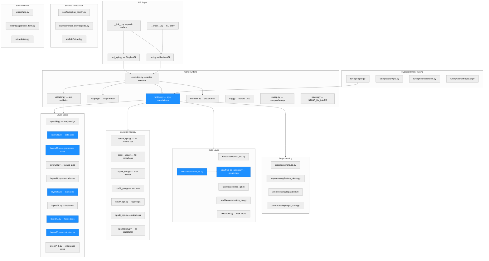
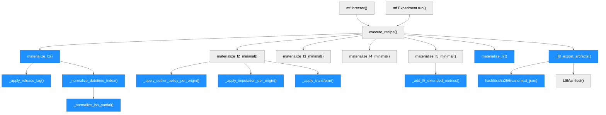
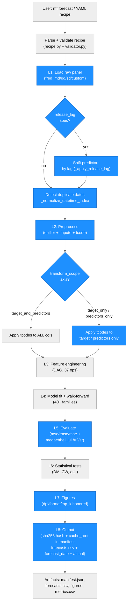

# macroforecast — Architecture

> Generated by scriber for run `2026-05-15-phase-audit-fix-p0-p1-bundle` on 2026-05-15.
> Updated: Cycle 12 — P0+P1 audit-fix bundle (15 source fixes + P2 docs bundle).
> HEAD `0ba30de2` (docs commit) on `main`, server1 `~/project/macroforecast`.

## Overview

`macroforecast` is a Python package (3.10+) for fair, reproducible macroeconomic forecasting benchmarking. The central abstraction is a **YAML recipe** that specifies an end-to-end study across 8 ordered layers (L0–L8): study design, data ingestion, preprocessing, feature engineering, model fitting, evaluation, interpretation, and output/caching. A single recipe produces bit-exact replications. The package ships a Simple API (`mf.forecast`, `mf.Experiment`) for exploratory use and a full Recipe API (`mf.run`) for production study runs. External dependencies include `pandas`, `numpy`, `statsmodels`, `scikit-learn`, `PyYAML`, `requests`, and optional extras (`shap`, `xgboost`, `lightgbm`, `catboost`, `torch`).

---

## Module Structure

### Module Reference

| Module / File | Layer | Purpose | Key Exports | Changed (Cycle 12) |
| --- | --- | --- | --- | --- |
| `macroforecast/api_high.py` | API | Simple API: `mf.forecast`, `mf.Experiment` | `forecast()`, `Experiment` | no |
| `macroforecast/api.py` | API | Recipe API: `mf.run`, `mf.replicate` | `run()`, `replicate()` | no |
| `macroforecast/__init__.py` | API | Public surface re-exports | all public names | no |
| `macroforecast/core/runtime.py` | Core | Layer materializers for L1–L8; all fix sites | `materialize_l*`, helpers | **yes** (F-P0-1, F-P1-1..14) |
| `macroforecast/core/execution.py` | Core | Recipe executor, walk-forward orchestration | `execute_recipe()` | no |
| `macroforecast/core/recipe.py` | Core | YAML recipe loader + merge with defaults | `load_recipe()` | no |
| `macroforecast/core/validator.py` | Core | Axis validation dispatcher | `validate_layer()` | no |
| `macroforecast/core/manifest.py` | Core | Provenance + manifest construction | `L8Manifest` | no |
| `macroforecast/core/layers/l1.py` | Layers | L1 data axis spec + `_normalize_iso_partial` | `L1Axes`, `_is_iso_date` | **yes** (F-P0-1) |
| `macroforecast/core/layers/l2.py` | Layers | L2 preprocessing axis spec | `L2Axes`, `temporal_rule` | no |
| `macroforecast/core/layers/l5.py` | Layers | L5 eval axis spec + future-rejection guards | `L5Axes`, `_validate_metric_options` | **yes** (F-P1-9) |
| `macroforecast/core/layers/l7.py` | Layers | L7 figure axis spec | `L7Axes` | no |
| `macroforecast/core/layers/l8.py` | Layers | L8 output axis spec | `L8Axes` | no |
| `macroforecast/core/figures.py` | Core | Matplotlib figure renderers | `render_bar_global`, `render_default_for_op` | **yes** (F-P1-11) |
| `macroforecast/core/ops/l3_ops.py` | Ops | 37 feature engineering operators | `l3_op_*` functions | no |
| `macroforecast/raw/datasets/fred_sd.py` | Raw | FRED-SD state-level panel loader | `load_fred_sd()` | no |
| `macroforecast/raw/fred_sd_groups.py` | Raw | FRED-SD variable group → column mapping | `resolve_fred_sd_variable_group()` | **yes** (F-P1-7 wired) |
| `macroforecast/defaults.py` | API | Default values for all axes | `DEFAULT_*` | no |
| `macroforecast/custom.py` | API | Custom model decorator | `@custom_model` | no |
| `macroforecast/tuning/engine.py` | Tuning | HP search orchestrator | `TuningEngine` | no |
| `macroforecast/wizard/app.py` | Wizard | Solara web UI entry | `app` | no |

---

## Function Call Graph

### Main Pipeline (Simple API → L1 → L8)

### Function Reference

| Function | Defined In | Calls | Changed | Purpose |
| --- | --- | --- | --- | --- |
| `_normalize_iso_partial()` | `layers/l1.py` | `date.fromisoformat`, `calendar.monthrange` | **yes** (F-P0-1 new) | Accept YYYY / YYYY-MM / YYYY-MM-DD; normalize to full date |
| `_is_iso_date()` | `layers/l1.py` | `_normalize_iso_partial` | **yes** (F-P0-1 rewritten) | Predicate wrapping `_normalize_iso_partial` |
| `_apply_release_lag()` | `runtime.py` | pandas `.shift()` | **yes** (F-P1-1 new) | Shift predictor columns by release-lag spec |
| `_normalize_datetime_index()` | `runtime.py` | `pd.to_datetime`, `is_unique` check | **yes** (F-P1-4) | Sort dates; detect + raise on duplicates |
| `_read_custom_panel_path()` | `runtime.py` | file peek, CSV read | **yes** (F-P1-5) | Detect Transform: header; raise with hint |
| `_resolve_fred_sd_states()` | `runtime.py` | `leaf_config` key lookup | **yes** (F-P1-6) | Apply sd_states filter to columns |
| `resolve_fred_sd_variable_group()` | `raw/fred_sd_groups.py` | group map lookup | **yes** (F-P1-7 wired) | Resolve group name to variable list |
| `_apply_outlier_policy_per_origin()` | `runtime.py` | winsorize / IQR / MAD helpers | **yes** (F-P1-3 new) | Per-origin outlier clipping in walk-forward |
| `_apply_imputation_per_origin()` | `runtime.py` | ffill / mean helpers | **yes** (F-P1-2 new) | Per-origin imputation in walk-forward |
| `_apply_transform()` | `runtime.py` | tcode application loop | **yes** (F-P1-14) | Gate tcode loop by transform_scope axis |
| `_add_l5_extended_metrics()` | `runtime.py` | group-by aggregation | **yes** (F-P1-8 new) | Compute medae, theil_u1, theil_u2, success_ratio |
| `_validate_metric_options()` | `layers/l5.py` | axis value checks | **yes** (F-P1-9) | Future-rejection for unimplemented L5 axes |
| `render_bar_global()` | `core/figures.py` | matplotlib | **yes** (F-P1-11) | Bar chart; now accepts `dpi`, `top_k` kwargs |
| `render_default_for_op()` | `core/figures.py` | matplotlib | **yes** (F-P1-11) | Dispatch to figure type; now respects `dpi`, `top_k` |
| `_l8_export_artifacts()` | `runtime.py` | `_compute_forecast_date`, `_lookup_actual`, `hashlib.sha256` | **yes** (F-P1-10/12/13) | Export forecasts.csv with forecast_date+actual; sha256 hash; manifest cache_root |

---

## Data Flow

---

## Architectural Patterns

- **Layer-as-specification**: Each layer (L0–L8) has a dedicated `layers/l{n}.py` that defines the axis schema (validated) independently from `runtime.py` which materializes the layer. Validation and execution are cleanly separated.
- **Walk-forward closure**: L4 walk-forward uses a closure (`_per_origin_callable`) that captures per-origin state. Cycle 12 inserted per-origin imputation and outlier policy into this closure (F-P1-2, F-P1-3), extending the pattern correctly.
- **Operator registry**: Feature (L3), model (L4), evaluation (L5), test (L6), figure (L7), and output (L8) operators are registered in `ops/` and dispatched via `ops/registry.py`. Adding a new operator requires one entry in the ops file and one in the registry — no runtime.py changes.
- **Extras guard**: Optional dependencies (SHAP, XGBoost, LightGBM, CatBoost, torch) are import-guarded. Missing extras raise `ImportError` with an install hint, not `AttributeError`.
- **SHA-256 canonical hash (Cycle 12 new)**: Recipe identity is now `hashlib.sha256(json.dumps(recipe, sort_keys=True, default=str, separators=(",",":")))[:16]`. Cross-process stable, replacing Python `hash()` which was PYTHONHASHSEED-salted.
- **FRED-SD dual-site wiring**: `_load_official_raw_result` has two FRED-SD branches (primary + regional). F-P1-6/7 wired state filters and variable group resolution into both branches symmetrically.

---

## Notes

- `runtime.py` is the largest single file (~14 000 lines). Cycle 12 added ~320 lines across 15 fix sites. All fixes are clearly marked with `# F-P{n}-{m} fix:` comments for auditability.
- The `l*_5.py` diagnostic layers (L1.5, L2.5, L3.5, L4.5) are validated but their per-axis walk is incomplete — they are documented only via `plans/` per the CONVENTIONS rule.
- 40+ L4 model families: count reflects all registered operators in `ops/l4_ops.py` + `scaffold/option_docs/l4.py`. README and docs now say "40+" (version-agnostic) after Cycle 12 P2-C fix.
- Sphinx 9.1.0 in the project `.venv` — build tested Sphinx -W clean post-Cycle-12 docs edits.
