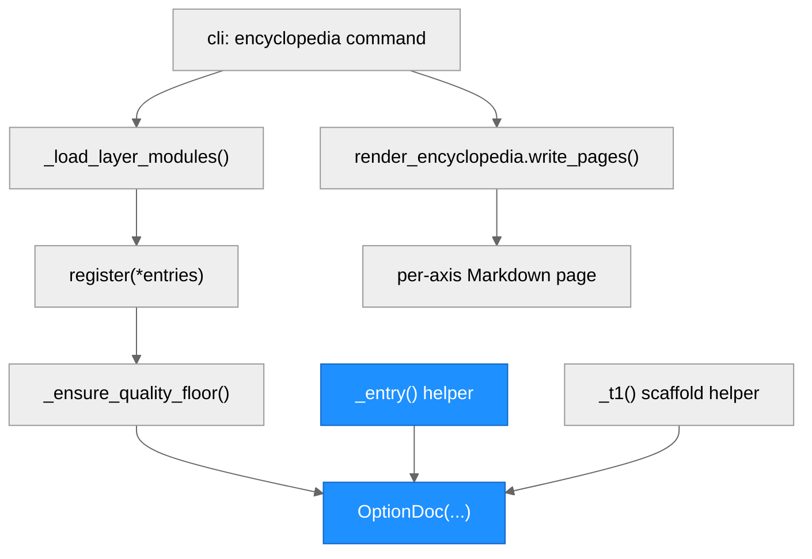
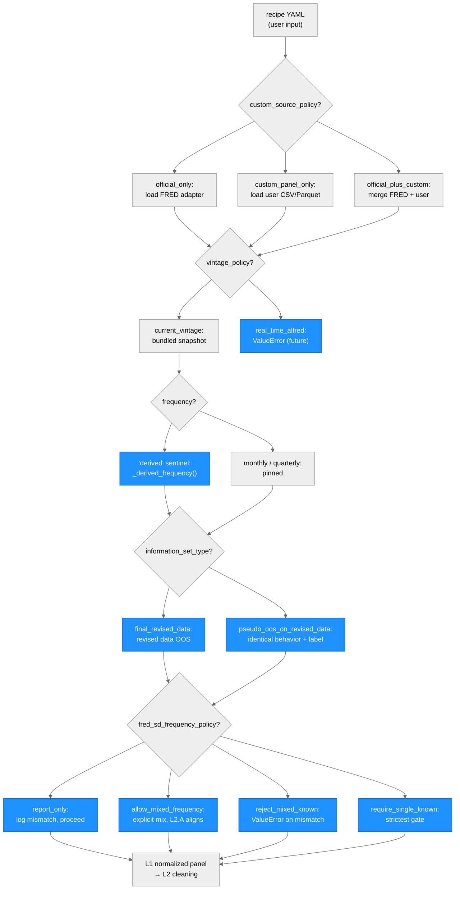

<!-- ARCHITECTURE.md — macroforecast scaffold/option_docs subsystem -->
<!-- Generated: 2026-05-16, Cycle 17 Builder O-1 -->

# macroforecast — Architecture Diagram

## System Architecture

### Module Structure

```mermaid
%%{init: {'theme': 'neutral'}}%%
graph TD
    subgraph API["API Layer"]
        CLI["scaffold/cli.py\n(CLI entry point)"]
        MAIN["scaffold/__main__.py\n(module runner)"]
    end

    subgraph Scaffold["Scaffold Layer"]
        SINIT["scaffold/__init__.py\n(register() + load)"]
        BUILDER["scaffold/builder.py\n(recipe builder)"]
        WIZARD["scaffold/wizard.py\n(interactive wizard)"]
        INTROSPECT["scaffold/introspect.py\n(schema introspection)"]
        TEMPLATES["scaffold/templates.py\n(Jinja2 templates)"]
        RENC["scaffold/render_encyclopedia.py\n(encyclopedia writer)"]
        RERST["scaffold/render_rst.py\n(RST generator)"]
    end

    subgraph OptionDocs["Option Docs Registry"]
        ODINIT["option_docs/__init__.py\n(OPTION_DOCS dict)"]
        TYPES["option_docs/types.py\n(OptionDoc dataclasses)"]
        L0["option_docs/l0.py\n(Workflow axes)"]
        L1["option_docs/l1.py\n(Data definition — CHANGED)"]
        L2["option_docs/l2.py\n(Cleaning/alignment)"]
        L3["option_docs/l3.py\n(Feature engineering)"]
        L4["option_docs/l4.py\n(Model)"]
        L5["option_docs/l5.py\n(Evaluation)"]
        L6["option_docs/l6.py\n(Output)"]
        L7["option_docs/l7.py\n(Figures)"]
        L7A["option_docs/l7_a.py\n(Figure sub-axes)"]
        L8["option_docs/l8.py\n(Deployment)"]
        DIAG["option_docs/diagnostics.py\n(completeness checks)"]
    end

    CLI --> SINIT
    MAIN --> SINIT
    SINIT --> BUILDER
    SINIT --> WIZARD
    SINIT --> RENC
    SINIT --> INTROSPECT
    BUILDER --> TEMPLATES
    WIZARD --> ODINIT
    RENC --> ODINIT
    RERST --> ODINIT
    ODINIT --> TYPES
    ODINIT --> L0
    ODINIT --> L1
    ODINIT --> L2
    ODINIT --> L3
    ODINIT --> L4
    ODINIT --> L5
    ODINIT --> L6
    ODINIT --> L7
    ODINIT --> L7A
    ODINIT --> L8
    ODINIT --> DIAG

    style L1 fill:#1e90ff,stroke:#1565c0,color:#fff
```

| Module | Purpose | Key Dependencies | Changed in This Run |
|---|---|---|---|
| `scaffold/__init__.py` | Exposes `register()` function; triggers auto-load of layer modules | `option_docs/__init__.py` | No |
| `scaffold/cli.py` | CLI entry point for `macroforecast.scaffold` commands (`encyclopedia`, `wizard`, `inspect`) | `scaffold/__init__.py` | No |
| `scaffold/render_encyclopedia.py` | Writes per-axis Markdown pages to `docs/encyclopedia/` | `option_docs/__init__.py`, `templates.py` | No |
| `scaffold/render_rst.py` | Writes RST fragments for Sphinx autodoc | `option_docs/__init__.py` | No |
| `scaffold/wizard.py` | Interactive recipe authoring wizard; surfaces `OptionDoc` on `?` | `option_docs/__init__.py` | No |
| `option_docs/__init__.py` | Global `OPTION_DOCS` dict; quality-floor enforcement; auto-loads layer modules | `types.py`, all layer modules | No |
| `option_docs/types.py` | `OptionDoc`, `Reference`, `CodeExample`, `ParameterDoc` dataclasses | — | No |
| `option_docs/l1.py` | L1 (data definition) option documentation: 26 axes, ~90 entries across L1.A–L1.G | `types.py`, `register()` | **YES** |
| `option_docs/l0.py` | L0 (workflow) option documentation | `types.py`, `register()` | No |
| `option_docs/l2.py`–`l8.py` | L2–L8 option documentation (cleaning, features, model, eval, output, figures, deploy) | `types.py`, `register()` | No |
| `option_docs/diagnostics.py` | Completeness checks; flags entries with `last_reviewed=""` | `option_docs/__init__.py` | No |

---

### Function Call Graph

| Function | Purpose | Key Dependencies | Changed in This Run |
|---|---|---|---|
| `_entry()` in `l1.py` | Helper that constructs an `OptionDoc` with L1-specific defaults (`layer="l1"`, `last_reviewed=_REVIEWED`) | `OptionDoc` | Indirectly (callers promoted) |
| `_t1()` in `l1.py` | Scaffold helper for long-tail axes; identical structure to `_entry()` but with 2026-05-05 review date | `OptionDoc` | No (fred_sd_freq ops migrated away from `_t1`) |
| `register(*entries)` | Inserts `OptionDoc` objects into global `OPTION_DOCS` dict; applies `_ensure_quality_floor()` | `option_docs/__init__.py` | No |
| `_ensure_quality_floor()` | Tops up `description`/`when_to_use` with axis-context tail when entry is too short | `OptionDoc` | No |
| `render_encyclopedia.write_pages()` | Writes per-axis Markdown to output directory | `OPTION_DOCS`, `templates.py` | No |

---

### Data Flow

| Node | Role | Changed in This Run |
|---|---|---|
| `real_time_alfred` | Future feature; raises `ValueError` at validation in all v0.9.x | **YES** — new OptionDoc entry |
| `'derived'` sentinel | Auto-resolves to `monthly`/`quarterly` via `_derived_frequency()` at L1 normalization | **YES** — sentinel documented in both `monthly`/`quarterly` entries |
| `final_revised_data` | Standard pseudo-OOS on currently-published revised data | **YES** — richer prose + Stark-Croushore/Faust-Wright refs |
| `pseudo_oos_on_revised_data` | Semantic synonym for `final_revised_data` in v0.9.x | **YES** — numerical-equivalence note + refs |
| `report_only` | Log frequency mismatch, proceed | **YES** — upgraded from `_t1()` scaffold |
| `allow_mixed_frequency` | Explicit mixed-frequency permission | **YES** — upgraded from `_t1()` scaffold |
| `reject_mixed_known_frequency` | Hard-reject on known-frequency mismatch only | **YES** — upgraded from `_t1()` scaffold |
| `require_single_known_frequency` | Strictest: reject unknown + mismatched | **YES** — upgraded from `_t1()` scaffold |
