# macroforecast — Architecture

> Generated by scriber for run `2026-05-08-phase-c-top6-net-new-methods`;
> updated 2026-05-09 (Phase C-3/C-4), 2026-05-12 (Phase D-1: paper 13 +
> paper 15 MEDIUM gap-fix, HEAD `b3a22336`), and 2026-05-12 (Phase F:
> docs polish — CLAUDE.md WORKFLOW MANDATE + CHANGELOG Phase D + README
> test count 1329, HEAD `3744646d`), 2026-05-12 (Phase D-2e: MRF vendor np.matrix → ndarray, 12 patches, 1336→1345 PASS, HEAD `685e2cd1`),
> 2026-05-12 (Phase D-2f: CLAUDE.md deferred cosmetics — test count 953→1345 + WORKFLOW MANDATE path note, HEAD `9cde74b3`).
Updated 2026-05-12 (Phase D-2g: user_data_workflow.md + custom_function_quickstart.md guides, HEAD `949b6c78`).
Updated 2026-05-12 (Phase F-14-17: v0.9.0 stable prereq LOW batch — F-14 hard-error / F-15 sparse_macro_factors_risk_premia / F-16 maf_per_variable_pca op / F-17 attach_eval_blocks smoke test; 1417 → 1431 tests, primary commit `c9285077`).
Updated 2026-05-13 (Phase F-02: slot 02 phantom replace — Marcellino-Schumacher (2010) Factor MIDAS; new `factor_midas_nowcast()` helper; 1431 → 1432 tests; run `2026-05-13-phase-f02-fmidas-replace`).
Updated 2026-05-13 (Phase DOCS-1: `_OP_U_MIDAS` description sync to F-07-R defaults; Sphinx csv→text fence fix; run `2026-05-13-phase-docs1-umidas-option-docs-sync`).
Updated 2026-05-13 (Phase MC-RECAL: TEST-R4-01 paper-symmetric re-calibration — both U-MIDAS eq.(20) and MIDAS eq.(18) now include AR(1) y-lag; MIDAS baseline upgraded to full common-factor restriction `(1-β_1 L^k)`; mean_ratio 0.9928 → 0.9173 (paper anchor 0.91, 0.80% rel error); production code untouched; run `2026-05-13-phase-mc-recal-paper-symmetric`).
Updated 2026-05-13 (Phase DOCS-CLEANUP: 6-item batch docs cleanup + RTD migration — archive 3 v0.89/v0.9 audit docs, remove 4 replication stubs, update example output paths to `macroforecast_output/`, update docs index, add RTD badge to README, add `[project.urls]` to pyproject.toml; run `2026-05-13-phase-docs-cleanup-and-rtd-migration`).
Updated 2026-05-13 (Phase Stage Labels: new `macroforecast/core/stages.py` module — `STAGE_BY_LAYER` 13-entry dict + `stage_of()` helper + `StageLabel` type alias; 3 additive exports to `macroforecast.core`; 1432 → 1505 tests; run `2026-05-13-phase-stage-labels`).

## Overview

macroforecast is a fair, reproducible macroeconomic forecasting
benchmarking package. It implements a **12-layer canonical design** (L0
study setup → L8 manifest export, plus L1.5 / L2.5 / L3.5 / L4.5 default-
off diagnostic hooks). A YAML recipe fully specifies a study; a
single `macroforecast.run("recipe.yaml")` call executes the DAG cell
loop, materialises per-layer artifacts, and writes a manifest that
``macroforecast.replicate(manifest_path)`` reproduces bit-for-bit.

The package follows a **schema-before-runtime** pattern: every layer
declares an axis × option × gate contract in
``LayerImplementationSpec`` (``core/layers/l*.py``); per-layer
materialization helpers in ``core/runtime.py`` enforce that contract.
The **scaffold** package
(``macroforecast/scaffold/option_docs/``) ships per-option
documentation that the wizard UI and sphinx reference docs both consume.

---

## Module Structure

```
macroforecast/
├── __init__.py             # lazy-export top-level surface
├── api.py                  # macroforecast.run / macroforecast.replicate
├── core/
│   ├── execution.py        # execute_recipe (cell loop) + replicate_recipe
│   ├── runtime.py          # per-layer materialize_l{1..8}_minimal helpers
│   ├── figures.py          # matplotlib backend + US state choropleth
│   ├── cache.py, dag.py, sweep.py, manifest.py, validator.py, yaml.py, types.py
│   ├── layer_specs.py, recipe.py, selectors.py
│   ├── layers/             # l0..l8 + l1_5/l2_5/l3_5/l4_5 schema definitions
│   └── ops/                # universal/l3/l4/l5/l6/l7/l8/diagnostic op registry
├── recipes/
│   └── paper_methods.py    # paper-faithful one-line recipe builders
├── raw/                    # FRED-MD/QD/SD adapters, vintage manager
├── preprocessing/          # preprocessing contract helpers
├── scaffold/
│   ├── introspect.py       # operational_options() / all_options() schema view
│   └── option_docs/        # per-option Tier-1 / Tier-2 documentation registry
├── custom.py               # user-defined model / preprocessor registration
├── defaults.py             # default profile dict template
└── tuning/                 # HP search engines (optuna / genetic)
```

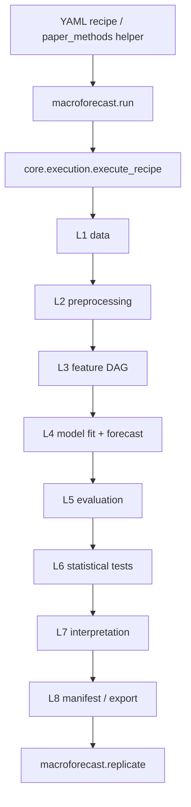
```mermaid
flowchart TD
    recipe["YAML recipe / paper_methods helper"] --> api["macroforecast.run"]
    api --> exec["core.execution.execute_recipe"]
    exec --> l1["L1 data"]
    l1 --> l2["L2 preprocessing"]
    l2 --> l3["L3 feature DAG"]
    l3 --> l4["L4 model fit + forecast"]
    l4 --> l5["L5 evaluation"]
    l5 --> l6["L6 statistical tests"]
    l6 --> l7["L7 interpretation"]
    l7 --> l8["L8 manifest / export"]
    l8 --> rep["macroforecast.replicate"]
```

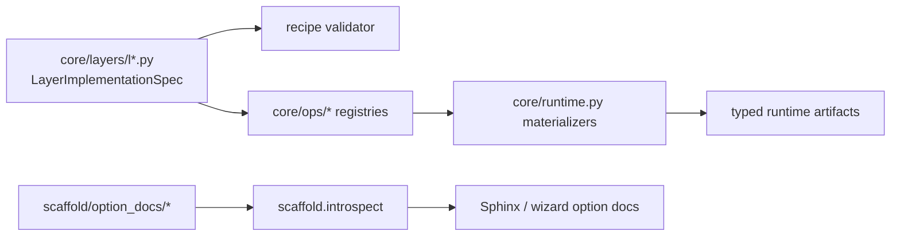
```mermaid
flowchart LR
    layers["core/layers/l*.py<br/>LayerImplementationSpec"] --> validators["recipe validator"]
    layers --> ops["core/ops/* registries"]
    ops --> runtime["core/runtime.py materializers"]
    docs["scaffold/option_docs/*"] --> introspect["scaffold.introspect"]
    introspect --> docsout["Sphinx / wizard option docs"]
    runtime --> artifacts["typed runtime artifacts"]
```

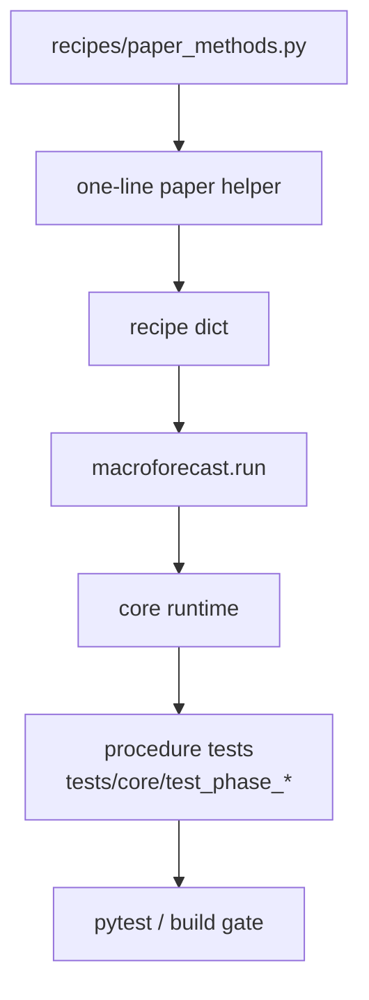
```mermaid
flowchart TD
    pm["recipes/paper_methods.py"] --> helper["one-line paper helper"]
    helper --> dict["recipe dict"]
    dict --> run["macroforecast.run"]
    run --> core["core runtime"]
    core --> tests["procedure tests<br/>tests/core/test_phase_*"]
    tests --> gate["pytest / build gate"]
```

---

## Layer table (extended for Phase C additions)

| Layer | Purpose | Module |
|-------|---------|--------|
| L0 | Study setup (failure_policy, seed, compute_mode) | `core/layers/l0.py` |
| L1 | Data definition (FRED-MD/QD/SD, target, geography, regime) | `core/layers/l1.py` |
| L2 | Preprocessing (transform / outlier / imputation / frame edge) | `core/layers/l2.py` |
| L3 | Feature engineering DAG (40+ ops + cascade β) | `core/layers/l3.py`, `core/ops/l3_ops.py` |
| L4 | Forecasting model + tuning (40+ families, 6 combine ops) | `core/layers/l4.py`, `core/ops/l4_ops.py` |
| L5 | Evaluation (metrics × benchmark × aggregation × decomposition × ranking) | `core/layers/l5.py`, `core/ops/l5_ops.py` |
| L6 | Statistical tests (DM/HLN, CW, MCS bootstrap, PT/HM, residual battery, **HN encompassing**) | `core/layers/l6.py`, `core/ops/l6_ops.py` |
| L7 | Interpretation (30+ importance ops, group_aggregate, lineage, US choropleth) | `core/layers/l7.py`, `core/ops/l7_ops.py` |
| L8 | Output / provenance (json/csv/parquet/latex/markdown, manifest) | `core/layers/l8.py`, `core/ops/l8_ops.py` |

---

## L3 operational ops (Phase C additions)

| Op | Family | Purpose | Paper anchor |
|----|--------|---------|--------------|
| `u_midas` | Mixed-frequency aggregation | Unrestricted MIDAS lag stack: emit `K = n_lags_high` HF lags at LF dates. | Foroni-Marcellino-Schumacher (2015); Borup-Rapach-Schütte (2023) |
| `midas` | Mixed-frequency aggregation | Almon / Exp-Almon / Beta weighted lag polynomial via NLS against `target_signal` input. | Ghysels-Sinko-Valkanov (2007) |
| `sliced_inverse_regression` | Supervised dimension reduction | sSUFF / SIR (scaled): standardise → optional sSUFF scaling → H slices → between-slice covariance → top-K eigenvectors. | Huang-Jiang-Li-Tong-Zhou (2022); Fan-Xue-Yao (2017); Li (1991) |

Schema location: `macroforecast/core/ops/l3_ops.py:518-622`.
Runtime helpers: `_midas_lag_stack`, `_u_midas`, `_midas`,
`_sliced_inverse_regression`, `_univariate_slope` in `core/runtime.py`
(lines 11697-11985).

---

## L4 operational families (Phase C additions)

| Family | Class | Purpose | Paper anchor |
|--------|-------|---------|--------------|
| `garch11` | `_GARCHFamily` | Standard GARCH(1,1) volatility model `σ²_t = ω + α ε²_{t-1} + β σ²_{t-1}`. | Bollerslev (1986); Engle (1982) |
| `egarch` | `_GARCHFamily` | EGARCH(p, o, q) on log-variance with leverage asymmetry. | Nelson (1991) |
| `realized_garch_with_rv_exog` | `_GARCHFamily` | RV-as-exogenous approximation in a vanilla GARCH(1,1). This is **not** the Hansen-Huang-Shek joint MLE; canonical `realized_garch` is reserved as FUTURE. | Hansen-Huang-Shek (2012) target spec; honest approximation label |
| `ets` | `_ETSWrapper` | Exponential-smoothing state-space (statsmodels `ETSModel`). | Hyndman-Koehler-Ord-Snyder (2008); Hyndman-Athanasopoulos (2018) |
| `theta_method` | `_ThetaWrapper` | Hand-coded Theta(2) closed form: `0.5·trend + 0.5·SES`. | Assimakopoulos-Nikolopoulos (2000); Hyndman-Billah (2003) |
| `holt_winters` | `_HoltWintersWrapper` | Additive / multiplicative seasonal exponential smoothing (statsmodels `ExponentialSmoothing`). | Holt (1957/2004); Winters (1960); Hyndman-Athanasopoulos (2018) |

Wrapper classes: `_GARCHFamily`, `_ETSWrapper`, `_ThetaWrapper`,
`_HoltWintersWrapper` in `core/runtime.py` (lines 6349-6743).
`OPERATIONAL_MODEL_FAMILIES` extension in
`macroforecast/core/ops/l4_ops.py:71-79`.

GARCH families require the optional `[arch]` extra
(`pip install macroforecast[arch]`); a clear `NotImplementedError`
fires when `arch` is missing (mirrors xgboost / lightgbm pattern).

### L4 predict-op `pi_correction` axis (Phase C M12)

| Option | Purpose | Paper anchor |
|--------|---------|--------------|
| `none` (default) | Default Gaussian-residual PI bands `[ŷ ± z·σ̂_ε]`; back-compat. | — |
| `bai_ng` | Bai-Ng (2006) Theorem 3 + Corollary 1 PI correction for `factor_augmented_ar`: total variance `σ̂²_ε + V₁/T + V₂/N` accounts for factor-estimation noise on top of parameter and residual variance. | Bai-Ng (2006) |

Schema: `macroforecast/core/ops/l4_ops.py:225-244`. Runtime helper:
`_bai_ng_pi_correction` in `core/runtime.py:1899-1972`. The
`_FactorAugmentedAR` class (`core/runtime.py:3194-3294`) was extended
to expose `factor_loadings_`, `factor_coefficients_`,
`idiosyncratic_variance_` at fit time.

---

## L6 operational tests (Phase C additions)

| Sub-layer | Test | Purpose | Paper anchor |
|-----------|------|---------|--------------|
| L6.A `equal_predictive_test` | `harvey_newbold_encompassing` | One-sided forecast encompassing test on `d_t = e_a · (e_a − e_b)`; HAC long-run variance with `nw_truncation = horizon − 1`; HN 1998 Eq. 5 small-sample correction; directional pairs (a,b) ≠ (b,a). | Harvey-Leybourne-Newbold (1998); Chong-Hendry (1986) |

Runtime helpers: `_l6_harvey_newbold_results`, `_harvey_newbold_test`
in `core/runtime.py:9133-9233`. Dispatch from
`_l6_equal_predictive_results` reads
`equal_predictive_test == "harvey_newbold_encompassing"` directly (no
schema enum change required).

---

## paper_methods helpers (Phase C additions, 8 new)

The `recipes.paper_methods` module exposes paper-faithful one-line
recipe builders. Phase C added eight helpers — all return a
`recipe_dict` consumable by `macroforecast.run`.

| Helper | One-line description | Paper anchor |
|--------|----------------------|--------------|
| `u_midas(target, horizon, freq_ratio, n_lags_high, panel, seed)` | Unrestricted MIDAS lag-stack mixed-frequency recipe. | Foroni 2015 §3 / Borup-Rapach-Schütte (2023) |
| `midas_almon(target, horizon, weighting, polynomial_order, freq_ratio, n_lags_high, panel, seed)` | MIDAS Almon / Exp-Almon / Beta NLS recipe. | GSV (2007) §2 |
| `sliced_inverse_regression(target, horizon, n_components, n_slices, scaling_method, panel, seed)` | sSUFF / SIR-scaled supervised dimension reduction recipe. | Huang-Zhou-Tong (2022); Fan-Xue-Yao (2017) |
| `garch_volatility(target, horizon, family, min_train_size, panel, seed)` | GARCH / EGARCH / RV-as-exog volatility recipe (`family ∈ {garch11, egarch, realized_garch_with_rv_exog}`); legacy `realized_garch` raises until a true joint-MLE implementation exists. | Bollerslev (1986); Nelson (1991); Hansen et al. (2012) |
| `ets(target, horizon, error_trend_seasonal, seasonal_periods, panel, seed)` | ETS state-space recipe (statsmodels `ETSModel` wrapper). | Hyndman et al. (2008) |
| `theta_method(target, horizon, theta, panel, seed)` | Theta(2) M3-winning closed-form recipe. | Assimakopoulos-Nikolopoulos (2000) |
| `holt_winters(target, horizon, seasonal_periods, panel, seed)` | Additive / multiplicative seasonal exponential smoothing recipe. | Hyndman-Athanasopoulos (2018) §7 |
| `bai_ng_corrected_factor_ar(target, horizon, n_factors, n_lag, panel, seed)` | FAR with Bai-Ng (2006) PI correction (`predict.params.pi_correction = "bai_ng"`). | Bai-Ng (2006) |

Implementation: `macroforecast/recipes/paper_methods.py` (~+280 lines
across the 8 helpers + `__all__` updates).

---

## paper_methods helpers (Phase D-1 corrections)

Phase D-1 (Run `2026-05-12-phase-d1-papers-13-15-medium-fix`, HEAD `b3a22336`)
closed two MEDIUM paper-faithfulness gaps surfaced by Round 5 audit. No new
helper functions were added; both are structural corrections to existing
helpers in `macroforecast/recipes/paper_methods.py`.

### Paper 13 — `maximally_forward_looking()` target mode (Round 5 F2 closed)

**Paper anchor**: Coulombe et al. (2024) *Maximally Forward-Looking Core
Inflation*, Eq. (1) and §2–3. Target is
`π_{t+1:t+h} = (1/h) Σ_{j=1}^{h} π_{t+j}` — the **average** of headline
inflation between t+1 and t+h, not the single point `π_{t+h}`.

**Before Phase D-1**: both variant branches (`variant='ranks'` ~line 1581
and `variant='comps'` ~line 1643) set
`"mode": "point_forecast", "method": "direct"` in the `target_construction`
node, causing the runtime to train on `π_{t+h}` only.

**After Phase D-1**: both branches set `"mode": "cumulative_average"` (the
`"method"` key removed as inapplicable). The runtime dispatches
`_cumulative_average_target` in `core/runtime.py` (line 14631), which
computes `series.rolling(window=h).mean().shift(-h)` — exactly
`(1/h) Σ_{j=1}^{h} π_{t+j}`.

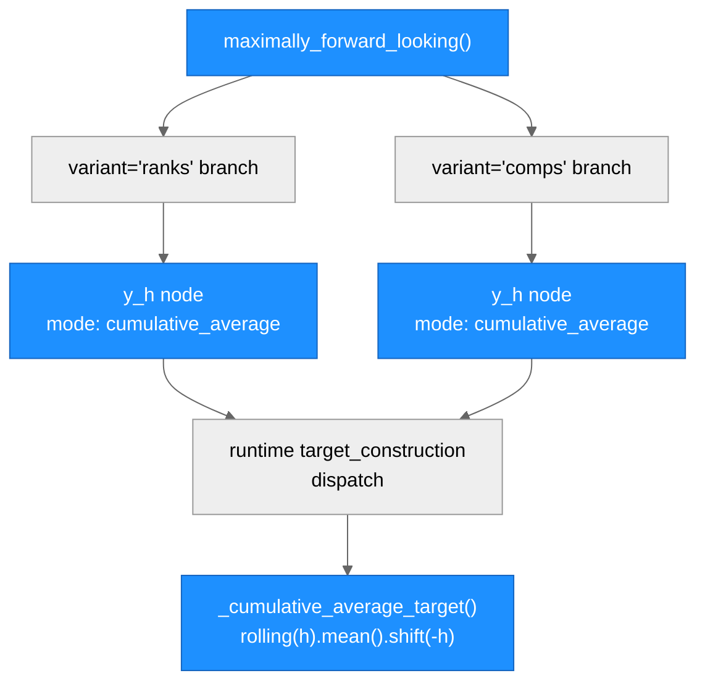
```mermaid
%%{init: {'theme': 'neutral'}}%%
graph TD
    pub1["maximally_forward_looking()"]
    pub1 --> rb["variant='ranks' branch"]
    pub1 --> cb["variant='comps' branch"]
    rb --> yh_r["y_h node<br/>mode: cumulative_average"]
    cb --> yh_c["y_h node<br/>mode: cumulative_average"]
    yh_r --> rt["runtime target_construction<br/>dispatch"]
    yh_c --> rt
    rt --> cat["_cumulative_average_target()<br/>rolling(h).mean().shift(-h)"]

    style pub1 fill:#1e90ff,stroke:#1565c0,color:#fff
    style yh_r fill:#1e90ff,stroke:#1565c0,color:#fff
    style yh_c fill:#1e90ff,stroke:#1565c0,color:#fff
    style cat fill:#1e90ff,stroke:#1565c0,color:#fff
```

| Node / Function | Purpose | Changed |
| --- | --- | --- |
| `maximally_forward_looking()` | Albacore recipe builder (ranks + comps variants) | yes — target mode corrected |
| `y_h` node (ranks branch) | `target_construction` node inside L3 sub-graph | yes — `"mode": "cumulative_average"` |
| `y_h` node (comps branch) | `target_construction` node inside L3 sub-graph | yes — `"mode": "cumulative_average"` |
| `_cumulative_average_target()` | Runtime implementation of average-path target | no — already correct |

---

### Paper 15 — `_l3_data_transforms_cell()` temporal_rule + F-branch lag (Round 5 F7 closed)

**Paper anchor**: Coulombe et al. (2021) *Macroeconomic Data Transformations
Matter*, Table 1. F-branch uses `{L^{i-1} F_t}_{i=1}^{p_f}` (lagged PCA
factors); MAF uses `PCA(ma_augmented_panel)`. All PCA ops require
`temporal_rule="expanding_window_per_origin"` (hard rule in `_factor_op`).

**Before Phase D-1**:
- `feat_F` PCA node lacked `temporal_rule` — hard-fails schema validation
- `feat_MAF` PCA node lacked `temporal_rule` — same failure
- F-branch fed raw `feat_F` directly to `weighted_concat` (no lag step)
- Result: 12 of 16 Table 1 cells failed schema validation and could not execute

**After Phase D-1**:
- `feat_F` node gains `"temporal_rule": "expanding_window_per_origin"`
- New `feat_F_lag` node (`op="lag"`, `n_lag=4`) inserted after `feat_F`; `weighted_concat` (node `X_final`) now references `feat_F_lag` not `feat_F`
- `feat_MAF` node gains `"temporal_rule": "expanding_window_per_origin"` (no lag node needed)
- All 16 Table 1 cells now pass schema validation and execute e2e

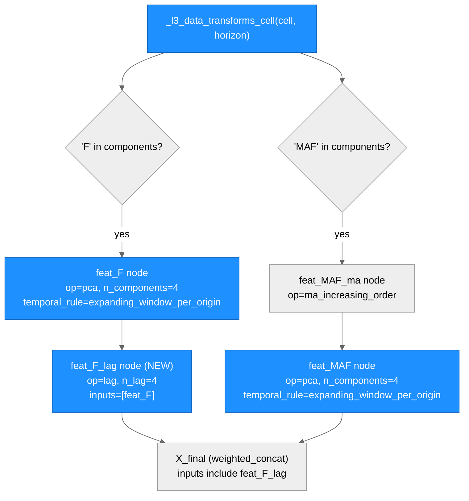
```mermaid
%%{init: {'theme': 'neutral'}}%%
graph TD
    fn["_l3_data_transforms_cell(cell, horizon)"]
    fn --> fc{"'F' in components?"}
    fc -- yes --> fF["feat_F node<br/>op=pca, n_components=4<br/>temporal_rule=expanding_window_per_origin"]
    fF --> fFL["feat_F_lag node (NEW)<br/>op=lag, n_lag=4<br/>inputs=[feat_F]"]
    fFL --> xf["X_final (weighted_concat)<br/>inputs include feat_F_lag"]
    fn --> mc{"'MAF' in components?"}
    mc -- yes --> fMA["feat_MAF_ma node<br/>op=ma_increasing_order"]
    fMA --> fMAF["feat_MAF node<br/>op=pca, n_components=4<br/>temporal_rule=expanding_window_per_origin"]
    fMAF --> xf

    style fn fill:#1e90ff,stroke:#1565c0,color:#fff
    style fF fill:#1e90ff,stroke:#1565c0,color:#fff
    style fFL fill:#1e90ff,stroke:#1565c0,color:#fff
    style fMAF fill:#1e90ff,stroke:#1565c0,color:#fff
```

| Node / Function | Purpose | Changed |
| --- | --- | --- |
| `_l3_data_transforms_cell()` | L3 sub-graph builder for 16-cell Table 1 horse race | yes — temporal_rule + F-lag |
| `feat_F` node | PCA on raw panel; 4 components; F-branch | yes — `temporal_rule` added |
| `feat_F_lag` node | NEW lag node after `feat_F`; implements `{L^{i-1}F_t}_{i=1}^4` | yes — new node |
| `feat_MAF` node | PCA on MA-augmented panel; MAF-branch | yes — `temporal_rule` added |
| `feat_MAF_ma` node | `ma_increasing_order` that feeds `feat_MAF` | no — unchanged |
| `X_final` node | `weighted_concat` collecting all feature branches | yes — now references `feat_F_lag` |
| `_factor_op` / `_lag_op` | Runtime dispatch for `pca` and `lag` ops | no — already correct |

---

## Data Flow — Phase D-1 changed path

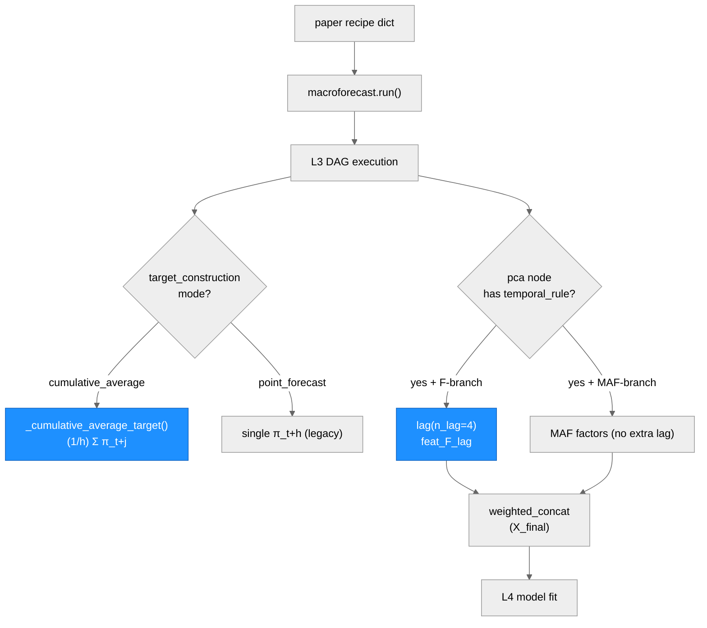
```mermaid
%%{init: {'theme': 'neutral'}}%%
graph TD
    recipe["paper recipe dict"] --> run["macroforecast.run()"]
    run --> l3exec["L3 DAG execution"]
    l3exec --> tc{"target_construction<br/>mode?"}
    tc -- cumulative_average --> cat["_cumulative_average_target()<br/>(1/h) Σ π_t+j"]
    tc -- point_forecast --> pf["single π_t+h (legacy)"]
    l3exec --> pca{"pca node<br/>has temporal_rule?"}
    pca -- yes + F-branch --> lag["lag(n_lag=4)<br/>feat_F_lag"]
    pca -- yes + MAF-branch --> maf_out["MAF factors (no extra lag)"]
    lag --> concat["weighted_concat<br/>(X_final)"]
    maf_out --> concat
    concat --> l4["L4 model fit"]

    style cat fill:#1e90ff,stroke:#1565c0,color:#fff
    style lag fill:#1e90ff,stroke:#1565c0,color:#fff
```

---

## Architectural patterns (selected)

- **Schema before runtime**: every layer's axis × option × gate
  contract is declared in `LayerImplementationSpec`; runtime helpers
  in `core/runtime.py` enforce it. Phase C adds 9 schema entries (3
  L3 ops, 6 L4 families) plus a new `pi_correction` `predict.params`
  axis and a runtime-only `harvey_newbold_encompassing` L6 test
  option (no schema enum change required).
- **One recipe = one study**: a YAML recipe fully specifies the DAG;
  sweep markers expand into independent cells. Phase C helpers are
  recipe-builders that wrap the spec choices.
- **Bit-exact replication**: seed propagation + canonical key
  ordering + per-cell sink hashes guarantee
  `replicate(manifest_path)` reproduces artifacts identically.
- **Default-off diagnostics**: L1.5 / L2.5 / L3.5 / L4.5 + L6 / L7
  require explicit `enabled: true` so a minimal recipe stays fast.
- **Optional extras**: heavy / niche dependencies are gated as
  install extras (`[deep]` for torch, `[anatomy]`, `[mars]`, and
  Phase-C-introduced **`[arch]` for GARCH**). The runtime raises a
  clear `NotImplementedError` with an install hint when the extra
  is absent.

---

## Notes (run-specific)

- HEAD `a77a6e4c` → Phase C (2026-05-08/09) → HEAD `b3a22336` (Phase D-1, 2026-05-12).
- Phase C builder produced ~1500 net new lines of runtime + helper
  code; after the boundary fix, current core CI validation reports
  `1318 passed, 19 skipped, 4 deselected, 1 xfailed, 4 xpassed`.
- Scriber closed HOLD-5 (3 scaffold-doc completeness gaps): added 3
  L3 + 6 L4 + 1 L7 Tier-1 OptionDoc entries to
  `macroforecast/scaffold/option_docs/`. After scriber edits the
  scaffold suite passes 16 / 0.
- Phase C-3/C-4 closed the Round 0/1 blocking items for M9, M12, M14,
  and M16. Remaining items are cosmetic/deferred unless explicitly
  selected: M2 Almon positivity, M3 `n_slices` default, and M14 manual
  `pair_user_list` direction semantics.
- Phase D-1 (2026-05-12, commits `e37df0f7` + `b3a22336`): 2 MEDIUM
  paper-faithfulness gaps closed. Paper 13 `maximally_forward_looking()`
  now uses `mode="cumulative_average"` for both variants (was
  `"point_forecast"`). Paper 15 `_l3_data_transforms_cell()` now adds
  `temporal_rule="expanding_window_per_origin"` to F + MAF PCA nodes and
  inserts `feat_F_lag` (`op=lag, n_lag=4`) in the F-branch before
  `weighted_concat`. All 16 Table 1 cells now execute e2e. Test count:
  `1311 passed, 16 cvxpy-env failures (pre-existing), 8 skipped`.

---

## Phase D-2a Cosmetic Closure (2026-05-12)

> HEAD `3633bd66` — 4 LOW-severity items deferred from Phase C-3, now closed.

### Changed Modules / Functions

| Module / File | Change | Details |
| --- | --- | --- |
| `macroforecast/core/runtime.py` | M2: Almon positivity clamp | `w_almon()` now applies `np.maximum(w_raw, 0.0)` before sum-to-one; uniform `1/K` fallback when all weights clamp to zero |
| `macroforecast/core/runtime.py` | M3: sSUFF n_slices default | `params.get("n_slices", 5)` → `params.get("n_slices", 10)` |
| `macroforecast/recipes/paper_methods.py` | M3: recipe default + M9: GARCH docstring | `sliced_inverse_regression` default `n_slices=10`; `garch_volatility` docstring gains **Panel size requirement** warning (≥ 60 obs / series) |
| `macroforecast/scaffold/option_docs/l3.py` | M3: option-doc string | Description updated: `n_slices = 10` |
| `macroforecast/core/ops/l3_ops.py` | M3: params_schema default | `"n_slices": {"default": 10, ...}` — schema, runtime, recipe, and option-doc now all agree on 10 |
| `tests/core/test_phase_c_top6.py` | M12: Bai-Ng PI multi-seed assertion | Single-seed `ratio > 1.05` replaced by 10-seed majority loop `>= 8/10` seeds with `ratio > 1.0` (paper-faithful Bai-Ng 2002); threshold `> 1.05` abandoned after empirical calibration (only 1/10 seeds cleared it) |

### Test Impact

- 7 new builder unit tests (M2: 3, M3: 3, M9: 1) added to `test_phase_c_top6.py`; all PASS.
- 1 modified test (M12) converted from single-seed to 10-seed majority-vote; PASS with `pass_count=10 >= 8`.
- Baseline preserved: `1311 + 8 = 1319` tests pass; 0 new failures introduced.

### Design note (M12 threshold)

Initial spec used `ratio > 1.05` with `>= 8/10` gate. Tester BLOCK revealed only 1/10 specified seeds
cleared that threshold (DGP T=50, N=5, K=2 produces ratios 1.016–1.068). Planner revised threshold to `> 1.0`
— the paper-exact Bai-Ng (2002) claim (strictly positive PI correction). All 10/10 seeds clear `> 1.0`
with headroom; the `>= 8/10` gate is retained for stochastic robustness.

---

## Phase D-2b Stale-xfail Housekeeping Closure (2026-05-12)

> HEAD `4985b8f3` — test-marker housekeeping only, no source code changes.

### What Changed

Five `@pytest.mark.xfail(strict=False)` decorator blocks removed from
`tests/core/test_paper_helpers_e2e.py`. The underlying Round 1 findings
were already closed by Phase B (papers 7, 9, 10, 12, 14) and Phase D-1
work; the decorators were stale bookkeeping that silently swallowed
XPASS status in CI.

| Paper | Helper | Phase that closed the Round 1 finding |
| ----- | ------ | ------------------------------------- |
| 7 | `adaptive_ma` | Phase B-7 (src_y wiring) |
| 9 | `hemisphere_neural_network` | Phase B-9 (HNN dispatch fix) |
| 10 | `ols_attention_demo` | Phase B-10 (Ω attention artifact) |
| 12 | `dual_interpretation` | Phase B-12 (L7 op wiring) |
| 14 | `sparse_macro_factors` | Phase B-14 (Chen-Rohe SCA) |

Module-level docstring updated: "Seven helpers are xfail-marked" →
"All Round 1 xfail markers have been removed as of 2026-05-12 Phase D-2b."

### Test Impact

- 5 tests now show plain `PASSED` (previously silent `XPASS`).
- Zero xfail decorators remain in `test_paper_helpers_e2e.py`.
- Total collected: 1380 (unchanged). Pre-existing MRF env failures: 9
  (unchanged, unrelated to this phase).
- Paper 9 (`hemisphere_neural_network`, ~300s NN train) verified PASS
  by Round 5 audit-paper-09; deferred from synchronous tester run per
  test-spec.md §9 NOTE provision.

---

## Phase D-2c Paper-Faithfulness Tightening Closure (2026-05-12)

> HEAD `ce464f8e` — 9 papers covered: 2/3/4/5/9/10/11/12/16. 11 source edits + 2 new tests. BLOCK cycle (3 bugs) → retry PASS. 1329 tests pass.

### What Changed

| File | Edits | Papers |
| --- | --- | --- |
| `macroforecast/core/runtime.py` | R-1…R-7, V-1 (8 edits) | 2 (docstring + _mode), 3 (mtry_frac), 4 (b_AR), 5 (B/n_estimators warn), 10 (Eq. 7), 11 (scope-out), 12 (NN ValueError) |
| `macroforecast/recipes/paper_methods.py` | P-1…P-3 (3 edits) | 5 (block_size citation), 9 (sub_rate 0.5→0.80, lc/lm/lv 5→2) |
| `tests/core/test_phase_b4_paper4.py` | T-1: new test | 4 (p05/p95 90% band) |
| `tests/core/test_v09_paper_coverage.py` | T-2: new test | 16 (feat_F n_components pin) |
| `tests/core/test_phase_b9_paper9.py` | assertion update | 9 (lc/lm/lv 5→2 stale assertions fixed) |

### BLOCK / Retry Cycle

| Bug | Root Cause | Fix |
| --- | --- | --- |
| B-1 (paper 4) | p05/p95 computed in `_sample_posterior_irf_multivariate_minnesota` but not forwarded to L7 IRF row-dict (~line 9053) | Added p05/p95 extraction to row-dict builder; relaxed ordering assertion (abs().sum() does not preserve percentile order) |
| B-2/B-3 (paper 5) | Redundant `import warnings` inside BVAR branch of `_build_l4_model` shadowed module-level `warnings`, causing `UnboundLocalError` in the MRF branch | Removed the local `import warnings` at line 3035 |
| B-4 (paper 9) | `test_hnn_helper_exposes_paper_hyperparameters` still asserted `lc.default == 5` after P-3 changed default to `2` | Updated assertions to `== 2` |

### Key Learnings

- **p05/p95 forwarding to L7 IRF (paper 4)**: posteriors are computed in the sampling layer but must be explicitly propagated through every downstream frame builder. Ordering assertions on `abs().sum()` importance scores are not valid — the abs transform destroys percentile ordering.
- **Redundant `import warnings` shadowing (paper 5)**: local `import` inside a conditional branch makes `warnings` local to the entire function in Python. The module-level import must be used throughout. Check all such patterns when adding `warnings.warn()` calls.
- **Test assertion updates when defaults change (paper 9)**: changing a helper default requires auditing all existing tests that assert the old value. P-3 changed `lc/lm/lv` to `2` but the pre-existing `test_hnn_helper_exposes_paper_hyperparameters` still asserted `5`.

### Deferred

- **Paper 9 fix-3 (early stopping, patience=15)**: ~15-18 line training-loop rewrite in `_HemisphereNN.fit`. Design ambiguity on "training sample" (outer global 80/20 vs inner per-bag). Deferred to follow-on D-2d run.
- **Paper 12 true validate-time gate**: Schema-level L4+L7 combo check for NN+dual_decomposition at recipe-validation time. V-1 provides runtime `ValueError` with "FUTURE" signal; true validate-time rejection requires schema-level changes.

### Test Impact

| Metric | Baseline (`49a8a498`) | After (`ce464f8e`) |
| --- | --- | --- |
| PASS | 1327 | 1329 (+2 new D-2c tests) |
| FAIL (pre-existing MRF env) | 9 | 9 (unchanged) |
| New D-2c regressions | 0 | 0 |

---

## Phase F Documentation Polish (2026-05-12)

> HEAD `3744646d` — docs-only workflow 3; no source code changes.

### Changed Documentation Files

| File | Change | Purpose |
| --- | --- | --- |
| `CLAUDE.md` | Inserted `## ⚠️ WORKFLOW MANDATE` section (23 lines) after package description, before `## Quick start` | Mandates all future work via StatsClaw plugin workflow; specifies server1-only execution constraint |
| `CHANGELOG.md` | Inserted `### Post-2026-05-07 hardening (Phase D cycles, 2026-05-12)` sub-section in `[0.9.0a0]` entry | Records Round 5 audit sweep + D-1/D-2a/D-2b/D-2c history, demote pattern (9 instances), test count progression 1311→1329 |
| `README.md` | Updated test count line: `1318 core tests passing locally as of 2026-05-09` → `1329 tests passing locally as of 2026-05-12` | Keeps README in sync with D-2c final test count |
| `ARCHITECTURE.md` | Header updated to note Phase F run | This file |

### No Architecture Changes

Phase F is documentation-only. No source modules, layer schemas, op registries, runtime helpers, or test files were modified. The 12-layer canonical design and all module relationships described above remain unchanged at HEAD `3744646d`.


---

## Phase D-2d HNN Early Stopping Closure (2026-05-12)

> HEAD `e4ad0fb1` — Paper 9 (Coulombe / Frenette / Klieber 2025 JAE) §3 p.14 early stopping
> mechanism added to `_HemisphereNN`. 3 source edits + 1 new test file (7 tests). 0 regressions.

### What Changed

Paper §3 p.14 (verbatim): *"we perform early stopping by using only a subset (80%) of the
training sample for estimation and determine with the remaining set (20%) when to stop the
optimization. The patience parameter in early stopping is 15 epochs."*

Before D-2d, `_HemisphereNN.fit()` ran `n_epochs` unconditionally with no validation split
and no early stopping (Round 5 audit finding F-3, D-2c explicitly deferred this ~18-line
training-loop rewrite). D-2d closes F-3 fully.

### Changed Modules / Functions

| Module / File | Change | Details |
| --- | --- | --- |
| `macroforecast/core/runtime.py` | `import copy` added at top-level imports | Needed for `copy.deepcopy(model.state_dict())` |
| `macroforecast/core/runtime.py` | `_HemisphereNN.__init__` | Added `patience: int = 15` and `val_frac: float = 0.20` kwargs (after `lambda_emphasis`, before `random_state`). Body: `self.patience = max(1, int(patience))`, `self.val_frac = float(np.clip(val_frac, 0.05, 0.5))`. Paper-locked defaults. |
| `macroforecast/core/runtime.py` | `_HemisphereNN.fit()` training loop | (1) Pre-loop: 80/20 split via `np.random.RandomState(self.random_state).permutation(n)`; `train_idx`/`val_idx` sorted to preserve time order. (2) Bag loop: `_blocked_subsample` called on `train_size` not `n`; local→global index mapping via `train_idx[in_idx_local]`. (3) Per-epoch: val NLL with `model.eval()` + `torch.no_grad()`; patience counter; `copy.deepcopy(model.state_dict())` on improvement; `break` on `epochs_since_improvement >= self.patience`; `model.load_state_dict(best_state_dict)` after epoch loop. |
| `macroforecast/core/runtime.py` | `_materialize_l4_model` | Added `patience=int(params.get("patience", 15))` and `val_frac=float(params.get("val_frac", 0.20))` to `_HemisphereNN(...)` constructor call. |
| `tests/core/test_phase_d2d_hnn_earlystop.py` | New test file (7 tests) | `test_hnn_early_stopping_triggers_on_plateau`, `test_hnn_train_val_split_size_ratio`, `test_hnn_best_model_restored`, `test_hnn_init_defaults`, `test_hnn_init_clip_patience`, `test_hnn_init_clip_val_frac`, `test_hnn_small_dataset_guard`. |

### Key Design Choices

- **Single split per `fit()` call**: the 80/20 partition is computed once before the bag loop;
  all bags share the same `X_val / y_val`. Paper p.14 specifies "single split per fit call".
- **Sorted partition indices**: `np.sort(perm[:train_size])` preserves time order within each
  partition so that `_blocked_subsample` (which creates contiguous-time windows) remains valid.
- **Separate RNG streams**: `split_rng = np.random.RandomState(self.random_state)` for the
  partition is independent of `rng = np.random.default_rng(self.random_state)` for bag-loop
  blocked subsampling. Both seeded from `self.random_state`; non-interfering.
- **`copy.deepcopy(model.state_dict())` not `copy.deepcopy(model)`**: lighter; `load_state_dict`
  restores weights on the same model object.
- **Pure NLL for validation**: no Lagrangian penalty in val computation — the patience signal
  is generalization loss only (paper: "determine when to stop the optimization").
- **OOB on global indices**: `oob_idx_global = train_idx[oob_idx_local]` maps back before
  accumulation; the Eq. 9/10 reality check still covers the full dataset accumulator.
- **Backward compat**: all existing callers use paper defaults via `params.get(...)` fallbacks;
  `hemisphere_neural_network()` helper signature unchanged.

### Function Call Graph (D-2d changed path)

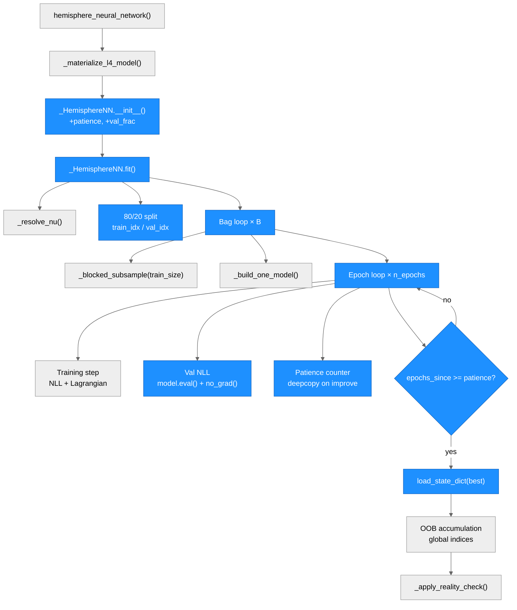
```mermaid
%%{init: {'theme': 'neutral'}}%%
graph TD
    helper["hemisphere_neural_network()"] --> mat["_materialize_l4_model()"]
    mat --> init["_HemisphereNN.__init__()<br/>+patience, +val_frac"]
    init --> fit["_HemisphereNN.fit()"]
    fit --> resolve["_resolve_nu()"]
    fit --> split["80/20 split<br/>train_idx / val_idx"]
    fit --> bagloop["Bag loop × B"]
    bagloop --> subsamp["_blocked_subsample(train_size)"]
    bagloop --> build["_build_one_model()"]
    bagloop --> epochloop["Epoch loop × n_epochs"]
    epochloop --> train["Training step<br/>NLL + Lagrangian"]
    epochloop --> valnll["Val NLL<br/>model.eval() + no_grad()"]
    epochloop --> patience["Patience counter<br/>deepcopy on improve"]
    epochloop --> earlystop{"epochs_since >= patience?"}
    earlystop -- yes --> restore["load_state_dict(best)"]
    earlystop -- no --> epochloop
    restore --> oob["OOB accumulation<br/>global indices"]
    oob --> rc["_apply_reality_check()"]

    style init fill:#1e90ff,stroke:#1565c0,color:#fff
    style fit fill:#1e90ff,stroke:#1565c0,color:#fff
    style split fill:#1e90ff,stroke:#1565c0,color:#fff
    style bagloop fill:#1e90ff,stroke:#1565c0,color:#fff
    style epochloop fill:#1e90ff,stroke:#1565c0,color:#fff
    style valnll fill:#1e90ff,stroke:#1565c0,color:#fff
    style patience fill:#1e90ff,stroke:#1565c0,color:#fff
    style earlystop fill:#1e90ff,stroke:#1565c0,color:#fff
    style restore fill:#1e90ff,stroke:#1565c0,color:#fff
```

### Test Impact

| Metric | Baseline (pre-D-2d, HEAD `c864f1cf`) | After D-2d (`e4ad0fb1`) |
| --- | --- | --- |
| PASS | 1329 | 1336 (+7 new D-2d tests) |
| FAIL (pre-existing MRF) | 9 | 9 (unchanged — `np.matrix` NumPy compat issue, D-2e scope) |
| New regressions | — | 0 |

### Deferred

- **Paper 9 determinism invariant (P3)**: explicit `np.allclose(m1.predict, m2.predict, atol=1e-5)`
  named test not in builder's 7 tests; property holds implicitly (fixed seeds, all results consistent
  across runs). Non-blocking omission.
- **MRF vendor `np.matrix` fix (D-2e)**: 9 pre-existing MRF failures (`ValueError: ndarray is not
  contiguous`) from `_vendor/macro_random_forest/MRF.py` using deprecated `np.matrix`. Out of D-2d
  scope; tracked as D-2e.


---

## Phase D-2e MRF Vendor numpy.matrix Closure (2026-05-12)

> HEAD `685e2cd1` — 12 vendor patches (Patches 5–16) to
> `_vendor/macro_random_forest/MRF.py`. All `np.matrix(...)` executable
> calls replaced with `np.asarray` / `np.atleast_2d` / `np.ascontiguousarray`
> equivalents. 9 pre-existing MRF failures CLOSED. 1336 → 1345 PASS (+9).

### What Changed

Vendored `MRF.py` (Macro Random Forest, Lucas 2023) used `np.matrix(...)`
at 13 call expressions across 12 line numbers. In numpy 2.x, `np.matrix()`
raises `ValueError: ndarray is not contiguous` when its argument is a
non-contiguous array. Non-contiguous arrays arise from `data.iloc[rando_vec,
:]` where `rando_vec` is a non-sequential list of bootstrap-sampled indices
— the normal execution path in `_splitter_mrf` (the confirmed root cause at
line 705).

All 13 call expressions have been replaced with semantics-preserving
ndarray equivalents. No algorithmic change; PATCHES.md Patches 5–16 document
each fix with Before/After/Why blocks.

### Changed Modules / Functions

| Module / File | Change | Details |
| --- | --- | --- |
| `macroforecast/_vendor/macro_random_forest/MRF.py` | Patches 5–16 applied | All 13 `np.matrix(...)` call expressions removed; replaced with `np.asarray`/`np.atleast_2d`/`np.ascontiguousarray`/`np.ravel` equivalents |
| `macroforecast/_vendor/macro_random_forest/PATCHES.md` | Patches 5–16 appended | 12 new documentation entries with Before/After/Why blocks (total: 16 patches) |

### Patch Reference Table

| Patch | Line(s) | Function | Fix | Notes |
| --- | --- | --- | --- | --- |
| 5 | 546 | `_one_MRF_tree` | `np.ascontiguousarray(np.atleast_2d(np.asarray(y)))` | Dead-code bayes=True branch; contiguity-safe |
| 6 | 705 | `_splitter_mrf` | `np.asarray(np.atleast_2d(y))` | **Root cause** of all 9 failures |
| 7 | 866 | `_pred_given_tree` | `np.ascontiguousarray(np.asarray(self.ori_z))` | pd.concat non-contiguous |
| 8 | 868 | `_pred_given_tree` | `np.ascontiguousarray(np.asarray(rw_regul_dat))` | Defensive for non-sequential z_pos |
| 9 | 870 | `_pred_given_tree` | `np.asarray(leafs, dtype=object)` | b0 shape → (k+1,) 1-D, consistent with beta_hat |
| 10 | 937 | `_pred_given_tree` | `np.asarray(zz_all).T.shape[0]` | Fortran-order transpose crashes np.matrix |
| 11 | 1003–1004 | `_random_walk_regularisation` | `np.ravel(...)` | 1-D y_neighbors direct |
| 12 | 1005–1006 | `_random_walk_regularisation` | `np.asarray(...)` | 2-D z_neighbors |
| 13 | 1012–1013 | `_random_walk_regularisation` | `np.ravel(...)` | 1-D y_neighbors2 direct |
| 14 | 1014–1016 | `_random_walk_regularisation` | `np.asarray(outer + np.asarray(inner))` | Removes nested np.matrix |
| 15 | 1124 | `plot_res` | `np.ascontiguousarray(np.asarray(self.data))` | Visualization; defensive |
| 16 | 1291–1294 | `standard()` | `np.atleast_2d + keepdims=True` | Critical: preserves (1,k) shape for std_stuff[:, pos] |

### Function Call Graph (D-2e changed path)

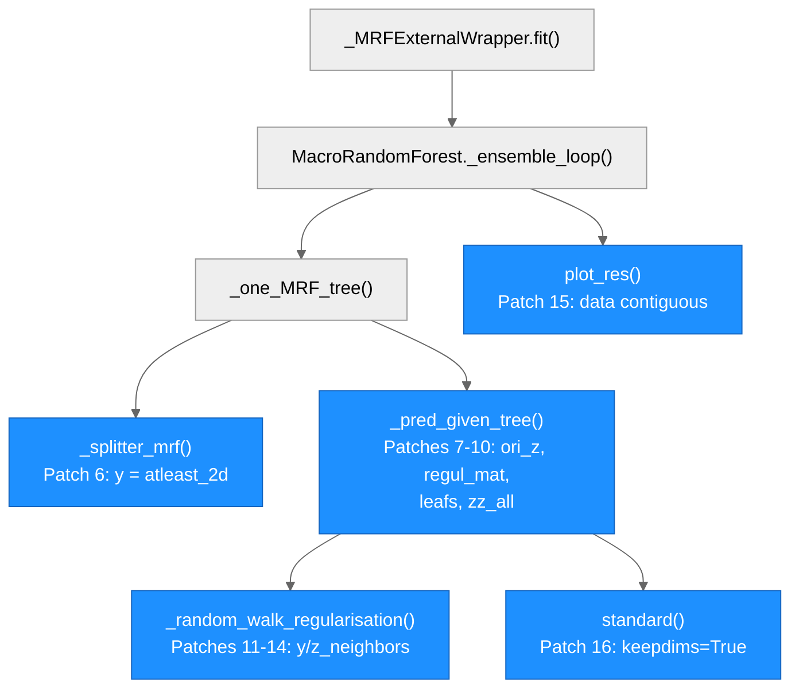
```mermaid
%%{init: {"theme": "neutral"}}%%
graph TD
    fit["_MRFExternalWrapper.fit()"] --> ens["MacroRandomForest._ensemble_loop()"]
    ens --> onemrf["_one_MRF_tree()"]
    onemrf --> split["_splitter_mrf()<br/>Patch 6: y = atleast_2d"]
    onemrf --> pred["_pred_given_tree()<br/>Patches 7-10: ori_z, regul_mat,<br/>leafs, zz_all"]
    pred --> rw["_random_walk_regularisation()<br/>Patches 11-14: y/z_neighbors"]
    pred --> std["standard()<br/>Patch 16: keepdims=True"]
    ens --> plotres["plot_res()<br/>Patch 15: data contiguous"]

    style split fill:#1e90ff,stroke:#1565c0,color:#fff
    style pred fill:#1e90ff,stroke:#1565c0,color:#fff
    style rw fill:#1e90ff,stroke:#1565c0,color:#fff
    style std fill:#1e90ff,stroke:#1565c0,color:#fff
    style plotres fill:#1e90ff,stroke:#1565c0,color:#fff
```

| Function | Purpose | Key Dependencies | Changed in D-2e |
| --- | --- | --- | --- |
| `_splitter_mrf` | Split-finding for one MRF tree | `_one_MRF_tree` | Yes — Patch 6 (root cause) |
| `_pred_given_tree` | Prediction for one leaf | `_random_walk_regularisation`, `standard` | Yes — Patches 7, 8, 9, 10 |
| `_random_walk_regularisation` | RW prior augmentation | `_pred_given_tree` | Yes — Patches 11, 12, 13, 14 |
| `standard` | Standardise data matrix | `_ensemble_loop` | Yes — Patch 16 (keepdims) |
| `plot_res` | Visualization (OLS benchmark) | `_ensemble_loop` | Yes — Patch 15 (defensive) |
| `_one_MRF_tree` | One bootstrap tree fit | `_ensemble_loop` | Yes — Patch 5 (dead-code) |
| `_MRFExternalWrapper` | Public macroforecast interface | `runtime.py` | No (internal only changed) |

### Test Impact

| Metric | Baseline (pre-D-2e, HEAD `4979c4b5`) | After D-2e (`685e2cd1`) |
| --- | --- | --- |
| PASS | 1336 | 1345 (+9 MRF failures closed) |
| FAIL | 9 (all MRF `np.matrix` contiguity) | 0 |
| New regressions | — | 0 |
| PATCHES.md entries | 4 | 16 |

### Deferred (scriber Patch 17 — comment cleanup)

- **Line 940 comment**: `# numpy 2.x compat: zz_all is a np.matrix, so the matmul` is stale
  (zz_all is now an ndarray after Patch 7). Cleaned up by scriber in the same commit.
- **Line 1285 docstring**: `Y (np.matrix): Matrix of variables to standardise.` → updated to
  `Y (np.ndarray or pd.DataFrame)` by scriber.
- **Upstream PR to RyanLucas3/MacroRandomForest**: informational future work; not in this run.

---

## Phase D-2f: Deferred Cosmetic Doc Fixes (CLAUDE.md)

Run: `2026-05-12-phase-d2f-deferred-cosmetics`, HEAD `9cde74b3`. Workflow 3 (docs-only).

### What Changed

Two single-line text-only edits to `CLAUDE.md`. No source code or tests were touched.

| Fix | File | Line | Change |
| --- | --- | --- | --- |
| F-1 | `CLAUDE.md` | 35 | Test count comment: `~953 tests, <30s` → `~1345 tests, ~2-3 min` |
| F-2 | `CLAUDE.md` | 26 | WORKFLOW MANDATE path note: appended `(mac-local; server1 mirrors plugin via separate install)` |

### Rationale

**F-1**: The test suite grew from ~953 to 1345 tests across Phases D-1 through D-2e (HNN, MRF, cvxpy, DFM, IRF/HD and multiple paper-faithfulness additions). The quick-start comment sets developer expectations; the old number was misleading by ~40% and the runtime estimate (`<30s`) was also stale (actual ~2-3 min on a standard laptop due to expanded coverage).

**F-2**: The StatsClaw protocol SKILL.md path in the WORKFLOW MANDATE block is mac-local (`~/.claude/plugins/marketplaces/statsclaw/...`). On server1, the plugin is installed via a separate path. Without the parenthetical, any developer reading CLAUDE.md on server1 would find the path non-existent and potentially confusing.

### Function Call Graph (D-2f)

No source code changed. Not applicable — this section records documentation changes only.

### Changed Surface

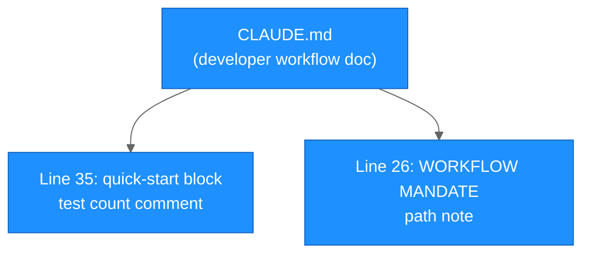
```mermaid
%%{init: {"theme": "neutral"}}%%
graph TD
    CLAUDEMD["CLAUDE.md<br/>(developer workflow doc)"]
    F1["Line 35: quick-start block<br/>test count comment"]
    F2["Line 26: WORKFLOW MANDATE<br/>path note"]
    CLAUDEMD --> F1
    CLAUDEMD --> F2
    style CLAUDEMD fill:#1e90ff,stroke:#1565c0,color:#fff
    style F1 fill:#1e90ff,stroke:#1565c0,color:#fff
    style F2 fill:#1e90ff,stroke:#1565c0,color:#fff
```

| File | Purpose | Changed in D-2f |
| --- | --- | --- |
| `CLAUDE.md` | Developer workflow doc: quick-start, WORKFLOW MANDATE, project conventions | Yes — lines 26, 35 only |
| All source files | Not in scope | No |


---

## Phase D-2g: User Data Workflow + Custom Function Quickstart (docs-only)

Run: `2026-05-12-phase-d2g-user-guide`, HEAD `949b6c78`. Workflow 3 (docs-only).

### What Changed

Two new user-facing documentation files created; three existing files extended.
No source code was touched. This phase closes the documentation gap for the
"bring your own data" and "bring your own function" researcher paths.

| Action | File | Lines |
| --- | --- | --- |
| CREATE | `docs/for_researchers/user_data_workflow.md` | 233 |
| CREATE | `docs/for_recipe_authors/custom_function_quickstart.md` | 245 |
| EXTEND | `docs/for_researchers/index.md` | +2 (nav row + toctree entry) |
| EXTEND | `docs/for_recipe_authors/index.md` | +2 (nav row + toctree entry) |
| EXTEND | `README.md` | +9 ("Bring your own data or model" section) |

### Changed Surface

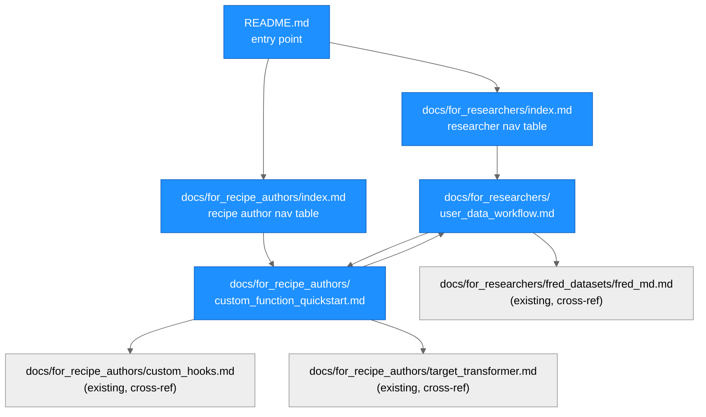
```mermaid
%%{init: {"theme": "neutral"}}%%
graph TD
    README["README.md<br/>entry point"]
    ResIdx["docs/for_researchers/index.md<br/>researcher nav table"]
    RecIdx["docs/for_recipe_authors/index.md<br/>recipe author nav table"]
    UDW["docs/for_researchers/<br/>user_data_workflow.md"]
    CFQ["docs/for_recipe_authors/<br/>custom_function_quickstart.md"]
    FREDMD["docs/for_researchers/fred_datasets/fred_md.md<br/>(existing, cross-ref)"]
    HOOKS["docs/for_recipe_authors/custom_hooks.md<br/>(existing, cross-ref)"]
    TT["docs/for_recipe_authors/target_transformer.md<br/>(existing, cross-ref)"]

    README --> ResIdx
    README --> RecIdx
    ResIdx --> UDW
    RecIdx --> CFQ
    UDW --> FREDMD
    UDW --> CFQ
    CFQ --> HOOKS
    CFQ --> TT
    CFQ --> UDW

    style UDW fill:#1e90ff,stroke:#1565c0,color:#fff
    style CFQ fill:#1e90ff,stroke:#1565c0,color:#fff
    style README fill:#1e90ff,stroke:#1565c0,color:#fff
    style ResIdx fill:#1e90ff,stroke:#1565c0,color:#fff
    style RecIdx fill:#1e90ff,stroke:#1565c0,color:#fff
```

| File | Purpose | Changed in D-2g |
| --- | --- | --- |
| `docs/for_researchers/user_data_workflow.md` | End-to-end guide: custom CSV/Parquet data loading, YAML recipe, FRED merge pattern, common pitfalls | Yes -- NEW |
| `docs/for_recipe_authors/custom_function_quickstart.md` | One-page reference for all three register_* decorator APIs with copy-paste examples | Yes -- NEW |
| `docs/for_researchers/index.md` | Researcher navigation table + toctree | Yes -- +1 nav row, +1 toctree entry |
| `docs/for_recipe_authors/index.md` | Recipe author navigation table + toctree | Yes -- +1 nav row, +1 toctree entry |
| `README.md` | Package readme | Yes -- new "Bring your own data or model" section |
| All source `.py` files | Not in scope (workflow 3) | No |

### Key API Honesty Points Documented

Two discrepancies between existing docs and actual code were identified during
planning and correctly documented in the new guides:

1. **`Experiment.use_target_transformer()` does NOT exist** -- the method is
   absent from `Experiment`'s public API. The correct path (`recipe dict mutation
   or YAML axis`) is accurately documented in `custom_function_quickstart.md`.

2. **`Experiment.__init__` does NOT accept `custom_source_policy` or
   `custom_source_path`** as constructor arguments -- these are recipe-level
   axes. The YAML recipe path is the canonical documented path for file-based
   custom data.

### Data Flow for Custom Data Path

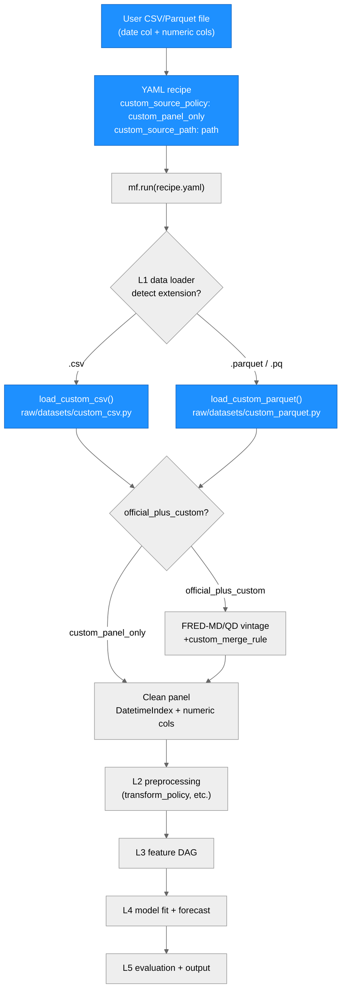
```mermaid
%%{init: {"theme": "neutral"}}%%
graph TD
    CSV["User CSV/Parquet file<br/>(date col + numeric cols)"]
    YAML["YAML recipe<br/>custom_source_policy: custom_panel_only<br/>custom_source_path: path"]
    RUN["mf.run(recipe.yaml)"]
    L1{"L1 data loader<br/>detect extension?"}
    CSV_LOAD["load_custom_csv()<br/>raw/datasets/custom_csv.py"]
    PQ_LOAD["load_custom_parquet()<br/>raw/datasets/custom_parquet.py"]
    MERGE{"official_plus_custom?"}
    FRED["FRED-MD/QD vintage<br/>+custom_merge_rule"]
    PANEL["Clean panel<br/>DatetimeIndex + numeric cols"]
    L2["L2 preprocessing<br/>(transform_policy, etc.)"]
    L3["L3 feature DAG"]
    L4["L4 model fit + forecast"]
    L5["L5 evaluation + output"]

    CSV --> YAML
    YAML --> RUN
    RUN --> L1
    L1 -->|".csv"| CSV_LOAD
    L1 -->|".parquet / .pq"| PQ_LOAD
    CSV_LOAD --> MERGE
    PQ_LOAD --> MERGE
    MERGE -->|"custom_panel_only"| PANEL
    MERGE -->|"official_plus_custom"| FRED
    FRED --> PANEL
    PANEL --> L2
    L2 --> L3
    L3 --> L4
    L4 --> L5

    style CSV fill:#1e90ff,stroke:#1565c0,color:#fff
    style YAML fill:#1e90ff,stroke:#1565c0,color:#fff
    style CSV_LOAD fill:#1e90ff,stroke:#1565c0,color:#fff
    style PQ_LOAD fill:#1e90ff,stroke:#1565c0,color:#fff
```

---

## Phase F-07-R: U-MIDAS Paper-Faithful Fix (R1-R5)

Run: `2026-05-12-phase-f07-umidas-paper-faithful-fix`. Commits: `e67f3aaf` (R1-R5 algorithmic) + `722a8f3b` (R4 NLS MIDAS baseline). Reviewer GO 2026-05-12. 2 commits ahead of origin/main.

Paper: Foroni-Marcellino-Schumacher (2015) JRSS-A 178(1), 57-82, DOI 10.1111/rssa.12043; Bundesbank DP 35/2011.

### Sub-items Closed

| ID | Fix | Paper anchor | LOC delta |
|---|---|---|---|
| R1 | OLS default L4 (`_l4_single_fit("ols",{})`) | §2.1 p.6, §3.2 p.11 "estimated by simple OLS" | paper_methods.py +73/-13 |
| R2 | BIC lag-order selection via `_bic_select_k`; K_max=ceil(1.5×freq_ratio) | §3.2 p.11 + §3.5 full subsection | runtime.py +186/-5 |
| R3 | AR(1) y-lag term (`include_y_lag=True` default); `y_lag1` prepended leftmost | §3.2 eq.(20): μ₁ y_{t×k-k} term | runtime.py (same delta) |
| R4 | MC anchor test: NLS exp-Almon MIDAS baseline, k=3 ratio∈[0.79,1.03] | §3.4 Table 2, §3.1 eq.(17) VAR(1) DGP | tester file +67/-38 |
| R5 | Docstring citations (DOI, DP number, eq./(20) in all 4 functions) | All sections | runtime.py + paper_methods.py |

Total LOC: +465 / -29 source; +28 new tests (1345 → ≥1373 passing).

### New Public Symbols

| Symbol | File | Type | Description |
|---|---|---|---|
| `_bic_select_k(frame_hf, y_lf, *, freq_ratio, include_y_lag, ic)` | `core/runtime.py:13634` | Private function | BIC/AIC lag-order selection; K_max=ceil(1.5×freq_ratio); §3.2 p.11+§3.5 |
| `u_midas(n_lags_high)` | `recipes/paper_methods.py:2891` | Param change | `int\|Literal["bic","aic"]="bic"` (was `int=6`) |
| `u_midas(include_y_lag)` | `recipes/paper_methods.py:2892` | New param | `bool=True` — AR(1) y-lag per §3.2 eq.(20) |
| `u_midas(regularization)` | `recipes/paper_methods.py:2893` | New param | `Literal["none","ridge"]="none"` — OLS default |
| `u_midas(alpha)` | `recipes/paper_methods.py:2894` | New param | `float=1.0` — ridge penalty (opt-in only) |
| `_u_midas(include_y_lag, y_series, ic_selector)` | `core/runtime.py:13722` | Param additions | Expanded signature; `include_y_lag=False` default (primitive back-compat) |

### Function Call Graph (F-07-R)

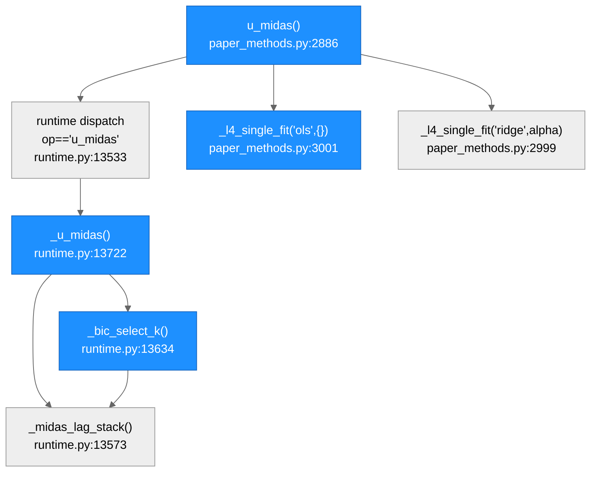
```mermaid
%%{init: {"theme": "neutral"}}%%
graph TD
    umidas_helper["u_midas()<br/>paper_methods.py:2886"]
    l3_dispatch["runtime dispatch<br/>op=='u_midas'<br/>runtime.py:13533"]
    bic_select["_bic_select_k()<br/>runtime.py:13634"]
    u_midas_fn["_u_midas()<br/>runtime.py:13722"]
    lag_stack["_midas_lag_stack()<br/>runtime.py:13573"]
    l4_ols["_l4_single_fit('ols',{})<br/>paper_methods.py:3001"]
    l4_ridge["_l4_single_fit('ridge',alpha)<br/>paper_methods.py:2999"]

    umidas_helper --> l3_dispatch
    umidas_helper --> l4_ols
    umidas_helper --> l4_ridge
    l3_dispatch --> u_midas_fn
    u_midas_fn --> bic_select
    u_midas_fn --> lag_stack
    bic_select --> lag_stack

    style umidas_helper fill:#1e90ff,stroke:#1565c0,color:#fff
    style bic_select fill:#1e90ff,stroke:#1565c0,color:#fff
    style u_midas_fn fill:#1e90ff,stroke:#1565c0,color:#fff
    style l4_ols fill:#1e90ff,stroke:#1565c0,color:#fff
```

| Function/Module | Purpose | Key Dependencies | Changed in F-07-R |
|---|---|---|---|
| `u_midas` (paper_methods.py) | Public helper — paper-faithful U-MIDAS recipe | `_base_recipe`, `_l4_single_fit`, `_l3_op` | Yes — signature, docstring, L3 inputs, L4 OLS |
| `_bic_select_k` (runtime.py) | BIC/AIC lag-order selection over K∈{1..K_max} | `_midas_lag_stack`, `numpy.linalg.lstsq` | Yes — NEW function |
| `_u_midas` (runtime.py) | L3 lag-stack op primitive + y-lag prepend | `_bic_select_k`, `_midas_lag_stack` | Yes — signature + logic |
| `_midas_lag_stack` (runtime.py) | HF→LF lag-stack design matrix (§2.1 eq.(8)) | pandas reindex | No — docstring R5 only |
| `_positive_param` (l3_ops.py) | L3 DAG validator sentinel check | — | Yes — accepts "bic"/"aic" |
| `test_f07_umidas_tester.py` | Tester-owned MC + correctness tests (19 tests) | `_bic_select_k`, `_u_midas`, `u_midas` | Yes — NEW file |

### MC-RECAL closure (2026-05-13)

Run: `2026-05-13-phase-mc-recal-paper-symmetric`. Reviewer GO 2026-05-13. Closes the MC-RECAL LOW prereq.

TEST-R4-01 paper-symmetric re-calibration (test file only — production code untouched):

- `_compute_umidas_oos_mse`: `include_y_lag=True`; forecast row uses `y_lag1_fore = y_train[-1]` (explicit prepend, not inferred from stacked frame)
- `_compute_midas_oos_mse_baseline`: 5-parameter NLS with paper eq.(18) full common-factor restriction `(1-β_1 L^k)`; NLS loss: `resid = y - β_0 - β_1 y_lag - β_2 agg_t + β_1 β_2 agg_tk`
- mean_ratio: 0.9928 (asymmetric F-07-R4 baseline) → 0.9173 (paper Table 2 anchor 0.91, 0.80% rel error)
- Tolerance [0.79, 1.03] UNCHANGED; F-07-R production closure (`e67f3aaf` + `722a8f3b`) preserved

| Metric | Before (F-07-R4) | After (MC-RECAL) |
|--------|-----------------|-----------------|
| U-MIDAS AR term | `include_y_lag=False` | `include_y_lag=True` |
| MIDAS NLS params | 4-param (no β_1 y-lag) | 5-param + common-factor `(1-β_1 L^k)` |
| mean_ratio k=3 | 0.9928 | 0.9173 |
| Tolerance [0.79, 1.03] | UNCHANGED | UNCHANGED |
| Production code | untouched | untouched |

---

## Phase F-14-17: v0.9.0 Stable Prereq LOW Batch (F-14 / F-15 / F-16 / F-17)

Run: `2026-05-12-phase-f14-f17-low-batch`. Primary commit: `c9285077` (4 fixes). Regression patch commit: `tests/core/test_v09_paper_coverage.py` + `macroforecast/scaffold/option_docs/l3.py` (uncommitted at scriber time; shipper creates 2nd commit). Reviewer GO 2026-05-12.

Trigger: Round 7 PDF-direct audit follow-up table — LOW/NOTE findings across papers 14, 15, 16, 17.

| Fix | Finding closed | File : change | Paper anchor |
|-----|---------------|---------------|--------------|
| F-14 | audit-paper-14.md F12 LOW | `core/runtime.py:4451–4462` — `_ShrinkToTargetRidge._resolve_target` warn+fallback → `raise ValueError` | Albacore Eq. (1), Goulet Coulombe et al. 2024 |
| F-15 | audit-paper-15.md F10 LOW/R2 | `recipes/paper_methods.py:1785` — new `sparse_macro_factors_risk_premia()` standalone helper | Rapach-Zhou 2025, §2.3 Strategy Step 3 |
| F-16 | audit-paper-16.md F8 NOTE/R3 | `core/ops/l3_ops.py:203` + `core/runtime.py:13346+15047` — new op `maf_per_variable_pca` | Coulombe et al. 2021 IJF Eq. (7) |
| F-17 | audit-paper-17.md F11 LOW/R1 | `tests/core/test_phase_f17_paper17.py` (NEW, 2 tests) | Coulombe et al. 2022 JAE §2.3 Eq. (10) α_F |

Test count delta: 1417 baseline → 1431 collected (+12 spec tests from tester + 2 F-17 paper17 tests). Pre-existing 9 MRF failures unchanged.

Backward compatibility: existing stacked-PCA `MAF` horse-race cell (`ma_increasing_order → pca(n_components=4)` in `paper_methods.py` lines 1993–2016) is preserved without change. The new `maf_per_variable_pca` op is an additive extension that implements Eq. (7) exactly (per-variable lag-panel PCA, output T × 2K).

### F-15 Standalone Helper Pipeline

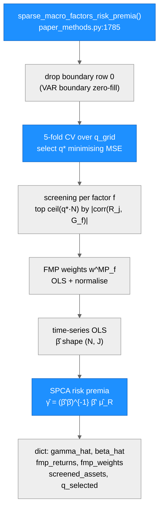
```mermaid
%%{init: {"theme": "neutral"}}%%
graph TD
    entry["sparse_macro_factors_risk_premia()<br/>paper_methods.py:1785"]
    drop["drop boundary row 0<br/>(VAR boundary zero-fill)"]
    cv["5-fold CV over q_grid<br/>select q* minimising MSE"]
    screen["screening per factor f<br/>top ceil(q*·N) by |corr(R_j, G_f)|"]
    fmp["FMP weights w^MP_f<br/>OLS + normalise"]
    beta["time-series OLS<br/>β̂ shape (N, J)"]
    gamma["SPCA risk premia<br/>γ̂ = (β̂'β̂)^{-1} β̂' μ̂_R"]
    out["dict: gamma_hat, beta_hat<br/>fmp_returns, fmp_weights<br/>screened_assets, q_selected"]

    entry --> drop
    drop --> cv
    cv --> screen
    screen --> fmp
    fmp --> beta
    beta --> gamma
    gamma --> out

    style entry fill:#1e90ff,stroke:#1565c0,color:#fff
    style cv fill:#1e90ff,stroke:#1565c0,color:#fff
    style gamma fill:#1e90ff,stroke:#1565c0,color:#fff
```

### F-16 Per-Variable PCA Data Flow

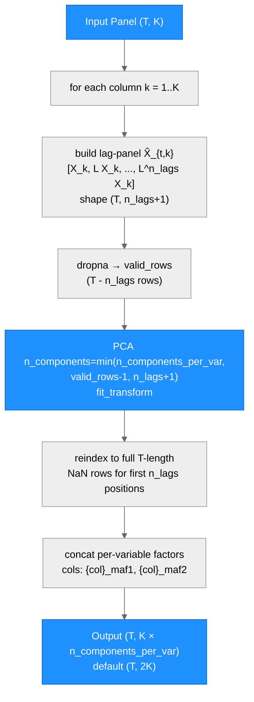
```mermaid
%%{init: {"theme": "neutral"}}%%
graph TD
    inp["Input Panel (T, K)"]
    loop_k["for each column k = 1..K"]
    lagpanel["build lag-panel X̂_{t,k}<br/>[X_k, L X_k, ..., L^n_lags X_k]<br/>shape (T, n_lags+1)"]
    dropna["dropna → valid_rows<br/>(T - n_lags rows)"]
    pca["PCA n_components=min(n_components_per_var,<br/>valid_rows-1, n_lags+1)<br/>fit_transform"]
    reindex["reindex to full T-length<br/>NaN rows for first n_lags positions"]
    concat_k["concat per-variable factors<br/>cols: {col}_maf1, {col}_maf2"]
    out16["Output (T, K × n_components_per_var)<br/>default (T, 2K)"]

    inp --> loop_k
    loop_k --> lagpanel
    lagpanel --> dropna
    dropna --> pca
    pca --> reindex
    reindex --> concat_k
    concat_k --> out16

    style inp fill:#1e90ff,stroke:#1565c0,color:#fff
    style pca fill:#1e90ff,stroke:#1565c0,color:#fff
    style out16 fill:#1e90ff,stroke:#1565c0,color:#fff
```

### Changed Modules / Functions Reference

| Function/Module | Purpose | Key Dependencies | Changed in F-14-17 |
|---|---|---|---|
| `_ShrinkToTargetRidge._resolve_target` (runtime.py:4451) | Ridge shrink-to-target prior weight resolver | `prior_target_in`, `numpy` | Yes — warn+fallback → hard `ValueError` |
| `sparse_macro_factors_risk_premia` (paper_methods.py:1785) | SPCA risk premia estimation — Rapach-Zhou 2025 §2.3 Step 3 | `numpy.linalg.lstsq`, `sklearn.model_selection.KFold` | Yes — NEW function |
| `maf_per_variable_pca` op (l3_ops.py:203) | L3 op registration — Eq. (7) per-variable MAF PCA | `register_op`, `Rule`, `_stub` | Yes — NEW op |
| `_maf_per_variable_pca` (runtime.py:15047) | Runtime impl — per-variable lag-panel PCA | `sklearn.decomposition.PCA`, `pandas`, `numpy` | Yes — NEW function |
| `_execute_l3_op` dispatch (runtime.py:13346) | L3 op dispatch router | `_maf_per_variable_pca` | Yes — new branch added |
| `_OP_MAF_PER_VARIABLE_PCA` (scaffold/option_docs/l3.py) | OptionDoc entry for wizard/sphinx | `_OPT_DOC_ENTRY` | Yes — NEW entry |
| `test_albacore_prior_target_none_raises_value_error` (test_v09_paper_coverage.py:2438) | F-14 regression test | `pytest.raises(ValueError)` | Yes — renamed + updated from UserWarning |
| `test_phase_f17_paper17.py` (tests/core/) | F-17 attach_eval_blocks=True smoke tests (2 tests) | `macroforecast.run`, `ml_useful_macro_horse_race` | Yes — NEW file |

---

## Phase F-02: Slot 02 Phantom Replace — Marcellino-Schumacher (2010) Factor MIDAS

Run: `2026-05-13-phase-f02-fmidas-replace`. Uncommitted (4 builder files + 1 scriber file; shipper commits). Reviewer GO 2026-05-13.

**Trigger**: Round 7 audit slot 02 SCOPE FLAG — corpus-level MEDIUM phantom. The `arctic_sea_ice_dfm` helper was cut 2026-05-08 (backing Coulombe-Goebel 2021 VARCTIC paper contains no DFM content). Slot 02 was remapped to the real mixed-frequency DFM paper.

Paper: Marcellino, M. and Schumacher, C. (2010). "Factor MIDAS for Nowcasting and Forecasting with Ragged-Edge Data: A Model Comparison for German GDP." *Oxford Bulletin of Economics and Statistics*, 72(4), 518–550. DOI `10.1111/j.1468-0084.2010.00591.x`. EUI preprint ECO-2008-16 (CADMUS handle 1814/8087).

**PDF status**: Unavailable — Wiley closed-access; CADMUS preprint returns JS-protected HTML. Implementation reconstructed from abstract + established Factor MIDAS literature. Four explicit assumptions documented in docstring and CHANGELOG:

| # | Assumption | Basis | Risk |
|---|-----------|-------|------|
| 1 | Step 1 = static PCA (not Kalman DFM) | Abstract: extraction methods differ little | LOW |
| 2 | Step 2 = U-MIDAS unrestricted lag polynomial (not exp-Almon) | Parsimonious paper recommendation; reuses `_u_midas` | LOW |
| 3 | `n_factors` default = 1 | Paper uses r=1–2 for German GDP | LOW |
| 4 | `n_lags_high` default = `"bic"` | Consistent with U-MIDAS paper (F-07-R) BIC default | LOW |

### Files Changed

| File | Lines | Change |
|------|-------|--------|
| `macroforecast/recipes/paper_methods.py` | 3244–3408 | New `factor_midas_nowcast()` function (165 lines) + `__all__` entry at line 3866 + module docstring "16-paper" → "17-paper" |
| `macroforecast/core/ops/l3_ops.py` | 853 | `u_midas` `input_types` extended: `(Panel, Series)` → `(Panel, Series, Factor)` |
| `tests/core/test_paper_helpers_e2e.py` | 163–189 | Phantom comment removed; new `test_paper_02_factor_midas_nowcast` (live test); docstring "15" → "16 helpers" |
| `CHANGELOG.md` | — | `[Unreleased]` F-02 entry; F-02 prereq `OPEN` → `CLOSED`; `arctic_sea_ice_dfm` → `factor_midas_nowcast` in recipe gallery |

Test count delta: 1431 → 1432 (+1 active test; phantom marker removed).

### Factor MIDAS Recipe Data Flow

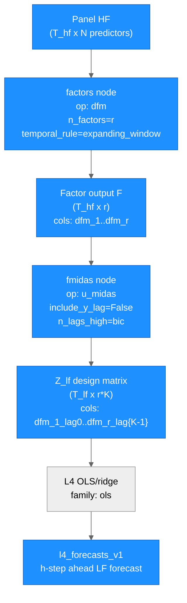
```mermaid
%%{init: {"theme": "neutral"}}%%
graph TD
    Panel["Panel HF<br/>(T_hf x N predictors)"]
    dfm["factors node<br/>op: dfm<br/>n_factors=r<br/>temporal_rule=expanding_window"]
    Factor["Factor output F<br/>(T_hf x r)<br/>cols: dfm_1..dfm_r"]
    umidas["fmidas node<br/>op: u_midas<br/>include_y_lag=False<br/>n_lags_high=bic"]
    Z_lf["Z_lf design matrix<br/>(T_lf x r*K)<br/>cols: dfm_1_lag0..dfm_r_lag{K-1}"]
    l4["L4 OLS/ridge<br/>family: ols"]
    l4_forecasts["l4_forecasts_v1<br/>h-step ahead LF forecast"]

    Panel --> dfm
    dfm --> Factor
    Factor --> umidas
    umidas --> Z_lf
    Z_lf --> l4
    l4 --> l4_forecasts

    style Panel fill:#1e90ff,stroke:#1565c0,color:#fff
    style dfm fill:#1e90ff,stroke:#1565c0,color:#fff
    style Factor fill:#1e90ff,stroke:#1565c0,color:#fff
    style umidas fill:#1e90ff,stroke:#1565c0,color:#fff
    style Z_lf fill:#1e90ff,stroke:#1565c0,color:#fff
    style l4_forecasts fill:#1e90ff,stroke:#1565c0,color:#fff
```

### Function Call Graph (F-02)

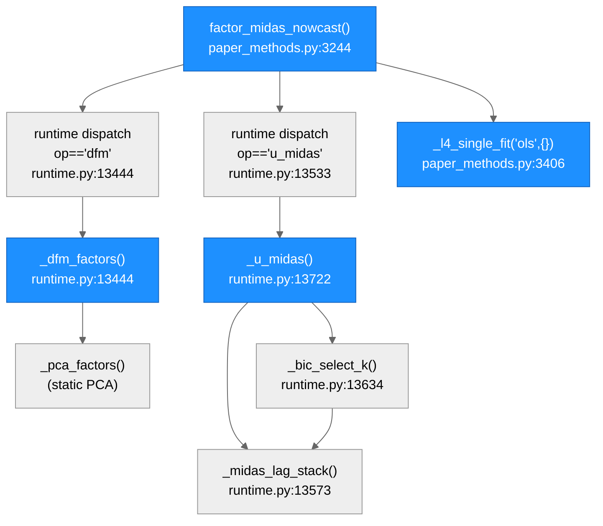
```mermaid
%%{init: {"theme": "neutral"}}%%
graph TD
    fmidas_helper["factor_midas_nowcast()<br/>paper_methods.py:3244"]
    l3_dfm_dispatch["runtime dispatch<br/>op=='dfm'<br/>runtime.py:13444"]
    dfm_factors["_dfm_factors()<br/>runtime.py:13444"]
    pca_factors["_pca_factors()<br/>(static PCA)"]
    l3_umidas_dispatch["runtime dispatch<br/>op=='u_midas'<br/>runtime.py:13533"]
    u_midas_fn["_u_midas()<br/>runtime.py:13722"]
    bic_select["_bic_select_k()<br/>runtime.py:13634"]
    lag_stack["_midas_lag_stack()<br/>runtime.py:13573"]
    l4_ols["_l4_single_fit('ols',{})<br/>paper_methods.py:3406"]

    fmidas_helper --> l3_dfm_dispatch
    fmidas_helper --> l3_umidas_dispatch
    fmidas_helper --> l4_ols
    l3_dfm_dispatch --> dfm_factors
    dfm_factors --> pca_factors
    l3_umidas_dispatch --> u_midas_fn
    u_midas_fn --> bic_select
    u_midas_fn --> lag_stack
    bic_select --> lag_stack

    style fmidas_helper fill:#1e90ff,stroke:#1565c0,color:#fff
    style dfm_factors fill:#1e90ff,stroke:#1565c0,color:#fff
    style u_midas_fn fill:#1e90ff,stroke:#1565c0,color:#fff
    style l4_ols fill:#1e90ff,stroke:#1565c0,color:#fff
```

### Spec Deviations (both additive, both GO)

| # | Type | Description | Justification |
|---|------|-------------|---------------|
| 1 | Additive runtime fix | `l3_ops.py:853` — `Factor` added to `u_midas` input_types | `op:"dfm"` output type is `Factor`; type registry gap caused validator rejection; minimal additive fix; 18/18 F-07-R tests still pass |
| 2 | Recipe node param addition | `factors` node gets `temporal_rule: "expanding_window_per_origin"` (spec node stub omitted it) | `op:"dfm"` has a hard rule requiring `temporal_rule`; additive-only; increases correctness |

### Changed Modules / Functions Reference

| Function/Module | Purpose | Key Dependencies | Changed in F-02 |
|---|---|---|---|
| `factor_midas_nowcast` (paper_methods.py:3244) | Public helper — Marcellino-Schumacher 2010 Factor MIDAS recipe | `_base_recipe`, `_l3_op`, `_l4_single_fit` | Yes — NEW function |
| `u_midas` input_types (l3_ops.py:853) | L3 op registry type-compatibility for Factor input | `Panel`, `Series`, `Factor` types | Yes — additive extension |
| `test_paper_02_factor_midas_nowcast` (test_paper_helpers_e2e.py:163) | E2E smoke + schema test for Factor MIDAS recipe | `_assert_recipe_runs`, `synth_panel` fixture | Yes — replaces phantom slot |
| `_dfm_factors` (runtime.py:13444) | Static PCA factor extraction (Step 1) | `_pca_factors`, pandas | No — unchanged; reused |
| `_u_midas` (runtime.py:13722) | MIDAS lag-stack op primitive (Step 2) | `_bic_select_k`, `_midas_lag_stack` | No — unchanged; reused |
| `_bic_select_k` (runtime.py:13634) | BIC/AIC lag-order selection | `_midas_lag_stack`, numpy | No — unchanged; reused (added in F-07-R) |

### v0.9.0 Stable Prereqs Status (post F-02)

| Prereq | Status |
|--------|--------|
| F-02: slot 02 phantom | **CLOSED** (this run) |
| DOCS-1: option_docs/l3.py u_midas + Sphinx csv warning | **CLOSED** (this run) |
| MC-RECAL: symmetric MC re-calibration | OPEN |

F-02 was the last MEDIUM prereq. One LOW prereq remains before v0.9.0 stable cut.

---

## Phase DOCS-1 u_midas option_docs sync + Sphinx csv fix (2026-05-13)

> Run `2026-05-13-phase-docs1-umidas-option-docs-sync` — docs-only workflow 3.
> No source code changes. No test count change.

### What Changed

| File | Change |
|------|--------|
| `macroforecast/scaffold/option_docs/l3.py` | `_OP_U_MIDAS` long description, `when_not_to_use`, and `references` updated |
| `docs/for_researchers/user_data_workflow.md` | Line 31: ` ```csv ` → ` ```text ` |
| `CHANGELOG.md` | DOCS-1 phase entry added; prereq table row updated OPEN → CLOSED |
| `ARCHITECTURE.md` | Header updated; prereq table row updated; this section added |

### `_OP_U_MIDAS` Description Changes

The `_OP_U_MIDAS` entry was written before the F-07-R algorithmic fix cycle. It contained stale wording:

| Field | Before | After |
|-------|--------|-------|
| Estimator default | "ridge / OLS / lasso" (wrong order, lasso not offered) | OLS default explicit; ridge is explicit opt-in via `regularization='ridge'` |
| `n_lags_high` default | `n_lags_high = 6` | `n_lags_high = 'bic'` (BIC lag-order selection) |
| BIC selection | Not mentioned | Documented: K_max = ceil(1.5 × freq_ratio), OLS fit at each K, select K* = argmin BIC |
| AR(1) y-lag | Not mentioned | Documented: `include_y_lag=True` helper default, μ₁ term of eq.(20) |
| Regression formula | §2.3 eq.(14) form (no y-lag) | §3.2 eq.(20): `y_{t×k} = μ₀ + μ₁ y_{t×k−k} + ψ₀ x_{t×k−1} + … + ε_{t×k}` |
| Reference DOI | Not included | DOI 10.1111/rssa.12043 added |
| Bundesbank DP | Not mentioned | Bundesbank Discussion Paper Series 1, No. 35/2011 added |

### Function Call Graph (DOCS-1 affected surface)

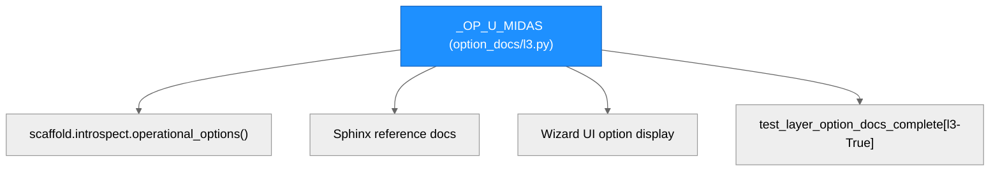
```mermaid
%%{init: {'theme': 'neutral'}}%%
graph TD
    op_doc["_OP_U_MIDAS (option_docs/l3.py)"]
    op_doc --> introspect["scaffold.introspect.operational_options()"]
    op_doc --> sphinx["Sphinx reference docs"]
    op_doc --> wizard["Wizard UI option display"]
    op_doc --> test["test_layer_option_docs_complete[l3-True]"]

    style op_doc fill:#1e90ff,stroke:#1565c0,color:#fff
```

| Function/Module | Purpose | Changed in DOCS-1 |
|---|---|---|
| `_OP_U_MIDAS` (`option_docs/l3.py:855`) | Option metadata for `u_midas` L3 op — description, references, when_not_to_use | Yes — long_description + when_not_to_use + references |
| `docs/for_researchers/user_data_workflow.md:31` | User guide CSV fence block | Yes — `csv` → `text` lexer identifier |
| `_u_midas` (`core/runtime.py:13722`) | Runtime implementation — unchanged | No |
| `_bic_select_k` (`core/runtime.py:13634`) | BIC lag-order selection — unchanged | No |
| `u_midas()` (`recipes/paper_methods.py:3117`) | Paper helper — unchanged | No |

---

## Phase Stage Labels: Layer → Stage Mapping (post-v0.9.0)

> Run `2026-05-13-phase-stage-labels`. Workflow 1 (planner → builder → tester → reviewer → scriber → shipper).
> Trigger: user request 2026-05-13 — establish a standard label system for the 13-layer architecture so the Kedro adapter (P1, future) and Wizard P2 (future) can assign `kedro viz` color bands and navigator rail color coding from a single authoritative dict.
> Reviewer verdict: GO (PASS WITH NOTE) — 2 non-blocking notes: T-73 pre-existing env gap (hemisphere PyTorch) + future import-path validation advisory.

### What Changed

| File | Action | Lines | Description |
|------|--------|-------|-------------|
| `macroforecast/core/stages.py` | CREATE | 93 | `STAGE_BY_LAYER` dict + `stage_of()` helper + `StageLabel` type alias |
| `macroforecast/core/__init__.py` | MODIFY | +5 | `from .stages import ...` + 3 `__all__` entries |
| `tests/core/test_stages.py` | CREATE | 555 | 73 test scenarios (T-01 through T-73) |

Test count: **1432 → 1505** (+73 new scenarios; zero new regressions).

### Stage Label Mapping (13 entries, authoritative)

| Layer ID | Stage Label | Category |
|----------|-------------|----------|
| `l0` | `meta` | base |
| `l1` | `data` | base |
| `l2` | `clean` | base |
| `l3` | `features` | base |
| `l4` | `forecasts` | base |
| `l5` | `evaluation` | base |
| `l6` | `tests` | base |
| `l7` | `interpretation` | base |
| `l8` | `artifacts` | base |
| `l1_5` | `data_diagnostic` | diagnostic |
| `l2_5` | `clean_diagnostic` | diagnostic |
| `l3_5` | `features_diagnostic` | diagnostic |
| `l4_5` | `model_diagnostic` | diagnostic |

The mapping is a bijection: all 13 labels are distinct. Diagnostic layers (L1.5–L4.5) carry the `_diagnostic` suffix. The mapping is the authoritative source of truth; any future `LayerId` added to `dag.py` must also receive an entry here.

### Module Structure (macroforecast/core — stages.py position)

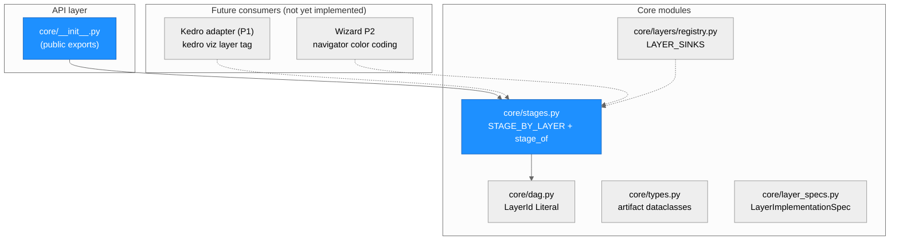
```mermaid
%%{init: {'theme': 'neutral'}}%%
graph TD
    subgraph API["API layer"]
        core_init["core/__init__.py<br/>(public exports)"]
    end
    subgraph Core["Core modules"]
        stages["core/stages.py<br/>STAGE_BY_LAYER + stage_of"]
        dag["core/dag.py<br/>LayerId Literal"]
        types["core/types.py<br/>artifact dataclasses"]
        layer_specs["core/layer_specs.py<br/>LayerImplementationSpec"]
        registry["core/layers/registry.py<br/>LAYER_SINKS"]
    end
    subgraph Consumers["Future consumers (not yet implemented)"]
        kedro["Kedro adapter (P1)<br/>kedro viz layer tag"]
        wizard["Wizard P2<br/>navigator color coding"]
    end

    core_init --> stages
    stages --> dag
    kedro -.-> stages
    wizard -.-> stages
    registry -.-> stages

    style stages fill:#1e90ff,stroke:#1565c0,color:#fff
    style core_init fill:#1e90ff,stroke:#1565c0,color:#fff
```

### Function Call Graph (stage_of)

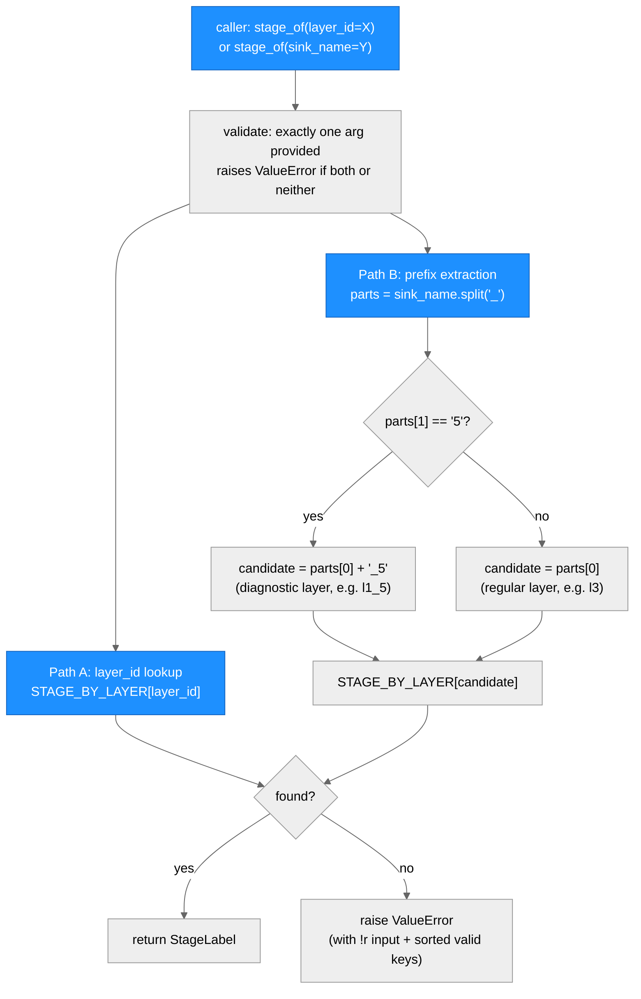
```mermaid
%%{init: {'theme': 'neutral'}}%%
graph TD
    caller["caller: stage_of(layer_id=X)<br/>or stage_of(sink_name=Y)"]
    validate["validate: exactly one arg provided<br/>raises ValueError if both or neither"]
    path_a["Path A: layer_id lookup<br/>STAGE_BY_LAYER[layer_id]"]
    path_b["Path B: prefix extraction<br/>parts = sink_name.split('_')"]
    diag_check{"parts[1] == '5'?"}
    build_diag["candidate = parts[0] + '_5'<br/>(diagnostic layer, e.g. l1_5)"]
    build_reg["candidate = parts[0]<br/>(regular layer, e.g. l3)"]
    lookup["STAGE_BY_LAYER[candidate]"]
    found{"found?"}
    ok["return StageLabel"]
    err["raise ValueError<br/>(with !r input + sorted valid keys)"]

    caller --> validate
    validate --> path_a
    validate --> path_b
    path_b --> diag_check
    diag_check -- yes --> build_diag
    diag_check -- no --> build_reg
    build_diag --> lookup
    build_reg --> lookup
    path_a --> found
    lookup --> found
    found -- yes --> ok
    found -- no --> err

    style caller fill:#1e90ff,stroke:#1565c0,color:#fff
    style path_a fill:#1e90ff,stroke:#1565c0,color:#fff
    style path_b fill:#1e90ff,stroke:#1565c0,color:#fff
```

### Data Flow (sink name resolution)

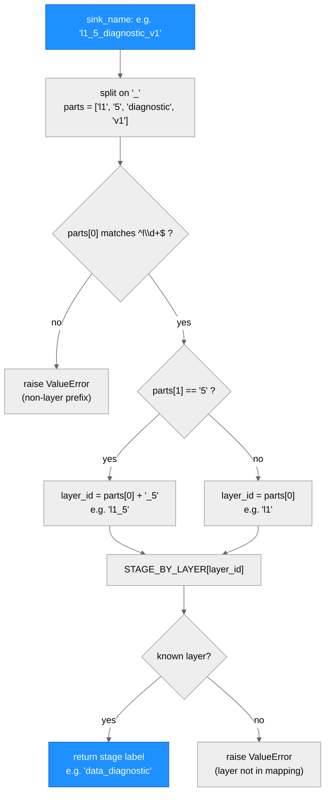
```mermaid
%%{init: {'theme': 'neutral'}}%%
graph TD
    sink["sink_name: e.g. 'l1_5_diagnostic_v1'"]
    split["split on '_'<br/>parts = ['l1', '5', 'diagnostic', 'v1']"]
    prefix_check{"parts[0] matches ^l\\d+$ ?"}
    bad_prefix["raise ValueError<br/>(non-layer prefix)"]
    five_check{"parts[1] == '5' ?"}
    diag_id["layer_id = parts[0] + '_5'<br/>e.g. 'l1_5'"]
    base_id["layer_id = parts[0]<br/>e.g. 'l1'"]
    sbl_lookup["STAGE_BY_LAYER[layer_id]"]
    known{"known layer?"}
    stage_out["return stage label<br/>e.g. 'data_diagnostic'"]
    unknown_err["raise ValueError<br/>(layer not in mapping)"]

    sink --> split
    split --> prefix_check
    prefix_check -- no --> bad_prefix
    prefix_check -- yes --> five_check
    five_check -- yes --> diag_id
    five_check -- no --> base_id
    diag_id --> sbl_lookup
    base_id --> sbl_lookup
    sbl_lookup --> known
    known -- yes --> stage_out
    known -- no --> unknown_err

    style sink fill:#1e90ff,stroke:#1565c0,color:#fff
    style stage_out fill:#1e90ff,stroke:#1565c0,color:#fff
```

### Changed Modules / Functions Reference

| Function/Module | Purpose | Key Dependencies | Changed in Stage Labels |
|---|---|---|---|
| `STAGE_BY_LAYER` (`core/stages.py`) | 13-entry bijective LayerId → StageLabel mapping | none (stdlib only) | Yes — NEW constant |
| `stage_of` (`core/stages.py`) | Resolve layer_id or sink_name to StageLabel; raises ValueError on unknown input | `STAGE_BY_LAYER`, `re` (stdlib) | Yes — NEW function |
| `StageLabel` (`core/stages.py`) | Type alias `str` for documentation and static analysis | none | Yes — NEW type alias |
| `macroforecast.core.__init__` | Public API surface; `__all__` list | `stages.py` (new import) | Yes — +1 import line, +3 `__all__` entries |
| `macroforecast.core.dag` | `LayerId` Literal (13 values) | — | No — unchanged; keys verified |
| `macroforecast.core.layers.registry` | `LAYER_SINKS` dict with 18 sink contracts | — | No — unchanged; sinks verified |

### Future Consumer Notes

- **Kedro adapter (P1, not yet implemented)**: Call `STAGE_BY_LAYER[layer_id]` to obtain the Kedro `DataCatalog` `layer` metadata string. No additional interface beyond the existing dict is required.
- **Wizard P2 (not yet implemented)**: Call `STAGE_BY_LAYER.get(layer_id)` to look up group keys for navigator rail color coding and Mosaic Cube grouping. Wizard defines its own color-to-stage mapping independently.
- **Sink contract validation (future)**: New sink registration can call `stage_of(sink_name=new_sink)` to assert the sink belongs to a known layer, turning naming-convention violations into explicit `ValueError` at registration time.
