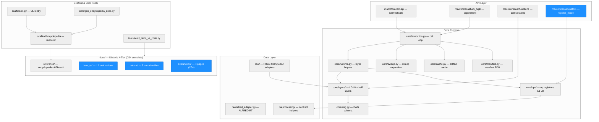
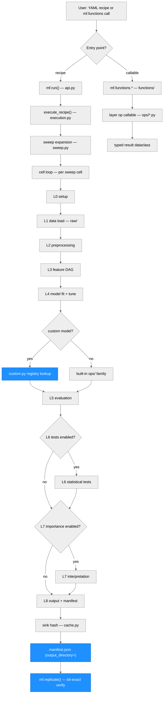
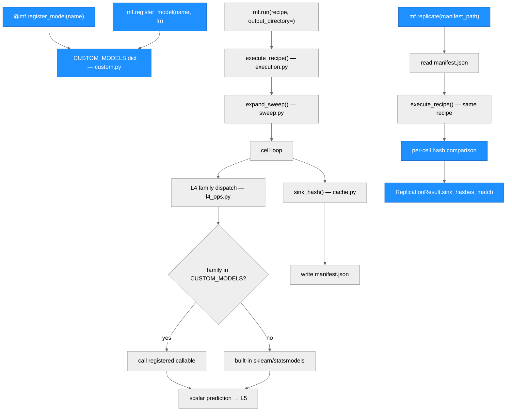

# macroforecast — Architecture

> Generated by scriber for run `2026-05-22-cycle55-v092b2-release-cut` on 2026-05-22.
> Last updated: C55 — v0.9.2b2 release cut (CHANGELOG synthesis C47-C54, version bump, PyPI HOLD).

## Overview

macroforecast is a Python package for reproducible macro-forecasting benchmarking
studies on FRED-MD / FRED-QD / FRED-SD data (or custom data sources). The 12-layer
canonical design (L0–L8 plus diagnostic half-layers L1.5–L4.5) converts a YAML
recipe into a sweep of independent study cells, each producing bit-exact replicable
artifacts. Layer operations are also available as standalone Python callables via
`mf.functions.*`.

C52 reorganized `docs/` from 11 parallel directories into the Diátaxis 4-tier
structure (tutorial / how-to / reference / explanation). C53 wrote the actual
user-facing tutorial and how-to content: three narrative tutorials, six how-to
task recipes, two refactors, five redirect stubs, and broken-link fixes. C54
completes the overhaul: four new explanation-tier pages (12_layer_design,
bit_exact_replicate, honesty_pass, recipe_to_run), reference index cleanup
(api/index.md umbrella, encyclopedia visibility, card layout), landing page
finalization, and tutorial CI smoke test. The Diátaxis docs overhaul is now
complete as of C54.

---

## Module Structure



### Module Reference

| Module / File | Layer | Purpose | Key Exports | Changed in C53 |
| --- | --- | --- | --- | --- |
| `macroforecast/api.py` | API | `mf.run`, `mf.replicate` entry points | `run`, `replicate` | no |
| `macroforecast/api_high.py` | API | High-level `Experiment` class | `Experiment` | no |
| `macroforecast/custom.py` | API | Custom model/preprocessor registry | `register_model`, `list_custom_models`, `clear_custom_models` | no (documented in C53) |
| `macroforecast/functions/` | API | 118 standalone callables by layer (L2–L7) | layer-grouped callables | no |
| `macroforecast/core/execution.py` | Core | Cell loop, seed propagation, `replicate_recipe` | `execute_recipe`, `ManifestExecutionResult` | no |
| `macroforecast/core/runtime.py` | Core | Per-layer `materialize_l*` artifact helpers | `materialize_l2` .. `materialize_l8` | no |
| `macroforecast/core/layers/` | Core | L0–L8 + L1.5–L4.5 schema definitions | layer axis / gate / default dicts | no |
| `macroforecast/core/ops/` | Core | Op registries: L3 (41 ops), L4 (47 families), L5–L8 | per-op factory callables | no |
| `macroforecast/core/sweep.py` | Core | Sweep expansion: `{sweep: [...]}` markers | `expand_sweep` | no |
| `macroforecast/core/cache.py` | Core | Content-addressed artifact cache, SHA-256 | `sink_hash` | no |
| `macroforecast/core/manifest.py` | Core | Manifest read/write, provenance record | `Manifest`, `ManifestRecord` | no |
| `macroforecast/raw/` | Data | FRED-MD / QD / SD adapters, vintage manager | `load_fred_md`, `load_alfred` | no |
| `docs/tutorial/index.md` | Docs | Toctree: 5 tutorials in learning order | navigation | yes (C53) |
| `docs/tutorial/01_first_forecast.md` | Docs | 5-min narrative: install→AR→manifest | full tutorial | yes (C53, new content) |
| `docs/tutorial/02_full_study.md` | Docs | Full study: sweep, DM test, L7 importance | full tutorial | yes (C53, new content) |
| `docs/tutorial/03_custom_model.md` | Docs | register_model narrative + sweep | full tutorial | yes (C53, new) |
| `docs/tutorial/two_entry_points.md` | Docs | Renamed from 03_two_entry_points + polished | full tutorial | yes (C53, rename+polish) |
| `docs/how_to/index.md` | Docs | Toctree: 12 task recipes + hidden redirect stubs | navigation | yes (C53) |
| `docs/how_to/add_custom_dataset.md` | Docs | Custom CSV / inline panel how-to | task recipe | yes (C53, new) |
| `docs/how_to/tune_hyperparameters.md` | Docs | HP search (grid/random/BIC) how-to | task recipe | yes (C53, new) |
| `docs/how_to/sweep_over_models.md` | Docs | Model sweep + pandas summary how-to | task recipe | yes (C53, new) |
| `docs/how_to/add_custom_model.md` | Docs | register_model terse recipe (refactored) | task recipe | yes (C53, refactor) |
| `docs/how_to/use_custom_hooks.md` | Docs | All 5 extension points (refactored) | task recipe | yes (C53, refactor) |
| `docs/how_to/replicate_a_study.md` | Docs | mf.replicate() + mismatch debug | task recipe | yes (C53, new) |
| `docs/how_to/partial_layer_execution.md` | Docs | Renamed from partial_execution + link fixes | task recipe | yes (C53, rename) |
| `docs/how_to/troubleshooting.md` | Docs | FAQ — 3 broken links fixed | polish | yes (C53, polish) |
| Redirect stubs (5) | Docs | add_dataset, user_data_workflow, custom_model, custom_hooks, partial_execution | orphan stubs | yes (C53, new) |

---

## Docs Structure (C53 Content Layer)

The C52 migration established the 4-tier skeleton. C53 fills in the tutorial
and how-to tiers with real user-facing content.

```mermaid
%%{init: {'theme': 'neutral'}}%%
graph TD
    IDX["docs/index.md (4-card landing)"]
    IDX --> TUT["tutorial/"]
    IDX --> HOW["how_to/"]
    IDX --> REF["reference/"]
    IDX --> EXP["explanation/"]

    TUT --> T0["00_install.md"]
    TUT --> T1["01_first_forecast.md (new)"]
    TUT --> T2["02_full_study.md (new)"]
    TUT --> T3["03_custom_model.md (new)"]
    TUT --> T4["two_entry_points.md (polished)"]
    TUT --> REPL["replications/ (C54)"]

    HOW --> H1["add_custom_dataset.md (new)"]
    HOW --> H2["tune_hyperparameters.md (new)"]
    HOW --> H3["sweep_over_models.md (new)"]
    HOW --> H4["add_custom_model.md (refactor)"]
    HOW --> H5["use_custom_hooks.md (refactor)"]
    HOW --> H6["replicate_a_study.md (new)"]
    HOW --> H7["partial_layer_execution.md (rename)"]
    HOW --> H8["target_transformer.md"]
    HOW --> H9["troubleshooting.md (polish)"]
    HOW --> H10["reproducibility_policy.md"]
    HOW --> H11["contributing.md"]
    HOW --> H12["conventions.md"]

    REF --> RA["reference/architecture/ (29 files)"]
    REF --> RE["reference/encyclopedia/ (319 files, hidden)"]
    REF --> RAPI["reference/api/"]
    REF --> RSS["reference/recipe_schema/ (9 files)"]

    style TUT fill:#1e90ff,stroke:#1565c0,color:#fff
    style HOW fill:#1e90ff,stroke:#1565c0,color:#fff
    style T1 fill:#1e90ff,stroke:#1565c0,color:#fff
    style T2 fill:#1e90ff,stroke:#1565c0,color:#fff
    style T3 fill:#1e90ff,stroke:#1565c0,color:#fff
    style T4 fill:#1e90ff,stroke:#1565c0,color:#fff
    style H1 fill:#1e90ff,stroke:#1565c0,color:#fff
    style H2 fill:#1e90ff,stroke:#1565c0,color:#fff
    style H3 fill:#1e90ff,stroke:#1565c0,color:#fff
    style H4 fill:#1e90ff,stroke:#1565c0,color:#fff
    style H5 fill:#1e90ff,stroke:#1565c0,color:#fff
    style H6 fill:#1e90ff,stroke:#1565c0,color:#fff
    style H7 fill:#1e90ff,stroke:#1565c0,color:#fff
    style H9 fill:#1e90ff,stroke:#1565c0,color:#fff
```



### C53 Docs Change Reference

| File | Change Type | Before C53 | After C53 |
| --- | --- | --- | --- |
| `docs/tutorial/index.md` | UPDATE | 4-stub toctree | 5-entry toctree (03_custom_model + two_entry_points) |
| `docs/tutorial/00_install.md` | POLISH | broken link to `for_researchers/quickstart.md` | valid `{doc}` xref to 01_first_forecast |
| `docs/tutorial/01_first_forecast.md` | NEW CONTENT | empty stub (from C52 mv) | 5-min AR recipe narrative |
| `docs/tutorial/02_full_study.md` | NEW CONTENT | empty stub (from C52 mv) | Full study: sweep, DM test, L7 |
| `docs/tutorial/03_custom_model.md` | NEW FILE | did not exist | register_model narrative |
| `docs/tutorial/two_entry_points.md` | RENAME + POLISH | `03_two_entry_points.md` | renamed + broken links fixed |
| `docs/how_to/index.md` | UPDATE | 8-entry toctree (old names) | 12-entry primary + 5-entry hidden (stubs) |
| `docs/how_to/add_custom_dataset.md` | NEW FILE | did not exist | CSV/inline panel how-to |
| `docs/how_to/tune_hyperparameters.md` | NEW FILE | did not exist | grid/random/BIC HP search |
| `docs/how_to/sweep_over_models.md` | NEW FILE | did not exist | model sweep + pandas summary |
| `docs/how_to/add_custom_model.md` | REFACTOR | did not exist (was custom_model.md) | terse register_model task recipe |
| `docs/how_to/use_custom_hooks.md` | REFACTOR | did not exist (was custom_hooks.md) | all 5 extension points |
| `docs/how_to/replicate_a_study.md` | NEW FILE | did not exist | mf.replicate() how-to |
| `docs/how_to/partial_layer_execution.md` | RENAME | was `partial_execution.md` | renamed + link fixes |
| `docs/how_to/troubleshooting.md` | POLISH | 3 broken links | links replaced with valid {doc} xrefs |
| Redirect stubs (5) | NEW FILES | did not exist | orphan stubs pointing to new names |

---

## Data Flow



---

## Function Call Graph (C53 — Custom Model + Replication Paths)



### Function Reference

| Function / Path | Defined In | Calls | Changed in C53 | Purpose |
| --- | --- | --- | --- | --- |
| `mf.run(recipe, output_directory=)` | `api.py` | `execute_recipe` | no (documented) | YAML recipe entry; writes manifest when output_directory given |
| `mf.replicate(manifest_path)` | `api.py` | `replicate_recipe` | no (documented) | Bit-exact replication via per-cell sink hash comparison |
| `mf.register_model(name)` | `custom.py` | `_CUSTOM_MODELS` dict | no (documented) | Decorator or direct-call; registers Python callable as family |
| `mf.list_custom_models()` | `custom.py` | `_CUSTOM_MODELS` keys | no (documented) | Returns tuple of registered names |
| `mf.clear_custom_models()` | `custom.py` | clears `_CUSTOM_MODELS` | no (documented) | Test teardown / notebook re-run safety |
| `execute_recipe()` | `core/execution.py` | layer helpers, sweep, cache | no | Cell loop; seed propagation; `ManifestExecutionResult` |
| `expand_sweep()` | `core/sweep.py` | recipe walker | no | Expands `{sweep: [...]}` markers into independent cells |
| `sink_hash()` | `core/cache.py` | SHA-256 | no | Content-addressed artifact fingerprint |
| `materialize_l1()` | `core/runtime.py` | `raw/` adapters | no | Loads panel from FRED or custom_panel_inline |
| `materialize_l2()` | `core/runtime.py` | preprocessing ops | no | McCracken-Ng transforms, outlier, imputation |
| `materialize_l3_minimal()` | `core/runtime.py` | L3 DAG ops | no | Feature engineering DAG; returns X_final, y_final |

---

## Cycle 54 — What Changed

This cycle is documentation content only. No source code algorithms were
added or modified. All changes are within `docs/explanation/`, `docs/reference/`,
and `tests/docs/`.

| Category | Change |
| --- | --- |
| Explanation pages (4 new) | `12_layer_design.md`, `bit_exact_replicate.md`, `honesty_pass.md`, `recipe_to_run.md` — conceptual rationale for the 12-layer design, bit-exact replication, honesty vocabulary, and execution pipeline |
| Explanation index | `docs/explanation/index.md` — replaced stub with 4-page toctree |
| Reference API index (new) | `docs/reference/api/index.md` — umbrella for standalone_functions/ + navigator/ |
| Reference index | `docs/reference/index.md` — encyclopedia moved to visible toctree; API links to new umbrella |
| Encyclopedia index | `docs/reference/encyclopedia/index.md` — auto-gen clarity sentence added |
| Landing page | `docs/index.md` — removed "Expanding in C54" placeholder |
| Tutorial smoke test | `tests/docs/test_tutorial_smoke.py` — new CI test extracting Python blocks from tutorials 01-03 and executing them in subprocess |
| CHANGELOG | C54 entry added |
| Docs overhaul status | **Complete** — all four Diátaxis tiers have substantive content (C52 structure, C53 tutorial/how-to, C54 explanation/reference) |

---

## Cycle 53 — What Changed

This cycle is documentation content only. No source code algorithms were
added or modified. All changes are within `docs/tutorial/` and `docs/how_to/`.

| Category | Change |
| --- | --- |
| Tutorial narratives (3 new) | `01_first_forecast.md`, `02_full_study.md`, `03_custom_model.md` — new user-facing narrative with tested code blocks |
| Tutorial polish (2) | `two_entry_points.md` (renamed from 03_), `00_install.md` (link fix) |
| Tutorial index | Updated toctree to reflect 5-entry order |
| How-to new files (4) | `add_custom_dataset.md`, `tune_hyperparameters.md`, `sweep_over_models.md`, `replicate_a_study.md` |
| How-to refactors (2) | `add_custom_model.md` (from custom_model.md), `use_custom_hooks.md` (from custom_hooks.md) |
| How-to rename | `partial_layer_execution.md` (git mv from partial_execution.md) + broken link fix |
| How-to polish (1) | `troubleshooting.md` — 3 broken links → valid {doc} xrefs |
| Redirect stubs (5) | `add_dataset.md`, `user_data_workflow.md`, `custom_model.md`, `custom_hooks.md`, `partial_execution.md` — orphan stubs pointing to renamed files |
| How-to index | Updated toctree: 12-entry primary + 5-entry hidden (stubs) |
| CHANGELOG | C53 entry added |

---

## Version: v0.9.2b2 (C55 — beta release cut)

## Cycle 55 — What Changed

This cycle is a release engineering cycle. No source code algorithms were
added or modified. All changes are administrative.

| Category | Change |
| --- | --- |
| Version bump | `pyproject.toml` + `macroforecast/__init__.py`: `0.9.2b1` → `0.9.2b2` |
| CHANGELOG synthesis | 8 unreleased cycle entries (C47-C54) consolidated into `[0.9.2b2]` section |
| Install docs | `docs/tutorial/00_install.md`: 4 occurrences of `@v0.9.2b1` → `@v0.9.2b2` |
| Build artifacts | `python3 -m build` produces `dist/macroforecast-0.9.2b2-py3-none-any.whl` + `.tar.gz` |
| Git tag | `v0.9.2b2` annotated tag applied to merge commit after PR merge |
| PyPI publish | HELD pending explicit user authorization |


## Module layout

```
macroforecast/
  __init__.py             # lazy-export top-level surface
  api.py                  # macroforecast.run / macroforecast.replicate
  api_high.py             # Experiment class, ForecastResult
  custom.py               # register_model / list_custom_models / clear_custom_models
  core/
    execution.py          # execute_recipe (cell loop) + replicate_recipe
    runtime.py            # per-layer materialize_l{1..8} helpers
    figures.py            # matplotlib backend + US state choropleth
    cache.py, dag.py, sweep.py, manifest.py, validator.py, yaml.py, types.py
    layer_specs.py, recipe.py, selectors.py
    layers/               # l0..l8 + l1_5/l2_5/l3_5/l4_5 schema definitions
    ops/                  # universal/l3/l4/l5/l6/l7/l8/diagnostic op registry
  raw/                    # FRED-MD/QD/SD adapters, vintage manager, manifest
  preprocessing/          # preprocessing contract helpers (legacy support)
  defaults.py             # default profile dict template
  tuning/                 # HP search engines (optional, integrated via L4)
  scaffold/               # encyclopedia renderer + CLI
    cli.py                # argparse entry: scaffold, encyclopedia subcommands
    encyclopedia/         # per-op .md page renderer
docs/
  index.md                # 4-card landing (C52 rewrite; unchanged in C53)
  tutorial/               # guided walkthroughs — C53: full content
    index.md              # updated toctree (C53)
    00_install.md         # polished (C53)
    01_first_forecast.md  # new narrative (C53)
    02_full_study.md      # new narrative (C53)
    03_custom_model.md    # new narrative (C53)
    two_entry_points.md   # renamed + polished (C53)
    replications/         # C54 scope
  how_to/                 # task-specific recipes — C53: full content
    index.md              # updated toctree (C53)
    add_custom_dataset.md # new (C53)
    tune_hyperparameters.md # new (C53)
    sweep_over_models.md  # new (C53)
    add_custom_model.md   # refactored (C53)
    use_custom_hooks.md   # refactored (C53)
    replicate_a_study.md  # new (C53)
    partial_layer_execution.md  # renamed (C53)
    troubleshooting.md    # polished (C53)
    target_transformer.md # unchanged
    reproducibility_policy.md # unchanged
    contributing.md       # unchanged
    conventions.md        # unchanged
    simple_api/           # unchanged
    add_dataset.md        # redirect stub (C53)
    user_data_workflow.md # redirect stub (C53)
    custom_model.md       # redirect stub (C53)
    custom_hooks.md       # redirect stub (C53)
    partial_execution.md  # redirect stub (C53)
  reference/              # complete reference (C52 migration; unchanged in C53)
    architecture/         # 12-layer design narrative (29 files)
    encyclopedia/         # auto-gen option lookup (319 files, sidebar-hidden)
    api/
      standalone_functions/  # 7 files
      navigator/             # 6 files
    recipe_schema/         # 9 files
  explanation/             # placeholder for C54
  help.md                  # convenience page
  conf.py                  # Sphinx config
tools/
  gen_encyclopedia_docs.py # encyclopedia generator
  audit_docs_vs_code.py    # drift detector
plans/design/             # 4-part design document (canonical source of truth)
tests/                    # 1345+ tests (core, layers, integration)
examples/recipes/         # YAML recipe examples per layer
```
