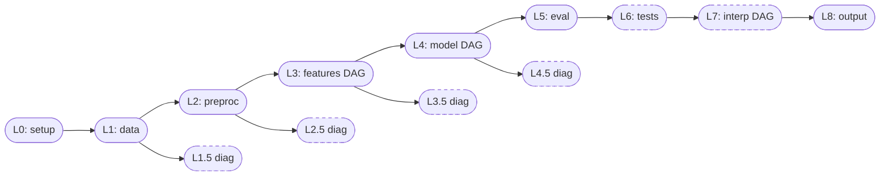

# Why 12 Layers?

The number of layers is not arbitrary. Each layer boundary solves a specific
problem in reproducible forecasting research. This page explains what those
problems are, why the boundaries are drawn where they are, and what the
contracts between layers prevent.

---

## The Decomposition Problem

A macroeconomic forecasting study involves a long chain of decisions: which
data to load, how to clean it, which features to construct, which models to
fit, how to evaluate performance, and how to interpret results. In a naive
implementation, these decisions collapse into one another. A model's built-in
scaler becomes part of the preprocessing, a benchmark's feature pipeline
silently differs from the challenger's, and interpretation figures draw on a
different transformation path than the one actually used in forecasting.

These are not hypothetical failures. They are the normal state of affairs
in forecasting research that lacks explicit boundaries. The consequence is
that two studies using "the same model" may not have run the same procedure,
and there is no way to audit the difference.

Every layer boundary in macroforecast is a firewall against one specific form
of this cross-contamination. A boundary is not an abstraction for its own
sake. It is the answer to the question: "what would go wrong if this were
merged with the adjacent layer?"

---

## Why the Count Is 9 Main Layers Plus 4 Diagnostic Halves

The 13 slots in the canonical flow are not 13 equally important compartments.
The diagnostic half-layers (L1.5, L2.5, L3.5, L4.5) are a different kind
of thing from the main sequence (L0 through L8). Separating them from the
main flow is itself a design decision, explained below.

### L0: Policy Before Science

L0 (`0_meta`) is not a scientific layer. It holds study-level metadata:
the failure policy (halt on first cell error versus continue through all
cells), the random seed, and the compute mode (serial or parallel). Nothing
in L0 is a research decision about data, features, or models.

The reason L0 comes first is not ordering for its own sake. Downstream layers
read the failure policy and the seed from the compiled manifest before
execution begins. If those values were not resolved before any layer ran,
the runtime could not propagate the seed consistently across all cells or
decide how to handle a cell failure mid-run.

"Policy before science" is the principle: the execution grammar is declared
and locked before any scientific computation begins.

### L1: The Data Boundary

L1 (`1_data`) separates *what data exists* from *what was done to it*. It
declares the data source (FRED-MD, FRED-QD, FRED-SD, or a custom panel),
the target series, the predictor universe, the geographic aggregation level,
and the regime indicator (if any).

Without L1 as a distinct boundary, preprocessing silently defines the universe
of predictors. A model that drops highly correlated series during its internal
feature selection is effectively changing the data universe. It becomes
impossible to state whether two models used the same predictors or not, and
equally impossible to replicate a result by re-specifying the data.

L1 also owns regime definitions. Regime indicators defined at L1 propagate
forward to L3 (conditioning feature construction), L4 (model fitting with
regime interactions), L5 (evaluation aggregation by regime), and L6
(conditional DM tests). This cross-layer propagation is only clean if regimes
are defined once, at the data boundary, before any layer reads them.

### L2: The Preprocessing Boundary

L2 (`2_preprocessing`) separates *cleaning* from *feature engineering*. It
owns transformations applied to the raw panel: outlier treatment, imputation,
frequency alignment, and frame-edge handling.

Without L2 as a distinct boundary, a model's built-in scaler or
missing-value imputer is part of the comparison but is not tracked anywhere.
Two models that appear to use the same features may have received differently
scaled inputs because their internal preprocessing differed. L2 ensures that
every cleaning operation is declared in the recipe, is applied uniformly to
all downstream layers, and is recorded in the manifest.

### L3: The Feature Engineering Boundary

L3 (`3_feature_engineering`) separates *what the model sees* from *how the
model uses it*. It owns feature construction — lags, moving averages,
dimensionality reduction, wavelet decomposition, and target construction
(rolling means, cumulative averages) — expressed as a directed acyclic graph
(DAG).

The DAG form is not incidental. Feature pipelines in real research are not
linear. A study might apply PCA to a subset of predictors, compute lags from
both the original series and the PCA-reduced series, and then feed the union
to a model. That structure is a graph, not a list. Using a DAG at L3 makes
the structure explicit and verifiable rather than buried in procedural code.

A critical non-negotiable rule: L3 owns target construction. This rule
prevents the ambiguity that would arise if feature engineering and forecast
combination were mixed. Two models that combine differently are being compared
at the model level, not the feature level, only if they receive identical
features from L3. If L3 were allowed to produce different targets for different
models, the resulting comparison would conflate feature decisions with model
decisions.

### L4: The Forecasting Model Boundary

L4 (`4_forecasting_model`) separates *forecast generation* from *evaluation*.
It owns model fitting, hyperparameter tuning, out-of-sample forecast
generation, and forecast combination.

The key enabler of fair comparison is that multiple L4 model nodes can share
the same L3 features. If a researcher specifies three forecasting families
in a single recipe, all three receive identically constructed features from
L3, evaluated on identically defined targets, at identically defined forecast
origins. The L3/L4 boundary is what makes the word "fair" meaningful in
this context.

L4 also owns forecast combination and ensembling. Combination is a forecast
operation, not an evaluation operation, because it produces a new forecast
object that can itself be evaluated.

### L5: The Evaluation Boundary

L5 (`5_evaluation`) separates *descriptive metrics* from *inferential tests*.
It owns point forecast accuracy metrics, benchmark comparisons, ranking, and
decomposition by regime or subperiod.

The separation from L6 exists because descriptive statistics and inferential
tests answer different questions. A relative MSFE comparing two models is
a description of what happened in the out-of-sample period. A Diebold-Mariano
test is a claim about whether the difference is statistically significant
under a null hypothesis. Without a boundary between them, a researcher might
report a p-value alongside descriptive metrics without noting that the test
requires sufficient out-of-sample origins to be meaningful, and without
auditing whether the test was configured correctly.

### L6: Statistical Tests (Default Off)

L6 (`6_statistical_tests`) separates *testing whether A beats B* from
*measuring how much A beats B*. It is default off because inferential tests
are not always appropriate — they require enough out-of-sample forecast
origins for the asymptotic theory to hold, and they require a clear research
question about which null hypothesis to test.

By separating L6 from L5 and making it default off, the design prevents a
common failure mode: a researcher enabling every available test on a dataset
with 20 out-of-sample origins, receiving p-values, and citing them without
awareness that the test has very low power. The boundary forces an explicit
choice.

### L7: Interpretation (Default Off)

L7 (`7_interpretation`) separates *explaining the forecast* from *making the
forecast*. Like L6, it is default off and uses a DAG.

Importance is always post-hoc. A SHAP value, a partial dependence plot, or
a forecast decomposition does not change the forecast; it characterizes it.
If interpretation were merged with forecasting, it would be unclear whether
an importance-weighted combination is a model operation or an interpretation
operation. Keeping L7 distinct from L4 enforces this conceptual separation.
The DAG form at L7 is used for the same reason as at L3 and L4: importance
workflows have branching structure (computing SHAP for some models, ALE for
others, then aggregating across a group).

### L8: The Output Boundary

L8 (`8_output`) is always the last layer to execute, regardless of which
upstream layers are active. It owns artifact selection, export format
(CSV, Parquet, LaTeX, Markdown, JSON), manifest finalization, and provenance
recording.

Separating output from the preceding layers prevents artifacts from being
written incrementally throughout the run in ways that are difficult to audit.
Every completed run produces a manifest that describes exactly what was
written and when. The manifest is always consistent with the artifacts because
L8 runs last.

### L1.5 / L2.5 / L3.5 / L4.5: Diagnostic Hooks

The four diagnostic half-layers are default off for a specific reason: they
must not mutate the construction sinks of the main sequence. A diagnostic
layer that alters the feature panel during its execution would contaminate
the L3 artifacts used by L4, breaking reproducibility.

By placing diagnostics in separate "side branches" off the main flow,
the design guarantees that enabling or disabling a diagnostic does not change
the forecast. The diagnostic observes the pipeline; it does not participate
in it.

---

## The Canonical Flow

Solid nodes are always active when the recipe includes the corresponding
layer key. Dashed nodes are default off and must be enabled explicitly.

---

## Inter-Layer Contracts

Each layer publishes a typed sink and may consume only the sinks of layers
that precede it in the canonical order. The full boundary table is in
[Layer Boundary Contract](../reference/architecture/layer_boundary_contract.md);
the reasoning behind the non-obvious rules follows.

**Why L3 owns target construction and L4 owns forecast combination.** If
target construction were allowed in L4, it would be possible for two models
to define their own rolling-mean targets with different window lengths. The
resulting comparison would be measuring something between feature decisions
and model decisions, which is not a meaningful scientific statement. The rule
that L3 owns targets ensures that the thing being compared across L4 model
nodes is the model, not the target.

**Why L5 owns descriptive evaluation and L6 owns inferential tests.** If
inferential tests lived in L5, they would always run whenever evaluation ran.
A researcher who wants descriptive accuracy metrics for a quick recipe sweep
does not necessarily want — or have sufficient data for — a full DM test.
Separating them means the researcher makes an active choice to request
hypothesis tests.

**Why diagnostics cannot mutate construction sinks.** A diagnostic that
changes the feature panel in-place during L3.5 would alter the inputs to L4.
The reproduction contract (same recipe produces same artifacts) would be
broken because the diagnostic's side effects would depend on execution order
and timing. The immutability rule makes diagnostics genuinely non-blocking.

---

## Cross-Layer References

The layer contracts are not purely downstream: four named cross-layer
references carry information from an upstream layer to a non-adjacent
downstream layer.

**is_benchmark (L4 to L5 and L6).** A model node in L4 that sets
`is_benchmark: true` is designated as the reference model for DM and CW tests
in L6 and as the benchmark baseline in L5. This is a recipe-level decision
because which model serves as the benchmark is part of the research design,
not an implementation detail. Placing the designation in L4 — where the
model is defined — makes the choice explicit and auditable.

**mcs_inclusion (L6 to L7).** The Model Confidence Set filter in L6 produces
a subset of models that survive at a given significance level. L7, when
enabled, uses this filter to determine which models receive full importance
analysis by default. Without this reference, interpretation would run for
all models regardless of whether they are statistically competitive.

**lineage (L3 to L7).** The feature construction DAG at L3 records a lineage
metadata artifact mapping each engineered feature back to the original series
it was derived from. L7 reads this artifact to attribute importance to the
original data sources rather than to the engineered feature names. Without
lineage, SHAP values would be reported for features named `pca_component_1`
rather than for the McCracken-Ng block that contributed most to that component.

**regime (L1.G to L3, L4, L5, L6.C).** Regime indicators defined at L1 —
whether NBER expansion/contraction cycles, estimated Markov-switching regimes,
or user-supplied dummies — propagate forward to condition feature construction
at L3, model fitting at L4 (where regime interactions are available), metric
aggregation at L5 (where breakdowns by regime period can be requested), and
conditional DM tests at L6. Defining regimes once at L1 guarantees consistency
across all the layers that use them.

---

## Custom Extensions Are First-Class

The layer contract is a specification, not a closed list of built-in
implementations. A custom Layer 2 preprocessor registered via
`macroforecast.custom.register_preprocessor`, or a custom Layer 3 feature
callable registered via `macroforecast.custom.register_op`, is treated
identically to a built-in operation. It goes through the same boundary check,
produces the same typed sink, and its name is recorded in the manifest
provenance.

This means that a methods researcher who implements a new data cleaning
procedure and compares it against the built-in scaler is subject to the same
boundary rules as anyone else. The custom operation cannot mutate upstream
sinks it did not produce, and its output becomes an auditable part of the
reproducibility record.

---

## Further Reading

- [Layer Boundary Contract](../reference/architecture/layer_boundary_contract.md)
  — the full boundary table with what each layer may consume and must emit.
- [Architecture Index](../reference/architecture/index.md) — per-layer pages
  with axis details and operational coverage.
- [Philosophy](../reference/architecture/philosophy.md) — the design intent
  that these boundaries encode.
