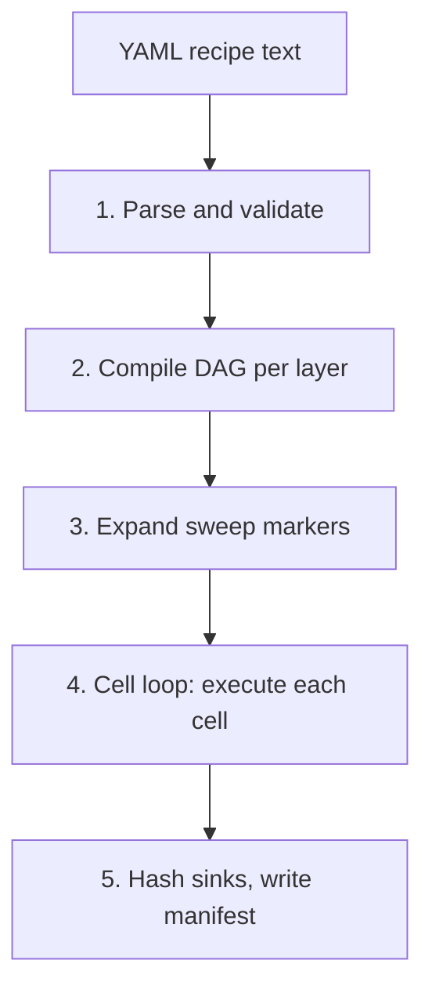

# From Recipe to Run

A YAML recipe is a static document. A study run is a sequence of computations
that may span hundreds of forecast origins, multiple model families, and
several output formats. This page traces the pipeline that connects them —
from the moment `mf.run("recipe.yaml")` is called to the moment artifacts
appear on disk.

---

## The Five Stages



Each stage serves a distinct purpose, and the ordering is not incidental.
Validation is first so the user gets a fast error instead of a slow failure
mid-run. The manifest is last so it is always consistent with the artifacts
that were actually written.

---

## Stage 1: Parse and Validate

`mf.run()` passes the recipe string or file path to
`macroforecast.core.yaml`, which parses the YAML and constructs a typed
recipe object. The validator then checks that:

- every layer key present in the recipe is a recognized layer identifier,
- every axis value for each layer is known and has the correct type,
- no selected value has `future` status (if it does, a hard error is raised
  before any output is written),
- all required sinks are declared in DAG layers,
- cross-layer references are consistent: a model node with `is_benchmark: true`
  must exist before L6 can reference it, and regime indicators used in L6.C
  conditional tests must have been defined at L1.

Errors at Stage 1 are raised immediately. The output directory is not created.
No artifacts are written. This is the design intent: a typo in an axis name,
a misspelled model family, or a reference to a future item should cost the
user a fraction of a second, not the duration of a full study run.

---

## Stage 2: Compile DAG per Layer

Three layers (L3, L4, and L7) use directed acyclic graphs rather than flat
lists of axis values. At this stage, the recipe's `nodes` declarations are
compiled into actual graph objects and topologically sorted.

Five node types exist:

- **`source`**: reads a named upstream sink from a previously executed layer.
- **`axis`**: declares a parameter that can be swept across values.
- **`step`**: executes a registered operation (a feature transform, a model
  family, an importance method) with specified configuration.
- **`combine`**: merges the outputs of multiple upstream nodes into a single
  artifact (used for forecast combination and feature concatenation).
- **`sink`**: names an output artifact that downstream layers may consume.

The topological sort is a hard requirement: cycles are not permitted and are
rejected with a clear error at compile time. A DAG that includes a cycle
would create a situation where a step depends on its own output, which is
logically incoherent in a single-pass execution.

List layers (L0, L1, L2, L5, L6, and L8) do not use a DAG; they use
`fixed_axes` and optional `leaf_config` dictionaries. Their compilation is
simpler: values are resolved against the layer's `AxisSpec`, defaults are
applied where the user has not specified a value, and the result is a
typed layer configuration object.

---

## Stage 3: Expand Sweep Markers

A sweep marker is a place in the recipe where a single value is replaced by
a list:

```yaml
4_forecasting_model:
  nodes:
    - type: step
      op: ridge
      config:
        n_lag: {sweep: [1, 2, 3]}
```

At Stage 3, the runtime expands every sweep marker into the full Cartesian
product of all marked axes. A recipe with two sweep markers — one with 3
values and one with 2 values — expands into 6 cells. A cell is one complete
execution of the recipe with one specific combination of sweep values.

Cell IDs are constructed to encode the sweep values, making artifact
directories human-readable (for example, `cell_n_lag=1_family=ridge/`).

Expansion happens before execution. The full cell grid is determined at
compile time. This means the total number of cells is always known before
any cell runs, which enables accurate progress reporting and deterministic
seed assignment.

---

## Stage 4: The Cell Loop

`macroforecast.core.execution` iterates over the cell grid. For each cell,
the runtime materializes the active layers in canonical order: L0, then L1,
then L2, then L3, then L4, then L5, then L6 (if enabled), then L7 (if
enabled), then L8. Each layer's output is passed to the next layer as a
typed sink.

The per-cell seed is derived at this stage. If the recipe sets
`reproducibility_mode: seeded_reproducible`, the runtime computes
`cell_seed = base_seed + cell_position` and injects it into every layer
that uses randomness. The position is the cell's index in the expanded grid,
assigned deterministically at Stage 3.

Cell failures are handled according to the `failure_policy` set in L0:

- `fail_fast` (the default): the first cell error aborts the entire run. The
  partial results are available in the output directory but the manifest is not
  written, signaling an incomplete run.
- `continue`: the failure is recorded in the cell's result object and the
  loop proceeds to the next cell. The manifest is written at the end
  regardless, including records of which cells failed and why.

The separation of cells is what makes sweep failures localized. A 30-cell
sweep where cell 17 fails can still produce 29 complete results, rather than
requiring the entire study to be re-run.

---

## Stage 5: Hash Sinks and Write Manifest

After each cell completes, L8 writes all requested artifacts to disk. After
all cells complete (or after a `fail_fast` termination), the runtime computes
SHA-256 hashes of every written artifact.

The manifest is then assembled and written to
`output_directory/manifest.json`. It contains the full resolved recipe,
per-cell sink hashes, per-cell sweep values, run timing, and environment
provenance (macroforecast version, Python version, custom model names).

The manifest is always consistent with the artifacts because it is written
after all artifacts. A manifest that exists is a record of a run that
completed its output phase. A missing or truncated manifest signals that
the run did not reach Stage 5, which is useful for diagnosing interrupted runs.

---

## Why This Design

Each stage separation encodes a specific design choice.

Validation first ensures that a misconfigured recipe fails fast — in under
a second — rather than after an hour of computation. A researcher who
misspells a model family name discovers the mistake before any data is loaded.

DAG compilation before expansion means the DAG structure is validated once
against the recipe's axis set, not once per cell. This is a performance
decision: with 100 cells in a sweep, re-compiling and re-validating the DAG
for each cell would add significant overhead with no benefit.

Sweep expansion before execution means cell positions are fixed before any
random state is assigned. Seeds are therefore determined by the recipe's
structure, not by execution order or timing, which is what makes them
reproducible across machines and across runs.

The manifest last means it is a record of completion, not of intent. A
manifest file is a statement that "this study completed its artifact phase
with the following hashes," which is the right semantics for a replication
audit.

---

## Further Reading

- [Recipe Layers](../reference/architecture/recipe_layers.md) — YAML key
  reference, shape rules for list versus DAG layers, and the minimal recipe
  skeleton.
- [Foundation Core](../reference/architecture/foundation.md) — the five DAG
  node types and the core contract for `macroforecast.core`.
- [Reproducibility](../reference/architecture/reproducibility.md) — how
  the manifest produced in Stage 5 is used by `mf.replicate` to verify
  bit-exact reproduction.
